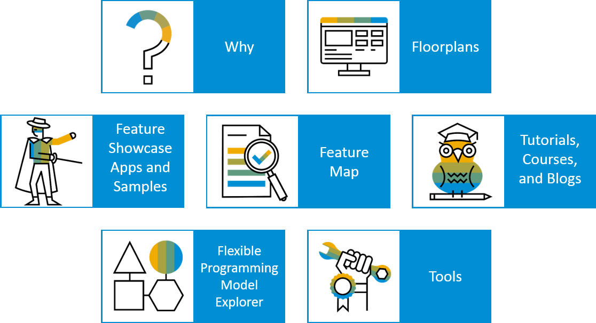

<!-- loio03265b0408e2432c9571d6b3feb6b1fd -->

# Developing Apps with SAP Fiori Elements

Develop apps using SAP Fiori elements and benefit from a template- and metadata-driven approach.

SAP Fiori elements provides designs for UI patterns and predefined floorplans for common application use cases. App developers can use SAP Fiori elements to create SAP Fiori applications based on OData services and annotations that don't need JavaScript UI coding. The resulting app uses predefined views and controllers that are provided centrally. This means no application-specific view instances are required. SAPUI5 interprets metadata and annotations of the underlying OData service and uses the corresponding views for the SAP Fiori app at startup.

The following image contains links to product documentation as well as to other websites.

