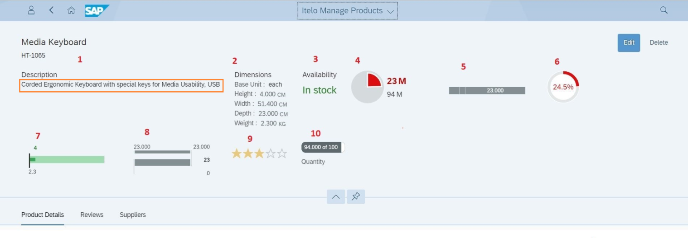
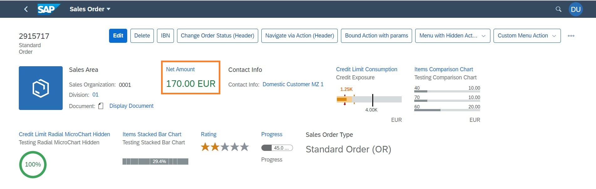
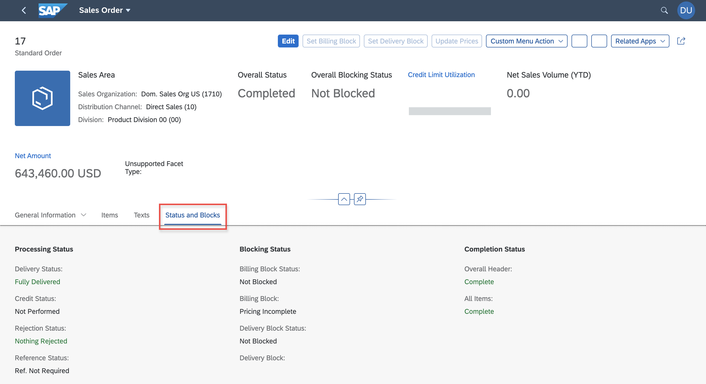
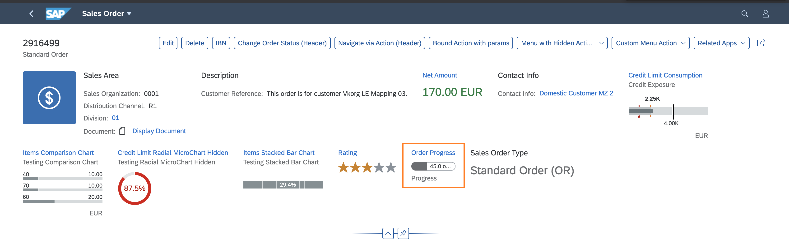
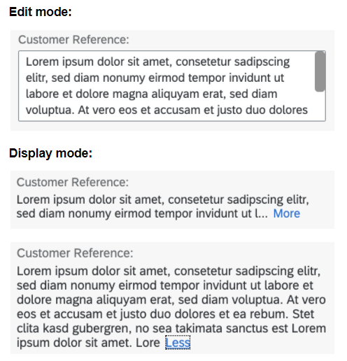
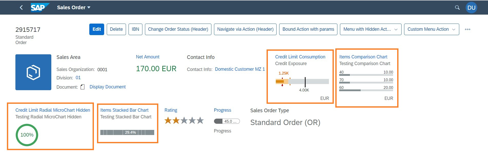

<!-- loioc18ada4bc56e427a9a2df2d1898f28a5 -->

# Different Representations of a `Field`

Applications can control how the field is represented by using annotations or metadata.

> ### Note:  
> This topic is currently only applicable to SAP Fiori elements for OData V4.


<a name="loioc18ada4bc56e427a9a2df2d1898f28a5__section_q1y_fvf_k4b"/>

## Representation as a Simple Plain Text Facet

A field can be displayed as a simple plain text facet, which shows up in the key-value format:

  

To be represented in this manner, you must initialize the OData field with an annotation that has a `UI.DataField` wrapped within `UI.FieldGroup`, as shown in the sample code below:

> ### Sample Code:  
> XML Annotation
> 
> ```
> <Annotation Term="UI.FieldGroup" Qualifier="PlainText">
>      <Record>
>           <PropertyValue Property="Data">
>                 <Collection>
>                      <Record Type="UI.DataField">
>                            <PropertyValue Property="Value" Path="description" />
>                        </Record>
>                  </Collection>
>           </PropertyValue>
>       </Record>
> </Annotation>
> ```

> ### Sample Code:  
> ABAP CDS Annotation
> 
> ```
> @UI.fieldGroup: [
>   {
>     value: 'DESCRIPTION',
>     type: #STANDARD,
>     qualifier: 'PlainText'
>   }
> ];
> 
> ```

> ### Sample Code:  
> CAP CDS Annotation
> 
> ```
> UI.FieldGroup #PlainText: {
> Data : [{
>               $Type : 'UI.DataField',
>                Value : description
>        }]
> }
> 
> ```

> ### Tip:  
> If the "Path" has a `sap:label()` associated to it, then first the label is displayed, followed by the value pointed to by the path \(separated by a colon\).


<a name="loioc18ada4bc56e427a9a2df2d1898f28a5__section_ihr_jvf_k4b"/>

## Representation as Part of a Form

You can group multiple fields together into a form-based representation:

  

For more information about the required annotations, see [Grouping of Fields](grouping-of-fields-cb1748e.md).


<a name="loioc18ada4bc56e427a9a2df2d1898f28a5__section_w4r_lvf_k4b"/>

## Representation as a Key Value Facet or a Key Performance Indicator \(KPI\)

A field can be represented as a key value facet or render a KPI:

  

The underlying annotation for this is the `UI.DataPoint` annotation:

> ### Sample Code:  
> XML Annotation
> 
> ```
> <Annotation Term="UI.DataPoint" Qualifier="Availability">
>       <Record Type="UI.DataPointType">
>            <PropertyValue Property="Title" String="Availability" />
>            <PropertyValue Property="Value" Path="stock/availability" />
>            <PropertyValue Property="Criticality" Path="stock/availability"/>
>        </Record>
> </Annotation>
> ```

> ### Sample Code:  
> ABAP CDS Annotation
> 
> ```
> @UI.dataPoint: {
>   title: 'Availability',
>   criticality: 'availability'
> }
> availability;
> 
> ```

> ### Sample Code:  
> CAP CDS Annotation
> 
> ```
> UI.DataPoint #Availability                               : {
>         Value                : stock.availability,
>         Title                : 'Availability',
>        Criticality         :  stock.availability
> }
> 
> ```

Apart from its usage in the object page header, the KPI could also be a `DataField` that is marked with criticality. In such cases, SAP Fiori elements brings up the object status control.

> ### Sample Code:  
> XML Annotation
> 
> ```
> <Record Type="SAP__UI.DataField">
>     <PropertyValue Property="Criticality" Path="OvrlDeliveryStatusCriticality"/>
>     <PropertyValue Property="CriticalityRepresentation" EnumMember="SAP__UI.CriticalityRepresentationType/WithoutIcon"/>
>     <PropertyValue Property="Value" Path="OverallDeliveryStatus"/>
>     <Annotation Term="SAP__UI.Importance" EnumMember="SAP__UI.ImportanceType/High"/>
> </Record>
> ```

> ### Sample Code:  
> ABAP CDS Annotation
> 
> ```
> @UI.dataPoint: {
>   criticality: 'OvrlDeliveryStatusCriticality',
>   criticalityRepresentation: #WITHOUT_ICON
> }
> OverallDeliveryStatus;
> 
> ```

> ### Sample Code:  
> CAP CDS Annotation
> 
> ```
> {
>         $Type : 'UI.DataField',
>         Value : OverallDeliveryStatus,
>        Criticality :  OvrlDeliveryStatusCriticality,
>              ![@UI.CriticalityRepresentation ]        :  #WithoutIcon 
> }
> 
> ```

This could render 3 KPIs, as shown in the image below:

  

> ### Tip:  
> If you add a semantic object annotation to the value field of the `DataPoint`, the value is shown as a link but does not show any criticality information. For more information about adding the semantic object annotation, see the section *Using a Link Control* in [Navigation from an App \(Outbound Navigation\)](navigation-from-an-app-outbound-navigation-d782acf.md).


<a name="loioc18ada4bc56e427a9a2df2d1898f28a5__section_tff_4vf_k4b"/>

## Representation as a Rating Indicator

A field can be displayed as a rating indicator:

  

This requires a `UI.DataPoint` annotation with the visualization type "Rating":

> ### Sample Code:  
> XML Annotation
> 
> ```
> <Annotation Term="UI.DataPoint" Qualifier="averageRating">
>       <Record>
>            <PropertyValue Property="Value" Path="averageRating" />
>             <PropertyValue Property="TargetValue" Decimal="5" />
>             <PropertyValue Property="Visualization"EnumMember="UI.VisualizationType/Rating" />
>       </Record>
> </Annotation>
> ```

> ### Sample Code:  
> ABAP CDS Annotation
> 
> ```
> @UI.dataPoint: {
>   targetValue: 5,
>   visualization: #RATING
> }
> averageRating;
> 
> ```

> ### Sample Code:  
>  CAP CDS Annotation
> 
> ```
> DataPoint #averageRating               : {
>         Value         : averageRating,
>         TargetValue   : 5.0,
>         Visualization : #Rating
> }
> 
> ```

> ### Tip:  
> When used within a table, the rating indicator is shown without a label.


<a name="loioc18ada4bc56e427a9a2df2d1898f28a5__section_mw1_qvf_k4b"/>

## Representation as a Progress Indicator

A field can be displayed as a progress indicator:

  

This requires a `UI.DataPoint` annotation with the visualization type "Progress":

> ### Sample Code:  
> XML Annotation
> 
> ```
> <Annotation Term="UI.DataPoint" Qualifier="quantity">
>       <Record>
>            <PropertyValue Property="Value" Path="stock/quantity" />
>             <PropertyValue Property="TargetValue" Decimal="100" />
>             <PropertyValue Property="Visualization"EnumMember="UI.VisualizationType/Progress" />
>        </Record>
> </Annotation>
> ```

> ### Sample Code:  
> ABAP CDS Annotation
> 
> ```
> @UI.dataPoint: {
>   targetValue: 100,
>   visualization: #PROGRESS
> }
> quantity;
> 
> ```

> ### Sample Code:  
>  CAP CDS Annotation
> 
> ```
> DataPoint #quantity               : {
>         Value         : stock.quantity,
>         TargetValue   : 100.0,
>         Visualization : #Progress
> }
> 
> ```

> ### Tip:  
> When used within a table, the progress indicator is shown without a label.


<a name="loioc18ada4bc56e427a9a2df2d1898f28a5__section_qjc_35f_k4b"/>

## Representation as a Link

A field can be displayed as a link. The link can then be used in one of the scenarios described below.

  


### Semantic Link

If the field is associated with a semantic object, it is rendered as a link - provided that the semantic object is a valid one in SAP Fiori launchpad. All the actions configured for this semantic object are displayed when users click on the link. If there is only one navigation target, the user is directly navigated upon clicking the link.

> ### Sample Code:  
> XML Annotation
> 
> ```
> <Annotations Target="clouds.products.CatalogService.Products/SoldToParty">
>     <Annotation Term="Common.SemanticObject" String="supplier"/>
> </Annotations>
> ```

> ### Sample Code:  
> ABAP CDS Annotation
> 
> ```
> annotate view PRODUCTS.CATALOGSERVICE.PRODUCTS with {
> @Consumption.semanticObject: 'supplier'
> soldtoparty;
> }
> 
> ```

> ### Sample Code:  
> CAP CDS Annotation
> 
> ```
> SoldToParty                   : String(10)                            @(Common : {
> SemanticObject                  : 'supplier'
> });
> 
> ```

For more information, see [Navigation from an App \(Outbound Navigation\)](navigation-from-an-app-outbound-navigation-d782acf.md).


### Quick View Card

This allows applications to specify additional information that end users can access by clicking on the link. For example, the link shows the status of a document, and clicking on it shows more detailed information.

For more information, see [Enabling Quick Views for Link Navigation](enabling-quick-views-for-link-navigation-307ced1.md).


### Contact Card

This allows applications to specify more details on the contact information displayed in the link field. For example, the link field shows the name of the supplier and clicking on the link shows additional information about the supplier. The additional information is shown in a popup.

For more information, see [Adding a Contact Facet](adding-a-contact-facet-a6a8c0c.md). The topic describes how a contact facet can be added to an object page form field. Similarly, you can add a table field by adding a reference to the `Communication.Contact` annotation in the `UI.LineItem` annotation: `UI.DataFieldForAnnotation`

> ### Sample Code:  
> XML Annotation
> 
> ```
> <Annotations Target="clouds.products.CatalogService.Products">
>     <Annotation Term="UI.LineItem">
>         <Collection>
>             <Record Type="UI.DataFieldForAnnotation">
>                 <PropertyValue Property="Label" String="Supplier"/>
>                 <PropertyValue Property="Target" AnnotationPath="supplier/@Communication.Contact"/>
>             </Record>
>         </Collection>
>     </Annotation>
> </Annotations>
> 
> <Annotations Target="sap.fe.manageitems.TechnicalTestingService.Supplier/phoneNumber">
>     <Annotation Term="Common.Label" String="Mobile"/>
>     <Annotation Term="Communication.IsPhoneNumber" Bool="true"/>
> </Annotations>
> 
> <Annotations Target="sap.fe.manageitems.TechnicalTestingService.Supplier/emailAddress">
>     <Annotation Term="Common.Label" String="Email"/>
>     <Annotation Term="Communication.IsEmailAddress" Bool="true"/>
> </Annotations>
> 
> ```

> ### Sample Code:  
> ABAP CDS Annotation
> 
> ```
> annotate view PRODUCTS.CATALOGSERVICE.PRODUCTS with {
> @UI.lineItem: [
>   {
>     label: 'Supplier',
>     value: 'SUPPLIER',
>     type: #AS_CONTACT,
>     position: 1 
>   }
> ]
> SupplierID; 
> }
> 
> annotate view FE.MANAGEITEMS.TECHNICALTESTINGSERVICE.SUPPLIER with { 
>     @Semantics.eMail.address: true
>     @EndUserText.label: 'EMail'
>     emailAddress;
>     @Semantics.telephone.type:  [ #CELL ]
>     @EndUserText.label: 'Mobile'
>     phoneNumber;
> }
> 
> ```

> ### Sample Code:  
> CAP CDS Annotation
> 
> ```
> UI.LineItem                         : [
>     {
>         $Type  : 'UI.DataFieldForAnnotation',
>         Target : 'supplier/@Communication.Contact',
>         Label  : 'Supplier'
>     }
> ]
> phoneNumber             : String(15)         @(
>             title     : 'Mobile',
>             Communication.IsPhoneNumber
> );
> emailAddress             : String(241)         @(
>             title     : 'Email',
>             Communication.IsEmailAddress
> );
> 
> ```


### Contact Links

Application developers can specify links for phone numbers or email addresses by using the annotations `Communication.IsPhoneNumber` and `Communication.IsEmailAddress`. The links are tagged with the prefix "mailto:" or "tel:". When users click the link, the browser redirects to the operating system \(for example Android, iOS, or Windows\) and directly performs the corresponding action, such as opening an email app.

```xml
<Annotations Target="sap.fe.manageitems.TechnicalTestingService.LineItems/phoneNumber">
    <Annotation Term="Common.Label" String="Mobile"/>
    <Annotation Term="Communication.IsPhoneNumber" Bool="true"/>
</Annotations>
```

```xml
<Annotations Target="sap.fe.manageitems.TechnicalTestingService.LineItems/emailAddress">
    <Annotation Term="Common.Label" String="Email"/>
    <Annotation Term="Communication.IsEmailAddress" Bool="true"/>
</Annotations>
```


### Basic Links

Application developers can display basic link with an optional icon or image using `DataFieldWithUrl`.

> ### Sample Code:  
> XML Annotation
> 
> ```
> <Annotation Term="UI.FieldGroup" Qualifier="DataFieldUrl">
>     <Record Type="UI.FieldGroupType">
>         <PropertyValue Property="Data">
>             <Collection>
>                 <Record Type="UI.DataFieldWithUrl">
>                     <PropertyValue Property="Url" String="www.sap.com"/>
>                     <PropertyValue Property="Value" String="This is an URL"/>
>                     <PropertyValue Property="IconUrl" String="sap-icon://arrow-right"/>
>                 </Record>
>                 <Record Type="UI.DataFieldWithUrl">
>                     <PropertyValue Property="Url" String="www.sap.com"/>
>                     <PropertyValue Property="Value" String=""/>
>                     <PropertyValue Property="IconUrl" Path="oneIcon"/>
>                 </Record>
>                 <Record Type="UI.DataFieldWithUrl">
>                     <PropertyValue Property="Url" Path="oneUrl"/>
>                     <PropertyValue Property="Value" String="This is an URL three"/>
>                     <PropertyValue Property="IconUrl" String="sap-icon://arrow-right"/>
>                 </Record>
>             </Collection>
>         </PropertyValue>
>     </Record>
> </Annotation>
> ```

> ### Sample Code:  
> ABAP CDS Annotation
> 
> ```
> @UI.fieldGroup: [
>   {
>     iconUrl: 'sap-icon://arrow-right'
>     type: #WITH_URL,
>     position: 1 ,
>     qualifier: 'DataFieldUrl'
>   },
>   {
>     url: 'ONEURL',
>     value: 'ONEURL',
>     type: #WITH_URL,
>     position: 2 ,
>     qualifier: 'DataFieldUrl'
>   }
> ]
> 
> ```

> ### Sample Code:  
> CAP CDS Annotation
> 
> ```
> UI.FieldGroup #DataFieldUrl: {
> Data : [{
>               $Type : 'UI.DataFieldWithUrl',
>               Url   : 'www.sap.com',
>               Value : 'This is an URL',
>               IconUrl: 'sap-icon://arrow-right',
>        },
>        {
>               $Type  : 'UI.DataFieldWithUrl',
>               Url    : oneDisplay,
>               Value  : oneUrl,
>               IconUrl: oneIcon
> }
> }]
> 
> ```


<a name="loioc18ada4bc56e427a9a2df2d1898f28a5__section_exz_w5f_k4b"/>

## Representation as a `TextArea` or `ExpandableText`

You can display a field as a `TextArea` in edit mode or as an `ExpandableText` in display mode by annotating the property associated to the field with `UI.MultiLineText`.

  

```xml
<Annotations Target="com.c_salesordermanage_sd.SalesOrderManage">
    <Annotation Term="Common.Label" String="Customer Reference"/>
    <Annotation Term="UI.MultiLineText" Bool="true"/>
</Annotations>
```


### Default Length

– Edit Mode –

The default number of lines of a text area is 4, but you can change this in the `manifest.json`. If the content exceeds the maximum number of lines for a given text area, then – depending on whether or not you are in edit mode – a scrollbar is shown. You can configure a text area in edit mode to grow and shrink, depending on its content.

– Display Mode –

The text is cut off after 100 characters and a *More* link is shown, allowing users to display the full text. By default, the text is expanded `"InPlace"`, but you can change this in the `manifest.json` by setting the expand behavior to `"Popover"`.


### Custom Length

You can specify the maximum number of characters a text area can have using `textMaxLength`. When enabled, an indicator at the bottom of the text area shows the remaining number of characters. When it is exceeded, the user will see a notification.


### Manifest-Based Definition

If you need to define your own custom length in a `FieldGroup` or a `LineItem`, their `controlConfiguration` has to be extended with a `"fields"` block or `"columns"` block in a structure, as shown in the following sample code:

> ### Sample Code:  
> `manifest.json`
> 
> ```
> "sap.ui5": {
>     "routing": {
>         "targets": {
>             "SalesOrderManageObjectPage": {
>                 "options": {
>                     "settings": {
>                         "controlConfiguration": {
>                             "@com.sap.vocabularies.UI.v1.FieldGroup#myQualifier": {
>                                 "fields": {
>                                     "DataField::myFormTextField": {
>                                         "formatOptions": {
>                                             "textLinesEdit": "6",
>                                             "textMaxCharactersDisplay": "Infinity"
>                                         }
>                                     }
>                                  }
>                              },
>                             "myEntity/@com.sap.vocabularies.UI.v1.LineItem": {
>                                 "columns": {
>                                     "DataField::myTableTextField": {
>                                         "formatOptions": {                                         
>                                             "textLinesEdit": "3",
>                                             "textMaxLines": "5",
>                                             "textMaxCharactersDisplay": "400",
>                                             "textExpandBehaviorDisplay" : "Popover"
>                                         }
>                                     }
>                                 }
>                             }
>                          }
>                      }
>                  }
>              }
>         }
>     }
>  }
> ```

The following table provides an overview of the parameters that are allowed in `formatOptions`:


<table>
<tr>
<th valign="top">

Parameter


</th>
<th valign="top">

Type


</th>
<th valign="top">

Description


</th>
</tr>
<tr>
<td valign="top">

`textLinesEdit`


</td>
<td valign="top">

String | Integer


</td>
<td valign="top">

An integer value or a string containing an integer value that defines the number of lines the text area can show when it is editable before a scrollbar is shown. If you use it together with `textMaxLines`, this parameter defines the minimum number of lines the field can shrink to.


</td>
</tr>
<tr>
<td valign="top">

`textMaxLines`


</td>
<td valign="top">

String | Integer


</td>
<td valign="top">

An integer value or a string containing an integer value that defines the maximum number of lines that the text area can grow to when it is editable before a scrollbar is shown. If this value is not given or if it is not larger than `textLinesEdit`, the text area does not grow or shrink.


</td>
</tr>
<tr>
<td valign="top">

`textMaxCharactersDisplay`


</td>
<td valign="top">

String | Integer


</td>
<td valign="top">

An integer value or a string containing an integer value that defines the number of characters to be displayed before the text is cut off and a *More* link is shown. If you set this value to `"Infinity"`, the text is shown completely.


</td>
</tr>
<tr>
<td valign="top">

`textExpandBehaviorDisplay`


</td>
<td valign="top">

String


</td>
<td valign="top">

Defines how the full text is displayed: either `"InPlace"` or `"Popover"`.


</td>
</tr>
<tr>
<td valign="top">

`textMaxLength`


</td>
<td valign="top">

String | Integer


</td>
<td valign="top">

An integer value or a string containing an integer value that defines the maximum number of characters that can be entered in the text area. When this number is exceeded, the user sees a notification. If this value is not given, the maximum number of characters is not restricted.


</td>
</tr>
</table>

You can explore and work with the coding yourself. Check out the live example in the flexible programming model explorer at [Format Options](https://ui5.sap.com/test-resources/sap/fe/core/fpmExplorer/index.html#/buildingBlocks/field/fieldFormatOptions).


<a name="loioc18ada4bc56e427a9a2df2d1898f28a5__section_kl4_2qs_r4b"/>

## Representation as a Micro Chart

You can render a field as a micro chart to show additional information like critical measures, or criticality.

  

For more information, see [Micro Chart Facet](micro-chart-facet-e219fd0.md) and [Adding a Micro Chart to a Table](adding-a-micro-chart-to-a-table-b8312a4.md).


<a name="loioc18ada4bc56e427a9a2df2d1898f28a5__section_k33_55z_tqb"/>

## Representation as File Upload/Download \(`Edm.Stream`\)

SAP Fiori elements allows you to enable stream support so that users can upload and download files. You can add `Edm.Stream` fields \(file upload\) to a form on the object page. For more information, see [Enabling Stream Support](enabling-stream-support-b236d32.md).


<a name="loioc18ada4bc56e427a9a2df2d1898f28a5__section_ajd_pfs_gxb"/>

## Representation as a Timestamp with Timezone Information

You can display a timestamp together with a timezone.

  

For more information, see the section *Date Picker and Date/Time Picker* in [Field Help](field-help-a5608ea.md).

**Related Information**  


[Value Help as a Dropdown List](value-help-as-a-dropdown-list-2a0a630.md "If your value help contains a fixed number of values, a dropdown list will be rendered.")

