<!-- loioc18ada4bc56e427a9a2df2d1898f28a5 -->

# Different Representations of a Field

You can control how the field is represented by using annotations or metadata in SAP Fiori elements for OData V4.

The following representations of a field are supported:

**Representations of a Field**

<table>
<tr>
<th valign="top">

Field Representation

</th>
<th valign="top">

Documentation

</th>
<th valign="top">

Screenshot

</th>
</tr>
<tr>
<td valign="top">

Plain text facet

</td>
<td valign="top">

[Plain Text Facet in the Object Page Header](plain-text-facet-in-the-object-page-header-1da0926.md) 

</td>
<td valign="top">

  
  
**Plain Text Facet in the Object Page Header**

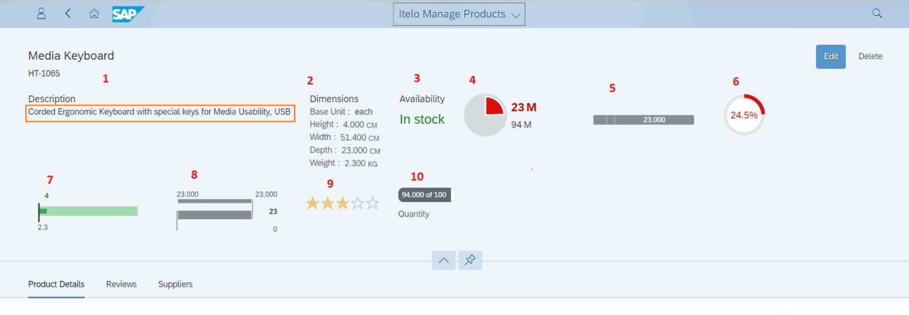

</td>
</tr>
<tr>
<td valign="top">

Amount with a currency or unit of measure

</td>
<td valign="top">

[Setting Units of Measure](setting-units-of-measure-0d6c1d5.md) 

</td>
<td valign="top">

  
  
**Fields with a Unit of Measure and a Currency**

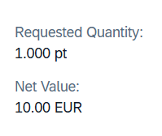

</td>
</tr>
<tr>
<td valign="top">

Field as part of a form

</td>
<td valign="top">

[Grouping of Fields](grouping-of-fields-cb1748e.md)

[The Form Building Block](the-form-building-block-391aad2.md)

[Form Facet in the Object Page Header](form-facet-in-the-object-page-header-ff0ae0b.md)

</td>
<td valign="top">

  
  
**Form Facet in the Object Page Header**

</td>
</tr>
<tr>
<td valign="top">

Key value facet or key performance indicator \(KPI\)

</td>
<td valign="top">

[The KPITag Building Block](the-kpitag-building-block-a256bff.md)

[Displaying a Field as a Key Value Facet or a Key Performance Indicator \(KPI\)](displaying-a-field-as-a-key-value-facet-or-a-key-performance-indicator-kpi-c312735.md)

</td>
<td valign="top">

  
  
**Key Value Facet in the Object Page Header**

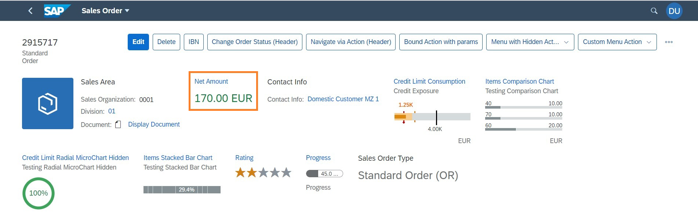

</td>
</tr>
<tr>
<td valign="top">

Rating indicator

</td>
<td valign="top">

[Adding a Rating Indicator to a Table](adding-a-rating-indicator-to-a-table-a797173.md)

[Rating Indicator Facet in the Object Page Header](rating-indicator-facet-in-the-object-page-header-bcc12cb.md)

</td>
<td valign="top">

  
  
**Rating Indicator in the Object Page Header**

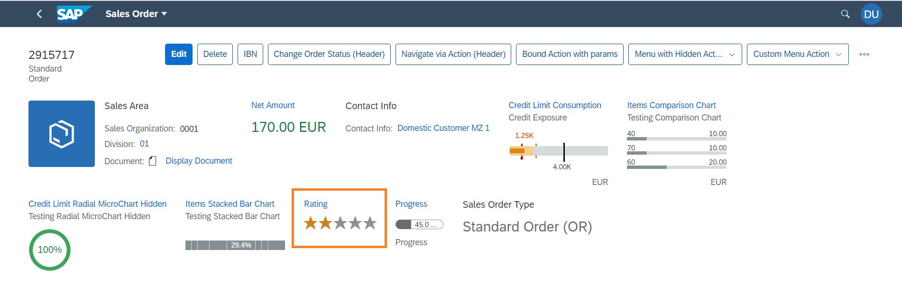

</td>
</tr>
<tr>
<td valign="top">

Progress indicator

</td>
<td valign="top">

[Adding a Progress Indicator to a Table](adding-a-progress-indicator-to-a-table-43f6f0f.md)

[Progress Indicator Facet in the Object Page Header](progress-indicator-facet-in-the-object-page-header-3b5e01c.md)

</td>
<td valign="top">

  
  
**Progress Indicator in the Object Page Header**

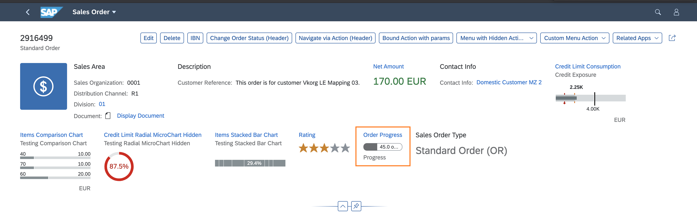

</td>
</tr>
<tr>
<td valign="top">

Link

</td>
<td valign="top">

[Link Fields](link-fields-1695504.md) 

</td>
<td valign="top">

  
  
**Contact Info in the Object Page Header**

</td>
</tr>
<tr>
<td valign="top">

Multi-line text

</td>
<td valign="top">

[Multi-Line Text Fields](multi-line-text-fields-b502146.md) 

</td>
<td valign="top">

  
  
**Multi-Line Text Field in Edit Mode and Display Mode**

</td>
</tr>
<tr>
<td valign="top">

Micro chart

</td>
<td valign="top">

[The MicroChart Building Block](the-microchart-building-block-74554b4.md)

[Adding a Micro Chart to a Table](adding-a-micro-chart-to-a-table-b8312a4.md)

[Micro Chart Facet in the Object Page Header](micro-chart-facet-in-the-object-page-header-e219fd0.md)

</td>
<td valign="top">

  
  
**Micro Chart Facets in the Object Page Header**

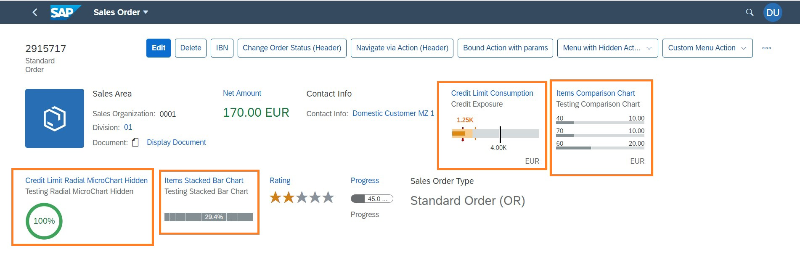

</td>
</tr>
<tr>
<td valign="top">

File upload and download

</td>
<td valign="top">

[Enabling Stream Support](enabling-stream-support-b236d32.md) 

</td>
<td valign="top">

  
  
**File Upload and Download Field**

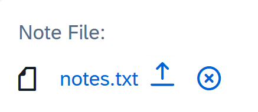

</td>
</tr>
<tr>
<td valign="top">

Checkbox

</td>
<td valign="top">

[Fields Representing Boolean Properties](fields-representing-boolean-properties-36ef70d.md)

[Grouping Checkboxes](grouping-of-fields-cb1748e.md#loiocb1748ea9b984251addc03718d98df35__Grouping_Checkboxes) section in [Grouping of Fields](grouping-of-fields-cb1748e.md)

</td>
<td valign="top">

  
  
**Checkbox**

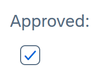

</td>
</tr>
<tr>
<td valign="top">

Radio button group

</td>
<td valign="top">

[Fields Representing Boolean Properties](fields-representing-boolean-properties-36ef70d.md) 

</td>
<td valign="top">

  
  
**Radio Button Group**

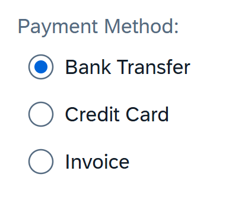

</td>
</tr>
<tr>
<td valign="top">

Timestamp with timezone information

</td>
<td valign="top">

[Date Picker and Date/Time Picker](field-help-a5608ea.md#loioa5608eabcc184aee99e1a7d88b28816c__section_jxp_rtv_s4b) section in [Field Help](field-help-a5608ea.md) 

</td>
<td valign="top">

  
  
**Timestamp Fields with Timezone**

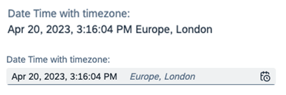

</td>
</tr>
<tr>
<td valign="top">

Multi-input field

</td>
<td valign="top">

[Using the Multi-Input Field](using-the-multi-input-field-04ff5b1.md) 

</td>
<td valign="top">

  
  
**Multi-Input Field**

</td>
</tr>
<tr>
<td valign="top">

Masked input field

</td>
<td valign="top">

[Masked Input Fields](masked-input-fields-de89aec.md) 

</td>
<td valign="top">

  
  
**Masked Input Field**

</td>
</tr>
<tr>
<td valign="top">

Field with a masked value

</td>
<td valign="top">

[Masking Fields To Hide Sensitive Data](masking-fields-to-hide-sensitive-data-6e46232.md) 

</td>
<td valign="top">

  
  
**Field with a Masked Value**

</td>
</tr>
<tr>
<td valign="top">

Avatar

</td>
<td valign="top">

[Using Images and Icons](using-images-and-icons-5760b63.md) 

</td>
<td valign="top">

  
  
**Avatar in the Object Page Header**

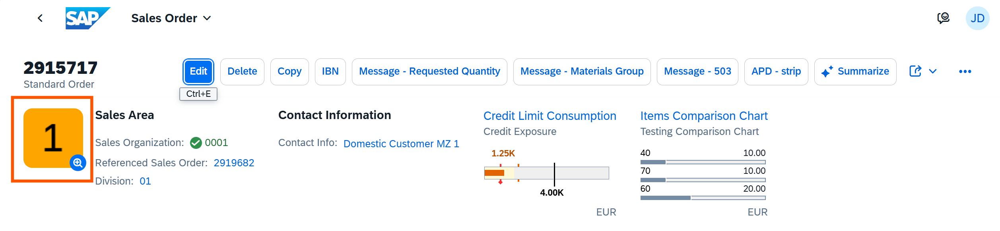

</td>
</tr>
<tr>
<td valign="top">

Address facet

</td>
<td valign="top">

[Address Facet in the Object Page Header](address-facet-in-the-object-page-header-0b73cbb.md) 

</td>
<td valign="top">

  
  
**Address Facet**

</td>
</tr>
<tr>
<td valign="top">

Contact facet

</td>
<td valign="top">

[Adding a Contact Facet](adding-a-contact-facet-a6a8c0c.md)

[Adding a Contact Quick View to a Table](adding-a-contact-quick-view-to-a-table-677fbde.md)

</td>
<td valign="top">

  
  
**Contact Facet in the Object Page Header**

</td>
</tr>
</table>

