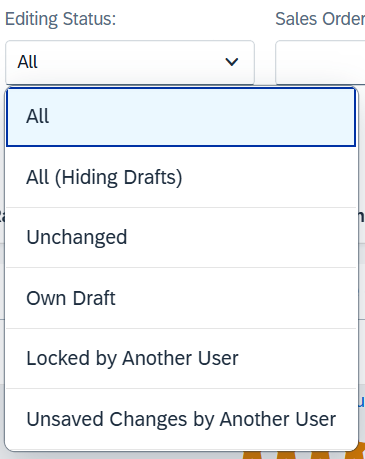

<!-- loio8eb695ac473b4ab0a726e4021ce35cf4 -->

# Disabling the Editing Status Filter

The editing status filter is enabled by default in the list report page of draft enabled applications.

> ### Note:  
> This topic is currently only applicable to SAP Fiori elements for OData V2.

   
  
**Editing status filter**

  

If required, you can disable this filter for your app. To do so, you need to adapt your OData service in the backend. The resulting metadata.xml file looks as shown below:

> ### Sample Code:  
> XML Annotation
> 
> ```xml
> <Annotation Term="Capabilities.NavigationRestrictions">
>     <Record>
>         <PropertyValue Property="RestrictedProperties">
>             <Collection>
>                 <Record>
>                     <PropertyValue Property="NavigationProperty" NavigationPropertyPath="DraftAdministrativeData" />
>                     <PropertyValue Property="FilterRestrictions">
>                         <Record>
>                             <PropertyValue Property="Filterable" Bool="false" />
>                         </Record>
>                     </PropertyValue>
>                 </Record>
>             </Collection>
>         </PropertyValue>
>     </Record>
> </Annotation>
> ```

> ### Sample Code:  
> ABAP CDS Annotation: Define behavior for `SalesOrderRoot` alias `SalesOrder`
> 
> ```
> 
> {
>   create;
>   delete;
>   update ( features : instance );
>  
>   association DraftAdministrativeData
>   { create;  }
>   [...]
> }
> 
> ```

