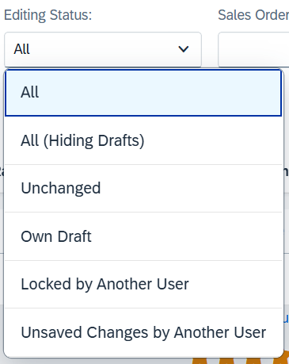

<!-- loiocd319e9f36474844a4960c6f0b9adee5 -->

# Disabling the Editing Status Filter

You can disable the *Editing Status* filter.

> ### Note:  
> For information about SAP Fiori elements for OData V4, see [Disabling the Editing Status Filter](disabling-the-editing-status-filter-8eb695a.md).

The *Editing Status* filter is enabled by default on the list report page of draft-enabled applications.

  
  
**Editing Status filter**



To disable this filter, add the following sample code to your annotation file:

> ### Sample Code:  
> XML Annotation
> 
> ```xml
> <Annotations Target="TravelService.EntityContainer/Travel">
>    <Annotation Term="Capabilities.NavigationRestrictions">
>       <Record Type="Capabilities.NavigationRestrictionsType">
>          <PropertyValue Property="RestrictedProperties">
>             <Collection>
>                <Record Type="Capabilities.NavigationPropertyRestriction">
>                   <PropertyValue Property="NavigationProperty" NavigationPropertyPath="DraftAdministrativeData"/>
>                   <PropertyValue Property="FilterRestrictions">
>                      <Record Type="Capabilities.FilterRestrictionsType">
>                         <PropertyValue Property="Filterable" Bool="false"/>
>                      </Record>
>                   </PropertyValue>
>                </Record>
>            </Collection>
>         </PropertyValue>
>       </Record>
>    </Annotation>
> </Annotations>
> ```

> ### Sample Code:  
> ABAP CDS Annotation
> 
> No ABAP CDS annotation sample is available. Please use the local XML annotation.

> ### Sample Code:  
> CAP CDS Annotation
> 
> ```
> annotate TravelService.Travel with @(
> Capabilities: {
>    NavigationRestrictions : {
>        $Type : 'Capabilities.NavigationRestrictionsType',
>        RestrictedProperties : [
>            {
>                $Type : 'Capabilities.NavigationPropertyRestriction',
>                NavigationProperty : DraftAdministrativeData,
>                FilterRestrictions : {
>                    $Type : 'Capabilities.FilterRestrictionsType',
>                    Filterable : false,
>                },
>            },
>        ],
>    },
> });
> ```

If you disable the *Editing Status* filter, users can no longer filter their objects based on the editing status.

