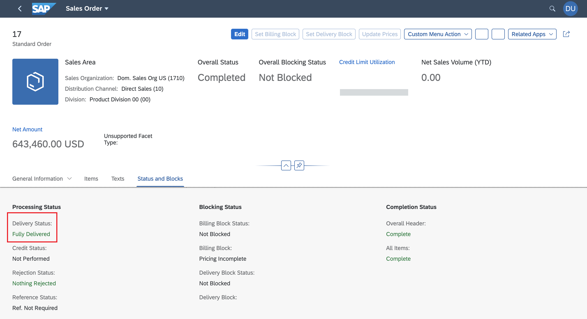

<!-- loioc312735b7417423ea239394b3b4f4018 -->

# Displaying a Field as a Key Value Facet or a Key Performance Indicator \(KPI\)

You can render a field as a key value facet in an object page header or a key performance indicator in SAP Fiori elements for OData V4.

See the following screenshot of a key value facet in an object page header:

  
  
**Key Value Facet**


The underlying annotation for this is the `UI.DataPoint` annotation:

> ### Sample Code:  
> XML Annotation
> 
> ```
> <Annotation Term="UI.DataPoint" Qualifier="Availability">
>       <Record Type="UI.DataPointType">
>            <PropertyValue Property="Title" String="Availability" />
>            <PropertyValue Property="Value" Path="stock/availability" />
>            <PropertyValue Property="Criticality" Path="stock/availability"/>
>        </Record>
> </Annotation>
> ```

> ### Sample Code:  
> ABAP CDS Annotation
> 
> ```
> @UI.dataPoint: {
>   title: 'Availability',
>   criticality: 'availability'
> }
> availability;
> 
> ```

> ### Sample Code:  
> CAP CDS Annotation
> 
> ```
> UI.DataPoint #Availability                               : {
>         Value                : stock.availability,
>         Title                : 'Availability',
>        Criticality         :  stock.availability
> }
> 
> ```

> ### Note:  
> You can also enable in-page and external navigation from a data point title. For more information, see [Navigation from Header Facet Title](navigation-from-header-facet-title-fa0ca22.md).

Apart from its usage in the object page header, the KPI can also be a `DataField` that is marked with criticality. In such cases, SAP Fiori elements brings up the object status control.

> ### Sample Code:  
> XML Annotation
> 
> ```
> <Record Type="SAP__UI.DataField">
>     <PropertyValue Property="Criticality" Path="OvrlDeliveryStatusCriticality"/>
>     <PropertyValue Property="CriticalityRepresentation" EnumMember="SAP__UI.CriticalityRepresentationType/WithoutIcon"/>
>     <PropertyValue Property="Value" Path="OverallDeliveryStatus"/>
>     <Annotation Term="SAP__UI.Importance" EnumMember="SAP__UI.ImportanceType/High"/>
> </Record>
> ```

> ### Sample Code:  
> ABAP CDS Annotation
> 
> ```
> @UI.dataPoint: {
>   criticality: 'OvrlDeliveryStatusCriticality',
>   criticalityRepresentation: #WITHOUT_ICON
> }
> OverallDeliveryStatus;
> 
> ```

> ### Sample Code:  
> CAP CDS Annotation
> 
> ```
> {
>         $Type : 'UI.DataField',
>         Value : OverallDeliveryStatus,
>        Criticality :  OvrlDeliveryStatusCriticality,
>              ![@UI.CriticalityRepresentation ]        :  #WithoutIcon 
> }
> 
> ```

This can render the delivery status as shown in the following screenshot:



> ### Tip:  
> If you add a semantic object annotation to the value field of the `DataPoint`, the value is shown as a link but does not show any criticality information. For more information about adding the semantic object annotation, see the [Options for Intent-Based Navigation](navigation-from-an-app-outbound-navigation-d782acf.md#loiod782acf8bfd74107ad6a04f0361c5f62__optionsIBN) subsection in [Navigation from an App \(Outbound Navigation\)](navigation-from-an-app-outbound-navigation-d782acf.md).

**Related Information**  


[Header Facets](header-facets-17dbd5b.md "You can add various types of facets to your object page header in SAP Fiori elements for OData V4.")

