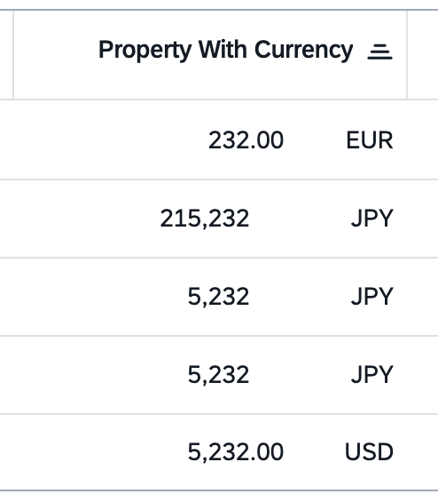

<!-- loiof6cf7157273845f0ac7c447fe153cd90 -->

# Displaying Amount with Currency or Unit of Measure

> ### Note:  
> This topic is only applicable to SAP Fiori elements for OData V4.

In a table in display mode, amounts with a currency or a unit of measure are aligned as follows:

-   The amount is aligned on the decimal separator \(if any\).
-   The currency or unit of measure is aligned to the right.

  
  
**Alignment of Amount with Currency**



To ensure a correct alignment of the amount, a default decimal padding of 5 is used for currencies and 3 for units of measure. You can change this decimal padding for your app. To do so, use the dedicated manifest keys `currency` and `unitOfMeasure` as shown in the following sample code:

> ### Sample Code:  
> `manifest.json`
> 
> ```
> "sap.fe": {
>     "macros": {
>         "table": {
>             "currency": {
>                 "decimalPadding": 5
>             },
>             "unitOfMeasure": {
>                 "decimalPadding": 3
>             }
>         }
>     }
> }
> ```

You can preserve the exact decimal places returned from the back end for currency values with `peserveDecimalsForCurrency`, as shown in the following sample code:

> ### Sample Code:  
> `manifest.json`
> 
> ```
> 
> "sap.fe": {
>     "app": {
>         "preserveDecimalsForCurrency": true
>     }
> }
> 
> ```

You can limit the number of decimals to the number of decimals defined for the unit with `showOnlyUnitDecimals`, as shown in the following sample code:

> ### Sample Code:  
> `manifest.json`
> 
> ```
> 
> "sap.fe": {
>     "app": {
>        "showOnlyUnitDecimals": true
>     }
> }
> 
> ```

