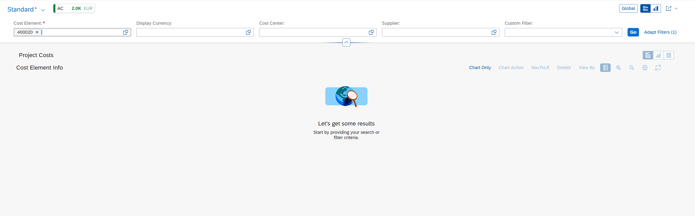
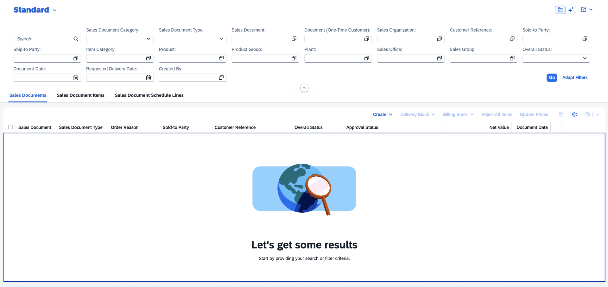
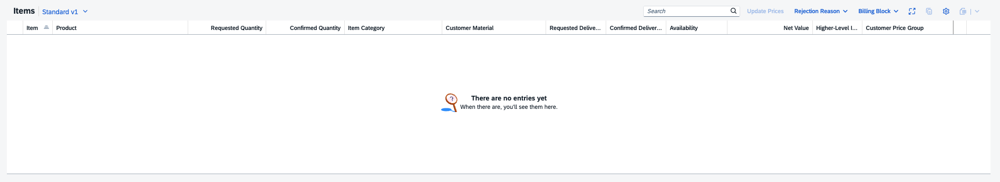

<!-- loiodee77bd88b4244138d16a0d48a89bb50 -->

# Displaying an Illustrated Message When No Data Is Found

You can modify the illustrated message displayed when no data is found for a table or a chart.

> ### Note:  
> For information about SAP Fiori elements for OData V4, see [Displaying An Illustrated Message When No Data Is Found](displaying-an-illustrated-message-when-no-data-is-found-f9925b6.md).

The illustration, the title of the message, and its description depend on the situation in which they are displayed: no items created within the table or chart, no applied filters, or search query.

  
  
**Illustrated Message in a Chart on List Report Page**

On the list report page, the size of the illustrated message adapts to the available space for the table, as shown in the following screenshot:

  
  
**Illustrated Message in a Table on the List Report Page**

On the object page in anchor bar mode, the size of the illustrated message is reduced to keep optimal information density, as shown in the following screenshot:

  
  
**Illustrated Message in a Table on the Object Page in Anchor Bar Mode**

In icon tab bar mode, if the section contains only a table, the size of the illustrated message adapts to the available space for the table similarly to the list report page.

You can override standard illustrated message texts by adding specific keys to the `i18n` file of the list report page, analytical list report page, and object page. For a list of the keys, see [Localization of UI Texts](localization-of-ui-texts-91b525b.md).

