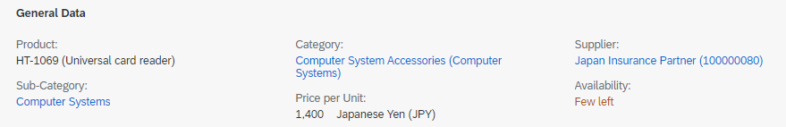

<!-- loio080886d8d4af4ac6a68a476beab17da3 -->

# Displaying Text and ID for Value Help Input Fields

You can configure object pages to show both text and ID for value help input fields in *Edit* and *Display* modes.


<a name="loio080886d8d4af4ac6a68a476beab17da3__section_q2k_ytx_jnb"/>

## Edit Mode

By default, you can enter a new value that is not defined in the value help. If the `textArrangement` annotation is defined, then the value help entity fetches and displays both text and ID, as per the annotation.


`textArrangement` is defined at the entity level or at the individual field level. The individual field level takes precedence over the entity level.


### Defining `textArrangement` at Entity Level

> ### Sample Code:  
> XML Annotation
> 
> ```xml
> 
> <Annotations Target="STTA_SALES_ORDER_ND_SRV_01.STTA_C_SO_SalesOrder_NDType">
>      <Annotation Term="com.sap.vocabularies.UI.v1.TextArrangement" EnumMember="com.sap.vocabularies.UI.v1.TextArrangementType/TextLast"/>
>  </Annotations>
> 
> ```

> ### Sample Code:  
> ABAP CDS Annotation
> 
> ```
> 
> @UI.TextArrangement: #TEXT_LAST
> annotate view STTA_C_SO_SALESORDER_ND with {
> 
> }
> ```

> ### Sample Code:  
> CAP CDS Annotation
> 
> ```
> 
> annotate STTA_SALES_ORDER_ND_SRV_01.STTA_C_SO_SalesOrder_NDType @(
>   UI.TextArrangement : #TextLast
> );
> ```


### Defining `textArrangement` at the Field Level

> ### Sample Code:  
> XML Annotation
> 
> ```xml
> 
>  <Annotations Target="STTA_SALES_ORDER_ND_SRV_01.STTA_C_SO_SalesOrder_NDType/BusinessPartnerID">
>        <Annotation Term="com.sap.vocabularies.UI.v1.TextArrangement" EnumMember="com.sap.vocabularies.UI.v1.TextArrangementType/TextOnly"/>
>  </Annotations>
> 
> ```

> ### Sample Code:  
> ABAP CDS Annotation
> 
> ```
> 
> annotate view STTA_C_SO_SALESORDER_ND with {
>   @UI.TextArrangement: #TEXT_ONLY
>   businesspartnerid;
> }
> ```

> ### Sample Code:  
> CAP CDS Annotation
> 
> ```
> 
> annotate STTA_SALES_ORDER_ND_SRV_01.STTA_C_SO_SalesOrder_NDType {
>   @UI.TextArrangement : #TextOnly
>   BusinessPartnerID
> };
> ```


### Client Validation Against Value Help

You can use the `ValueListForValidation` annotation to configure the client side validation for value help fields in the object page forms. These annotations are checked at the client against the value help \(`ValueList`\) entity set associated to the field.

You can use `ValueListForValidation` annotations under property level annotations:

> ### Sample Code:  
> `Common.ValueListForValidation`
> 
> ```
> <Annotations Target="STTA_PROD_MAN.STTA_C_MP_ProductType/Supplier" xmlns="http://docs.oasis-open.org/odata/ns/edm">
> 	<Annotation Term="Common.ValueListForValidation" String=""/>
> 	<Annotation Term="Common.ValueList">
> 		...Definition of ValueList...
> 	</Annotation>
> </Annotations>
> 
> ```

> ### Note:  
> -   `ValueListForValidation` works only in cases where no qualifier is set, that is, `String=""`.
> 
> -   User input that does not match the entries in the `ValueListForValidation` isn't stored in the back end \(not even for drafts\).


<a name="loio080886d8d4af4ac6a68a476beab17da3__section_dbd_xcp_fdc"/>

## Additional Features in SAP Fiori Elements for OData V2


### Edit Mode

Entering a new value that is not defined in the value help is ensured with the `TextInEditModeSource = ValueListNoValidation` configuration by default.

> ### Note:  
> This is only supported in object page forms and is not supported in tables.

`sap.ui.comp.smartfield.TextInEditModeSource.ValueList` enumeration members are supported in the following cases only:

-   The value property of the `SmartField` control instance is bound to an Entity Data Model \(EDM\) property type as `Edm.String` or `Edm.Guid`.

-   The `com.sap.vocabularies.UI.v1.TextArrangement` annotation for the bound EDM property or entity type is specified in the service metadata document or annotation file.

-   The binding mode for the value property of the `SmartField` control is set as a two-way binding.

-   The field from which the description is fetched is filterable.


If any of these conditions are not met, only the ID is displayed in the field.


### Display Mode

You can display both the text and ID of a `SmartField` that has a value list. To do so, specify `sap:text` directed to the navigation property of the value help from which the application fetches the description.

> ### Sample Code:  
> Modeling `sap:text` Using a Navigation Path
> 
> ```
> 
>    <Property Name="BusinessPartnerID" Type="Edm.String" Nullable="false" MaxLength="10" sap:display-format="UpperCase" sap:text="to_BusinessPartner/CompanyName" sap:label="Business Partner ID" sap:value-list="standard"/>
> 
> 
> <Annotations Target="STTA_SALES_ORDER_ND_SRV_01.STTA_C_SO_SalesOrder_NDType">
>          <Annotation Term="com.sap.vocabularies.UI.v1.TextArrangement" EnumMember="com.sap.vocabularies.UI.v1.TextArrangementType/TextLast"/> 
>  </Annotations>
> 
> ```

If this modeling is not done, text can also be fetched from the value help entity by defining the text arrangement as follows:

> ### Sample Code:  
> Modeling `sap:text` Using Value Help Entity
> 
> ```
> 
> <EntityType Name="C_CostCenterVHType" sap:label="Cost Center Value Help" sap:value-list="true"
>                 sap:content-version="1">
>                 <Key>
>                     <PropertyRef Name="CostCenter" />
>                 </Key>
>                 <Property Name="CostCenter" Type="Edm.String" Nullable="false" MaxLength="10"
>                     sap:display-format="UpperCase" sap:text="CostCenter_Text" sap:label="Cost Center" />
>                 <Property Name="CostCenter_Text" Type="Edm.String" MaxLength="20" sap:label="Cost Center Name"
>                     sap:creatable="false" sap:updatable="false" />
> </EntityType>
> 
> <Annotations Target="COST_CENTERS_SRV.C_CostCenterVHType"
>                 xmlns="http://docs.oasis-open.org/odata/ns/edm">
>      <Annotation Term="com.sap.vocabularies.UI.v1.TextArrangement"
>                     EnumMember="com.sap.vocabularies.UI.v1.TextArrangementType/TextLast" />
> </Annotations>
> 
> ```



For `DataField` record types that are bound to value help and rendered as a `SmartLink` using `SemanticObject` definition or the quick view, the value shows the descriptive text and the ID by default.

For `DataFieldWithNavigationPath` record types, when the value is bound to the value help, the field shows the descriptive text and the ID by default.

This behavior is applicable for tables, object page headers, and object page form sections. You can change it according to your requirements by using the `TextArrangement` configuration, such as `TextFirst`, `TextLast`, or `TextOnly`.

The functionality is not supported for the following record types:

-   `DataFieldWithIntentBasedNavigation`

-   `Communication.Contact`


If text arrangement is defined with `textSeparate`, only the ID is displayed.


<a name="loio080886d8d4af4ac6a68a476beab17da3__section_gsy_rfp_fdc"/>

## Additional Features in SAP Fiori Elements for OData V4


### Display Mode

For `DataField` record types that are bound to value help and rendered as a link using `SemanticObject` definition or the quick view, the value shows the descriptive text and the ID by default.

For `DataFieldWithNavigationPath` record types, when the value is bound to the value help, the field shows the descriptive text and the ID by default.

This behavior is applicable for tables, object page headers, and object page form sections. You can change it according to your requirements by using the `TextArrangement` configuration, such as `TextFirst`, `TextLast`, or `TextOnly`. For more information, see [Further Features of the Field](further-features-of-the-field-f49a0f7.md).

