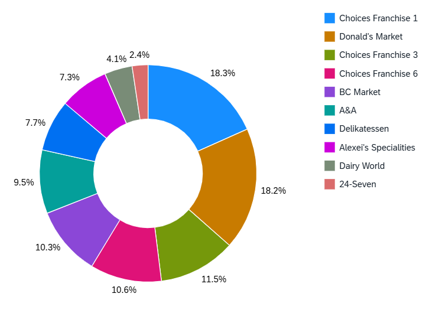

<!-- loio87a17ebef87c4b769783c57e50cc04c5 -->

# Donut Chart

You can render the chart as a donut chart in SAP Fiori elements for OData V4.

A donut chart displays data as differently colored sections of a donut.

  
  
**Example of a Donut Chart**

The value of the measure determines the size of each section. Donut charts help the viewer to quickly determine the key area that needs attention. For example, you can view numbers and percentages.

Donut charts require exactly one measure. You can provide more than one dimension. If this is the case, the dimensions are stacked so that the sections of the chart represent the combination of all dimensions. For example, if you define **Sales** as your measure, and provide two dimensions: **Year** and **Country**, the chart displays the sales data of each combination of year and country as a separate colored section.

> ### Note:  
> For information about donut chart cards on the overview page, see [Donut Chart Card](donut-chart-card-ee36513.md).

