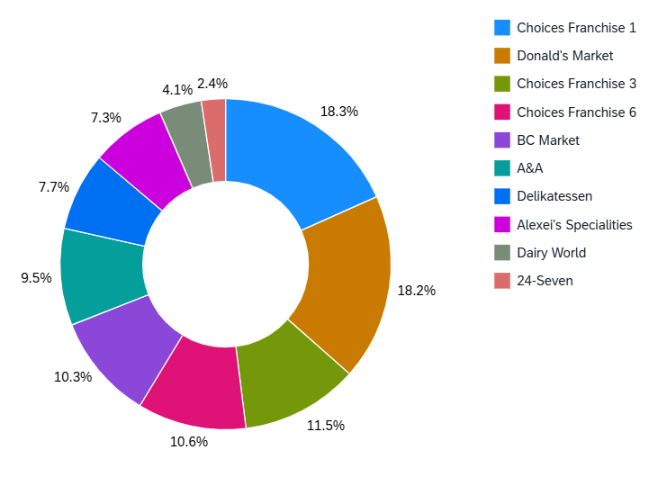

<!-- loio87a17ebef87c4b769783c57e50cc04c5 -->

# Donut Chart Card

A donut chart displays data as the differently colored sections of a donut.

The value of the measure determines the size of each section. Donut charts help the viewer to quickly determine the key area that needs attention. For example, you can view numbers and percentages. You can also disable navigation in the graph \(optional\).


Donut charts require exactly one measure. You can provide more than one dimension. If this is the case, the dimensions are stacked so that the sections of the chart represent the combination of all dimensions. For example, if you define **Sales** as your measure, and provide two dimensions: **Year** and **Country**, the chart displays the sales data of each combination of year and country as a separate colored section.


### Example for displaying percentages

> ### Sample Code:  
> ```
> "ChartProperties" : {
> 			"plotArea" : {
> 				dataLabel: {
> 					"type" : “percentage”
> 					}
> 				}
> 			}
> 
> ```


<a name="loio87a17ebef87c4b769783c57e50cc04c5__section_nby_lkz_y4b"/>

## Stable Coloring

You can now assign specific colors to the sections in the donut chart. Each color can be assigned to a particular dimension value. To enable this feature:

-   Configure a color map object that maps the key-value pairs between dimension and color values in the `colorPalette` property of the descriptor configuration.

-   Enable stable coloring by setting the `bEnableStableColors` property to **true** in card settings.

-   The chart dimension property \(`Role`\) in the chart annotation has to be a `Category`.

-   Define the `com.sap.vocabularies.Common.v1.Text` annotation for a dimension property within the entity type. This is considered to be a label for any individual dimensions value and also for rendering appropriate texts in the chart's legend.


<a name="loio87a17ebef87c4b769783c57e50cc04c5__section_ec4_nkz_y4b"/>

## Others Sector

You can pass filter conditions to target applications other than the dimensions shown on the donut chart. For example, in a donut chart with the sections A, B, C, and Others, navigation from Others section leads to a filter condition that excludes A, B, and C.


  
  
**Example of a Donut Chart Card**

  

