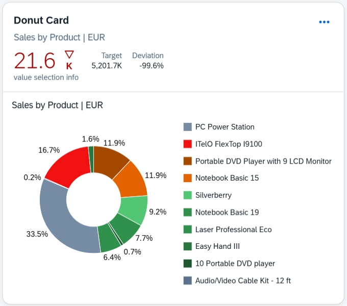

<!-- loioee3651342afe4b7f84e8f9749bd3887f -->

# Donut Chart Card

You can render the chart as a donut chart, which displays data as the differently colored sections of a donut.

  
  
**Example of a Donut Chart Card**



The size of each section is determined by the value of the measure, helping users quickly identify the key area that needs attention. Donut charts can display numbers and percentages, and you can optionally disable navigation from the chart.

Donut charts have the following requirements:

-   Exactly one measure

-   More than one dimension. If multiple dimensions are defined, they are stacked. The sections of the chart then represent the combination of all dimensions.


For example, if you define `Sales` as your measure, and provide two dimensions: `Year` and `Country`, the chart displays the sales data of each combination of year and country as a separate colored section.

The following sample code how to define a donut chart:

> ### Sample Code:  
> XML Annotation
> 
> ```
> <Annotation Term="UI.Chart" Qualifier="DonutChartSales">
>   <Record Type="UI.ChartDefinitionType">
>     <PropertyValue Property="Title" String="Sales Distribution"/>
>     <PropertyValue Property="Description" String="Sales by Region"/>
>     <PropertyValue Property="ChartType" EnumMember="UI.ChartType/Donut"/>
>     <PropertyValue Property="Measures">
>       <Collection>
>         <PropertyPath>NetSales</PropertyPath>
>       </Collection>
>     </PropertyValue>
>     <PropertyValue Property="Dimensions">
>       <Collection>
>         <PropertyPath>Region</PropertyPath>
>       </Collection>
>     </PropertyValue>
>     <PropertyValue Property="MeasureAttributes">
>       <Collection>
>         <Record Type="UI.ChartMeasureAttributeType">
>           <PropertyValue Property="Measure" PropertyPath="NetSales"/>
>           <PropertyValue Property="Role" EnumMember="UI.ChartMeasureRoleType/Axis1"/>
>         </Record>
>       </Collection>
>     </PropertyValue>
>     <PropertyValue Property="DimensionAttributes">
>       <Collection>
>         <Record Type="UI.ChartDimensionAttributeType">
>           <PropertyValue Property="Dimension" PropertyPath="Region"/>
>           <PropertyValue Property="Role" EnumMember="UI.ChartDimensionRoleType/Category"/>
>         </Record>
>       </Collection>
>     </PropertyValue>
>   </Record>
> </Annotation>
> ```

> ### Sample Code:  
> ABAP CDS Annotation
> 
> ```
> @UI.chart: [
>   {
>     qualifier: 'DonutChartSales',
>     title: 'Sales Distribution',
>     description: 'Sales by Region',
>     chartType: #DONUT,
>     measures: [ 'NetSales' ],
>     dimensions: [ 'Region' ],
>     measureAttributes: [
>       {
>         measure: 'NetSales',
>         role: #AXIS_1
>       }
>     ],
>     dimensionAttributes: [
>       {
>         dimension: 'Region',
>         role: #CATEGORY
>       }
>     ]
>   }
> ]
> ```

> ### Sample Code:  
> CAP CDS Annotation
> 
> ```
> @UI.Chart #DonutChartSales: {
>   Title: 'Sales Distribution',
>   Description: 'Sales by Region',
>   ChartType: #Donut,
>   Measures: [ NetSales ],
>   Dimensions: [ Region ],
>   MeasureAttributes: [
>     {
>       Measure: NetSales,
>       Role: #Axis1
>     }
>   ],
>   DimensionAttributes: [
>     {
>       Dimension: Region,
>       Role: #Category
>     }
>   ]
> }
> ```


## Displaying Percentages

To display values as percentages, configure the `ChartProperties` setting with `dataLabel.type` set to `percentage`, as shown in the following sample code:

> ### Sample Code:  
> ```
> "ChartProperties" : {
> 			"plotArea" : {
> 				dataLabel: {
> 					"type" : "percentage"
> 					}
> 				}
> 			}
> 
> ```


<a name="loioee3651342afe4b7f84e8f9749bd3887f__section_nby_lkz_y4b"/>

## Stable Coloring

You can assign specific colors to sections of the donut chart. Each color can be assigned to a particular dimension value. To enable this feature, perform the following configurations:

-   Define a color map object in the `colorPalette` property of the `manifest.json` file. This object associates key-value pairs between dimension and color values.

-   Enable stable coloring by setting the `bEnableStableColors` property to `true` in card settings.

-   Set the `Role`, chart dimension property in the chart annotation has to be a `Category`.

-   Define the `com.sap.vocabularies.Common.v1.Text` annotation for a dimension property within the entity type. This text is used as the label for individual dimensions value and also for rendering appropriate texts in the chart's legend.


<a name="loioee3651342afe4b7f84e8f9749bd3887f__section_ec4_nkz_y4b"/>

## Others Sector

A donut chart can group remaining data into an *Others* sector. You can pass filter conditions to target applications for sectors other than those explicitly shown on the chart.

For example, in a donut chart with the sections A, B, C, and Others, navigation from Others section leads to a filter condition that excludes A, B, and C.

