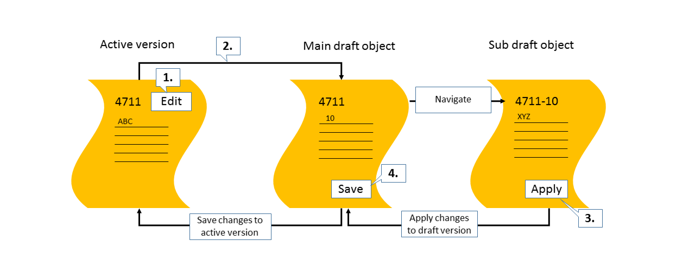
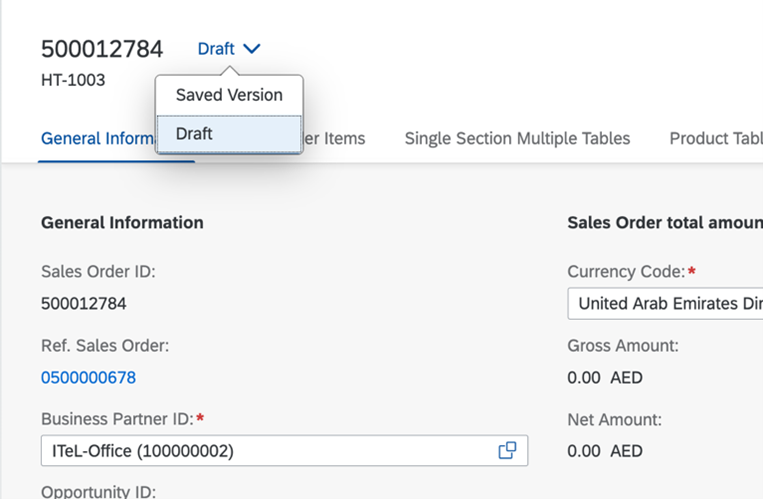
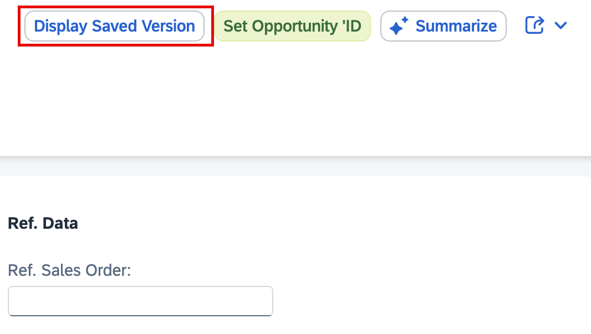

<!-- loiob0eb3cc0e69a46ef99735c58566a7bf8 -->

# Draft Handling

You can configure how your SAP Fiori elements app handles drafts.

> ### Note:  
> For information about SAP Fiori elements for OData V4, see [Draft Handling](draft-handling-ed9aa41.md).

A draft is an interim version of a business entity that has not yet been explicitly saved as an active version.SAP Fiori elements supports the creation of apps that use draft handling.

Drafts are used as follows:

-   To keep unsaved changes when an editing activity is interrupted. This lets users resume editing later.

-   To prevent data loss if an app terminates unexpectedly.

-   As a locking mechanism to prevent multiple users from editing the same object at the same time, and to inform users about unsaved changes by another user.


When a user starts creating a new business entity or edits an existing one, a draft is created in the background. This enables field validation and dynamic field control \(showing additional fields based on user interaction\) and provides default values for fields based on recent data entry. A draft can be validated for consistency and completeness at any time. This returns a list of messages.

While the user is modifying a business entity, an indicator shows when a draft is saved implicitly. The user still needs to choose *Save* to incorporate the changes into an active business document.

Drafts are saved automatically in the background after an interval of 20 seconds whenever users add or change information within a business entity while it's in edit mode. However, if the user has modified a field on the UI that has a side effect annotation, then the draft is saved immediately after the user moves out of the virtual field group of the corresponding side effect. The draft is also saved immediately when the user executes an action. In this case, the pending changes in the draft are also saved immediately.

You can turn off the feature to delay draft merges in `manifest.json` in exceptional cases using the following sample code:

> ### Sample Code:  
> Settings in `manifest.json`
> 
> ```
> "sap.ui.generic.app": {
>     "settings": {
>         "draftSettings": {
>             "dataSaveFrequency": "immediate"
>         }
>     }
> }
> 
> ```

You can use keyboard shortcuts for common tasks.

When a user toggles away from the draft version, any pending changes are automatically saved and are visible in the active version.


<a name="loiob0eb3cc0e69a46ef99735c58566a7bf8__section_mvv_ts2_pmb"/>

## Using the *Apply* Button

The footer bar of a subobject page contains an *Apply* button in create mode and edit mode. When users choose this button they can conclude their current create or edit activity, apply the changes or entries to the draft, and navigate one step up in the object hierarchy.

When a user edits an object, the system behavior of the *Apply* button is as follows: 

1.  On an object page, the user chooses *Edit*.

2.  The system creates a draft version of the object.

3.  The user makes changes to the draft version of the object and navigates to a detail page. When the user chooses *Apply*, the changes are applied to the draft.

4.  When the user chooses *Save*, the changes are saved to the active version of the object.


> ### Note:  
> If the `DiscardAction` has been defined in the `DraftRoot` annotation, the `DiscardAction` is called if the user chooses to delete the draft. If the `DiscardAction` has not been defined, the `Delete` call is triggered instead.


<a name="loiob0eb3cc0e69a46ef99735c58566a7bf8__section_ysr_zrm_mtb"/>

## Switching Between the Draft and Saved Version

Users can switch between the draft and saved version using a dropdown in applications that have the dynamic header.

  
  
**Dynamic Header**



Users can switch between the draft and saved version using a toggle button in applications that have the static or classic header.


### Switching Between the Draft and Saved Version - Internal Only!!!

  
  
**Static/Classic Header**




### Preparing the Draft for Activation on Tablet and Mobile Devices

The object page displays the *Validate* button to execute the `PreparationAction` call. The side effects, if configured, are also triggered along with the validate action.


<a name="loiob0eb3cc0e69a46ef99735c58566a7bf8__section_qvv_ts2_pmb"/>

## Handling Inconsistent Input

Users might enter data that is so inconsistent that the system cannot store it in the draft. For example, characters are entered in a number field, or more characters than the field length allows are entered. If this is the case, the contents of the UI differ from the contents of the draft. Before the draft can be saved by the user, the system displays a message prompting the users to solve these errors. After all errors have been solved, the draft can be saved.

This system behavior is also valid when using the *Apply* button. When choosing *Apply*, the system has to make sure that the contents on the UI and the stored contents of the draft are identical. If the errors described above occur, the system displays the same message prompting the user to solve them.

> ### Note:  
> This message lists only errors related to technical inconsistencies, not to logical inconsistencies. For example, if a user enters a business partner that does not exist, this error is not displayed. These types of errors are displayed in a state message when saving the object.


<a name="loiob0eb3cc0e69a46ef99735c58566a7bf8__section_i5f_syc_fhc"/>

## Preparing the Draft for Activation by Pressing [Enter\]

On a draft version of a document, if you press [Enter\] on input fields, by default the draft validation \(`PreparationAction` available on the `DraftRoot`\) is triggered. The `PreparationAction` performs a validation in the back end for the draft values and sends back validation messages if they're available. The pending changes on the draft, if any, are also saved before validating the draft instance.

The `PreparationAction` that is defined within the `DraftRoot` is called, even if you've pressed [Enter\] in the fields of the object page table, or in the subobject pages.

The side effects, if configured, are also triggered upon pressing [Enter\]. The `PreparationAction` call is skipped if you've annotated `TriggerAction` in the global side effects under the corresponding entity. In this case, `TriggerAction` is called instead of `PreparationAction`. However, in case of side effects annotated with source properties and `TriggerAction`, `PreparationAction` call is not impacted. For more information, see [Using Global Side Effects](using-global-side-effects-1c90f8d.md).

**Related Information**  


[https://experience.sap.com/fiori-design-web/draft-handling/](https://experience.sap.com/fiori-design-web/draft-handling/)

[https://help.sap.com/docs/SAP\_NETWEAVER\_AS\_ABAP\_752/cc0c305d2fab47bd808adcad3ca7ee9d/d36820f082c84085b6634be4576e351a.html](https://help.sap.com/docs/SAP_NETWEAVER_AS_ABAP_752/cc0c305d2fab47bd808adcad3ca7ee9d/d36820f082c84085b6634be4576e351a.html)

[Confirmation Popups](confirmation-popups-062078f.md "You can configure confirmation popups for various list report page and object page use cases.")

[Using Global Side Effects](using-global-side-effects-1c90f8d.md "You can configure global side effects.")

[Toggling Between Draft and Saved Values](toggling-between-draft-and-saved-values-11f948a.md "You can toggle between draft and saved values.")

