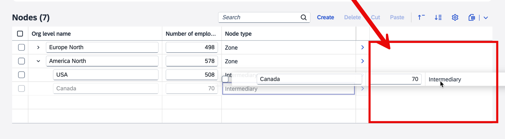
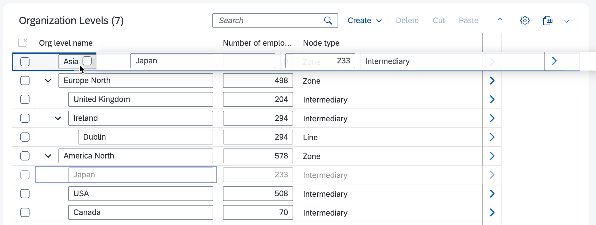
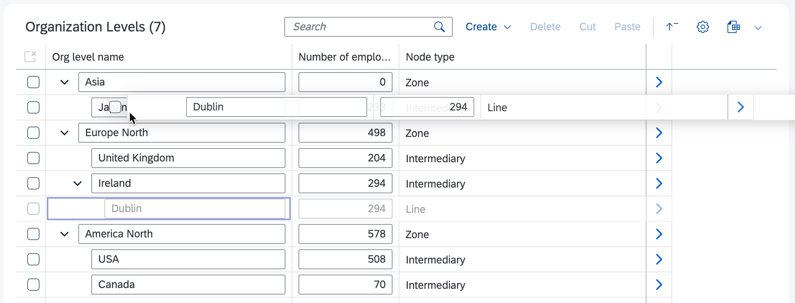

<!-- loiod2823f30a6e7486ba508350eccbe87e5 -->

# Drag and Drop in Tree Tables

Drag and drop functionality in tree tables enables users to reorganize hierarchical data by moving nodes between siblings or promoting them to root level in SAP Fiori elements for OData V4. Use extensions to restrict movements based on node types and business needs.

Drag and drop actions are supported as of SAPUI5 1.124.

Drag and drop between siblings is supported if the `ChangeNextSiblingAction` term is defined in the `RecursiveHierarchyActions` annotation. When using the ABAP RESTful Application Programming Model \(RAP\), this annotation is not set for root entities. For this reason, drag and drop between siblings is not supported on the list report page.

If a node is dropped onto the empty area on the right-hand side of a table, the node is promoted to a root node. In the following example, dropping the "Canada" node onto the highlighted area turns it into a root node, that is, a sibling to the "Europe North" and "America North" nodes.

  
  
**Dropping a Node onto the Empty Right-Hand Side of a Table**



You can use the following extensions to control the behavior of drag and drop:

-   `isMoveToPositionAllowed`: Define if a source node can be dropped on a specific parent node.

    -   The associated callback receives the source and target contexts as parameters.

    -   When dropping as a root node, the parent node is set to `null`.

-   `isNodeMovable`: Define if a node can be dragged.

    -   The associated callback receives the source context as a parameter.


In the following example: drag and drop is enabled.

> ### Sample Code:  
> `manifest.json`
> 
> ```json
> "tableSettings": {
>     "type": "TreeTable",
>     "hierarchyQualifier": "NodesHierarchy",
>     "personalization": true,
>     "creationMode": {...},
>     "isMoveToPositionAllowed": ".extension.hierarchy-edit.custom.OPExtend.moveToPositionAllowed",
>     "isNodeMovable": ".extension.hierarchy-edit.custom.OPExtend.nodeMovable"
> }
> ```

In the following example: `ControllerExtension` is used to control the behavior of drag and drop.

> ### Sample Code:  
> `manifest.json`
> 
> ```json
> sap.ui.define(["sap/ui/core/mvc/ControllerExtension"], function (ControllerExtension) {
>     "use strict";
>  
>     return ControllerExtension.extend("hierarchy-edit.custom.OPExtend", {
>         // this section allows to extend lifecycle hooks or override public methods of the base controller
>  
>         //Callback for Drop and Paste actions
>         moveToPositionAllowed: function (sourceContext, parentContext) {
>             switch (parentContext?.getProperty("nodeType")) {
>                 case "Zone":
>                     return sourceContext?.getProperty("nodeType") === "Intermediary"; //Only 'Intermediary' under a 'Zone'
>  
>                 case "Intermediary":
>                     return  sourceContext?.getProperty("nodeType") === "Line" && sourceContext?.getProperty("name") !== 'Dublin'; // Only 'Line' under 'Intermediary' AND 'Dublin' node cannot be moved
>  
>                 case "Line":
>                     return false; // Nothing under 'Line'
>  
>                 default:
>                     return false;
>             }
>         },
>  
>         //Callback for Drag and Cut actions
>         nodeMovable: function (sourceContext) {
>             return sourceContext?.getProperty("name") !== 'USA'; // 'USA' node cannot be moved or cut
>         }
>     });
> });
> ```

The following screenshot shows an example of the outcome. The user can drag and drop the "Japan" node under "Asia".

  
  
**Example of Dropping a Node Under a Parent Node**



The following screenshot shows another example of the outcome. Moving the "Dublin" node is forbidden, so the target node is not highlighted.

  
  
**Example of a Forbidden Move**



