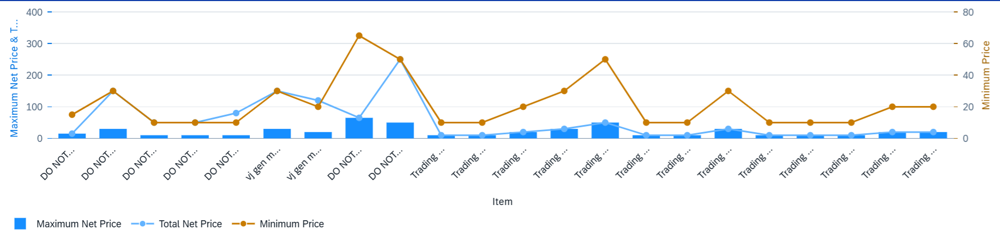

<!-- loio94dc2af368ae4309a66f23cc7b48b739 -->

# Dual Combination Chart Card

You can render the chart as a dual combination chart, which lets users view individual data points for a particular dimension. It contains two axis values, with a line chart representing the multiple measures.

  
  
**Example of a Dual Combination Chart Card**



A dual combination chart has the following requirements:

-   At least two measures.

-   At least one dimension with the `Category` role assigned to the category axis. `Category` is the default role.


> ### Note:  
> We recommend using only one time-based dimension for the category axis.

Measures are assigned to the feed's UID value axis, irrespective of their roles. They are visualized based on their position in the annotation:

-   The first measure is displayed as a column chart.

-   Each subsequent measure is displayed as a line within the chart.


> ### Note:  
> The `Role` property is ignored for measures in a dual combination chart. Measures are assigned to the value axis regardless of role.

All dimensions with the **Category** role are assigned to the category axis. The **Category** role is the default role.

The following sample code how to define a dual combination chart:

> ### Sample Code:  
> XML Annotation
> 
> ```
> <Annotation Term="UI.Chart" Qualifier="Eval_by_CtryCurr_Dual_Combo">
>                         <Record Type="UI.ChartDefinitionType">
>                         <PropertyValue Property="Title" String="Dual Combination Chart" />
>                         <PropertyValue Property="ChartType" EnumMember="UI.ChartType/CombinationDual"/>
>                         <PropertyValue Property="Measures">
>                             <Collection>
>                                 <PropertyPath>Sales</PropertyPath>
>                                 <PropertyPath>SalesShare</PropertyPath>
>                                 <PropertyPath>TotalSales</PropertyPath>
>                             </Collection>
>                         </PropertyValue>
>                         <PropertyValue Property="Dimensions">
>                             <Collection>
>                                 <PropertyPath>Product</PropertyPath>
>                                 <PropertyPath>Quarter</PropertyPath>
>                             </Collection>
>                         </PropertyValue>
>                         <PropertyValue Property="MeasureAttributes">
>                             <Collection>
>                                 <Record Type="UI.ChartMeasureAttributeType">
>                                     <PropertyValue Property="Measure" PropertyPath="Sales"/>
>                                     <PropertyValue Property="Role"
>                                         EnumMember="UI.ChartMeasureRoleType/Axis1"/>
>                                 </Record>
>                                 <Record Type="UI.ChartMeasureAttributeType">
>                                     <PropertyValue Property="Measure" PropertyPath="TotalSales" />
>                                     <PropertyValue Property="Role" EnumMember="UI.ChartMeasureRoleType/Axis1"/>
>                                 </Record>
>                                 <Record Type="UI.ChartMeasureAttributeType">
>                                     <PropertyValue Property="Measure" PropertyPath="SalesShare" />
>                                     <PropertyValue Property="Role" EnumMember="UI.ChartMeasureRoleType/Axis2"/>
>                                 </Record>
>                             </Collection>
>                         </PropertyValue>
>                         <PropertyValue Property="DimensionAttributes">
>                             <Collection>
>                                 <Record Type="UI.ChartDimensionAttributeType">
>                                     <PropertyValue Property="Dimension" PropertyPath="Product" />
>                                     <PropertyValue Property="Role" EnumMember="UI.ChartDimensionRoleType/Category"/>
>                                 </Record>
>                             </Collection>
>                         </PropertyValue>
>                     </Record>
>                 </Annotation>
> ```

> ### Sample Code:  
> ABAP CDS Annotation
> 
> ```
> @UI.chart: [{
>     qualifier: 'Eval_by_CtryCurr_Dual_Combo',
>     title: 'Dual Combination Chart',
>     chartType: #COMBINATION_DUAL,
> 
>     measures: [
>         'Sales',
>         'SalesShare',
>         'TotalSales'
>     ],
> 
>     dimensions: [
>         'Product',
>         'Quarter'
>     ],
> 
>     measureAttributes: [
>         {
>             measure: 'Sales',
>             role: #AXIS_1
>         },
>         {
>             measure: 'TotalSales',
>             role: #AXIS_1
>         },
>         {
>             measure: 'SalesShare',
>             role: #AXIS_2
>         }
>     ],
> 
>     dimensionAttributes: [
>         {
>             dimension: 'Product',
>             role: #CATEGORY
>         }
>     ]
> }]
> ```

> ### Sample Code:  
> CAP CDS Annotation
> 
> ```
> annotate service.SalesEntity with @(
>     UI.Chart #Eval_by_CtryCurr_Dual_Combo : {
>         Title     : 'Dual Combination Chart',
>         ChartType : #CombinationDual,
> 
>         Measures : [
>             Sales,
>             SalesShare,
>             TotalSales
>         ],
> 
>         Dimensions : [
>             Product,
>             Quarter
>         ],
> 
>         MeasureAttributes : [
>             {
>                 Measure : Sales,
>                 Role    : #Axis1
>             },
>             {
>                 Measure : TotalSales,
>                 Role    : #Axis1
>             },
>             {
>                 Measure : SalesShare,
>                 Role    : #Axis2
>             }
>         ],
> 
>         DimensionAttributes : [
>             {
>                 Dimension : Product,
>                 Role      : #Category
>             }
>         ]
>     }
> );
> ```

