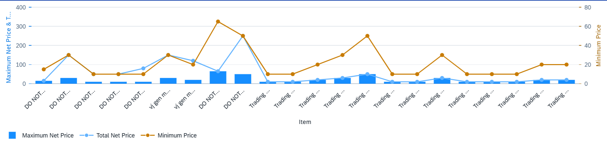

<!-- loioc406c18b07224eb2a10fc792f547c629 -->

# Dual Combination Chart Card

A dual combination chart type lets you view individual data points for a particular dimension.

The chart contains two axis values with a line chart representing the multiple measures.

Chart area configuration:

-   The first measure is displayed as a column chart type and subsequent measures display as a line within the chart.

-   We recommend using only one time-based dimension for the category axis.

-   Configure at least two measures. Assign the measures to the feed's UID value axis, irrespective of the roles.

-   Assign at least one role to the category axis. All dimensions with the **Category** role are assigned to the category axis. The **Category** role is the default role.


> ### Sample Code:  
> ```
> <Annotation Term="UI.Chart" Qualifier="Eval_by_CtryCurr_Dual_Combo">
>                         <Record Type="UI.ChartDefinitionType">
>                         <PropertyValue Property="Title" String="Dual Combination Chart" />
>                         <PropertyValue Property="ChartType" EnumMember="UI.ChartType/CombinationDual"/>
>                         <PropertyValue Property="Measures">
>                             <Collection>
>                                 <PropertyPath>Sales</PropertyPath>
>                                 <PropertyPath>SalesShare</PropertyPath>
>                                 <PropertyPath>TotalSales</PropertyPath>
>                             </Collection>
>                         </PropertyValue>
>                         <PropertyValue Property="Dimensions">
>                             <Collection>
>                                 <PropertyPath>Product</PropertyPath>
>                                 <PropertyPath>Quarter</PropertyPath>
>                             </Collection>
>                         </PropertyValue>
>                         <PropertyValue Property="MeasureAttributes">
>                             <Collection>
>                                 <Record Type="UI.ChartMeasureAttributeType">
>                                     <PropertyValue Property="Measure" PropertyPath="Sales"/>
>                                     <PropertyValue Property="Role"
>                                         EnumMember="UI.ChartMeasureRoleType/Axis1"/>
>                                 </Record>
>                                 <Record Type="UI.ChartMeasureAttributeType">
>                                     <PropertyValue Property="Measure" PropertyPath="TotalSales" />
>                                     <PropertyValue Property="Role" EnumMember="UI.ChartMeasureRoleType/Axis1"/>
>                                 </Record>
>                                 <Record Type="UI.ChartMeasureAttributeType">
>                                     <PropertyValue Property="Measure" PropertyPath="SalesShare" />
>                                     <PropertyValue Property="Role" EnumMember="UI.ChartMeasureRoleType/Axis2"/>
>                                 </Record>
>                             </Collection>
>                         </PropertyValue>
>                         <PropertyValue Property="DimensionAttributes">
>                             <Collection>
>                                 <Record Type="UI.ChartDimensionAttributeType">
>                                     <PropertyValue Property="Dimension" PropertyPath="Product" />
>                                     <PropertyValue Property="Role" EnumMember="UI.ChartDimensionRoleType/Category"/>
>                                 </Record>
>                             </Collection>
>                         </PropertyValue>
>                     </Record>
>                 </Annotation>
> ```

   
  
**Example of a Dual Combination Chart Card**

  

