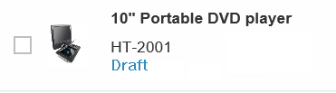
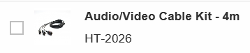
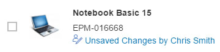

<!-- loio668ea184f58c4378a5394f54b4ae205d -->

# Editing Status

The editing status reflects the state of the object or entry in terms of the processing cycle. For example, it can give the user information about whether the item can be accessed, or about its level of completion.

<a name="loio668ea184f58c4378a5394f54b4ae205d__section_z1y_vrp_llb"/>

## Editing Status for Table Items

The list report allows users to view the editing status of the objects displayed. The editing status is calculated from the draft administrative data that is added in the back end.

**Draft Administrative Data: Visualization**

<table>
<tr>
<th valign="top">

Editing Status

</th>
<th valign="top">

Description

</th>
</tr>
<tr>
<td valign="top">

  

</td>
<td valign="top">

Draft: my own draft

</td>
</tr>
<tr>
<td valign="top">

  

</td>
<td valign="top">

Active version

</td>
</tr>
<tr>
<td valign="top">

  

</td>
<td valign="top">

Active version with draft created by another user; no longer locked

</td>
</tr>
<tr>
<td valign="top">

  

</td>
<td valign="top">

Active version with draft created by another user; locked

</td>
</tr>
</table>

<a name="loio668ea184f58c4378a5394f54b4ae205d__section_gzh_lht_ymb"/>

## Access to Administrative Data

For the statuses *Unsaved Changes by Another User* and *Locked by Another User*, the name of the user who last changed the object is visible directly in the line item in the list report \(see above\). Note that if the user's full name is not available in the master data in the back-end system, only the technical user name is displayed. If the technical name is also not available, the message then indicates that the unsaved changes or the lock on the object belongs to "another user".

In addition, for the statuses *Own Draft*, *Unsaved Changes by Another User*, and *Locked by Another User*, a link accesses a popover to allow you to view the user who last changed the object and the time of the change. Note that if the user's full name is not available in the master data in the back-end system, only the technical user name is displayed.

<a name="loio668ea184f58c4378a5394f54b4ae205d__section_tgf_4ht_ymb"/>

## Editing Status Filter

A static filter attribute is available for all applications, which is added to the filter bar of the list report for all draft-enabled applications by default. This filter allows users to search for objects or entries in a specific state.

The drop-down values are as follows:

**Drop-Down Values**

<table>
<tr>
<th valign="top">

Drop-Down Value

</th>
<th valign="top">

Description

</th>
</tr>
<tr>
<td valign="top">

 *All* 

</td>
<td valign="top">

Displays all entities

</td>
</tr>
<tr>
<td valign="top">

 *Own Draft* 

</td>
<td valign="top">

Displays a user’s own draft only

</td>
</tr>
<tr>
<td valign="top">

 *Locked by Another User* 

</td>
<td valign="top">

Displays all entities that are currently in progress by someone

</td>
</tr>
<tr>
<td valign="top">

 *Unsaved Changes by Another User* 

</td>
<td valign="top">

Displays all entities with unsaved changes \(lock expired, draft of someone is still available\)

</td>
</tr>
<tr>
<td valign="top">

 *Unchanged* 

</td>
<td valign="top">

Displays all entities that have no draft

</td>
</tr>
</table>

> ### Note:  
> The default search filter is *All*, even if the user clears the filter value.

### Disabling the Editing Status Filter

If desired, the editing status filter can be disabled after you generate your app. For more information, see [Disabling the Editing Status Filter](disabling-the-editing-status-filter-8eb695a.md).

**Related Information**  

[Handling Semantic Key Fields](handling-semantic-key-fields-aa2793c.md "Semantic key fields in tables are displayed with a special logic.")

[Settings for List Report Tables](settings-for-list-report-tables-4c2d17a.md "You can set up various aspects of the list report table through annotations and in the manifest.json file.")

