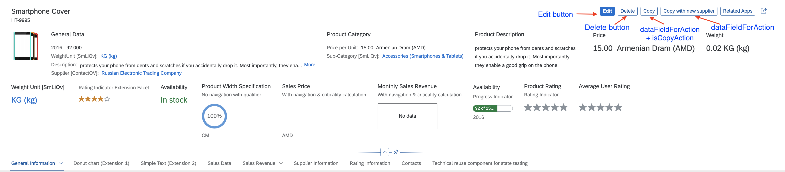
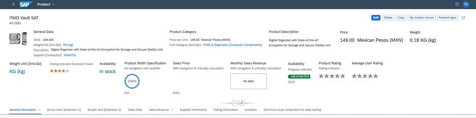

<!-- loio5fe439613f9c4e259015951594c423dc -->

# Enabling Actions in the Object Page Header

You can enable generic actions in your object header.

*Edit*, *Delete* and *Copy* are the generic actions.

All `com.sap.vocabularies.UI.v1.DataFieldForAction` within the unqualified `UI.Identification` are interpreted as actions. The system renders a button in the header displaying the text of the data field label.

   
  
**Object Page: Enable Actions in Header**

  


Annotations for the *Copy with new supplier* Button:

> ### Sample Code:  
> XML Annotation
> 
> ```xml
> <Annotation Term="UI.Identification">
>       <Collection>
>             <Record Type="UI.DataFieldForAction">
>                   <PropertyValue Property="Label" String="Copy with new supplier" />
>                   <PropertyValue Property="Action"
>                         String="STTA_PROD_MAN.STTA_PROD_MAN_Entities/STTA_C_MP_ProductCopy_new_supplier" />
>                   <Annotation Term="UI.Importance" EnumMember="UI.ImportanceType/High" />
>             </Record>
>             ...
>       </Collection>
> </Annotation>
> 
> ```

> ### Sample Code:  
> ABAP CDS Annotation
> 
> ```
> 
> @UI.identification: [
>   {
>     importance: #HIGH,
>     label: 'Copy with new supplier',
>     dataAction: 'PUSHDOWN:STTA_C_MP_ProductCopy_new_supplier',
>     type: #FOR_ACTION,
>     position: 1 
>   }
> ]
> product;
> ```

> ### Sample Code:  
> CAP CDS Annotation
> 
> ```
> 
> UI.Identification : [
>     {
>         $Type : 'UI.DataFieldForAction',
>         Label : 'Copy with new supplier',
>         Action : 'STTA_PROD_MAN.STTA_PROD_MAN_Entities/STTA_C_MP_ProductCopy_new_supplier',
>         ![@UI.Importance] : #High
>     }
> ]
> 
> ```

In SAP Fiori elements for OData V2, the object page context is always passed when a header action is invoked.

In SAP Fiori elements for OData V4, the object page context is only passed for bound header actions. For unbound actions, no context is passed.


### Edit Action on Subobject Page

The edit action is also available on the subobject page. Its behavior depends on the annotations on both levels:

-   The edit button is displayed on the subobject page only if it is also visible on the object page and if the subobject page entity is not annotated to hide it.

-   The edit button is enabled on the subobject page only if it is also enabled on the object page and if the subobject page entity is not annotated to disable it.


> ### Note:  
> Selecting the edit button on the subobject page enables the edit action for the entire object page, not just the subobject page where it was selected.


### Copy Action

The *Copy* button is not available by default. However, applications can define a standard copy action by annotating a `dataFieldForAction` with `isCopyAction`.

This *Copy* button is placed after the *Delete* button.

  

> ### Sample Code:  
> XML Annotation
> 
> ```xml
> <Annotation Term="UI.Identification">
>   <Collection>
>       <Record Type="UI.DataFieldForAction">
>           <PropertyValue Property="Label" String="Copy" />
>           <PropertyValue Property="Action" String="STTA_PROD_MAN.STTA_PROD_MAN_Entities/STTA_C_MP_ProductCopy" />
>           <Annotation Term="UI.IsCopyAction" Bool="true" />
>      </Record>
> 
> ```

> ### Sample Code:  
> CAP CDS Annotation
> 
> ```
> UI.Identification : [
>     {
>         $Type : 'UI.DataFieldForAction',
>         Label : 'Copy',
>         Action : 'STTA_PROD_MAN.STTA_PROD_MAN_Entities/STTA_C_MP_ProductCopy',
>         ![@UI.IsCopyAction] : true,
>     },
> ],
> ```

Applications can define a label for this button. If a label is not provided, then by default this button is labeled as *Copy*.

> ### Note:  
> The copy action is only available on the object page, not on the subobject pages.


<a name="loio5fe439613f9c4e259015951594c423dc__section_k41_bwx_qmb"/>

## Additional Features in SAP Fiori Elements for OData V2


### Edit and Delete Buttons

The *Edit* and *Delete* buttons are displayed as shown above, if the following conditions are met:

-   *Edit* button: `sap:updatable` is not set to `false`

-   *Delete* button: `sap:deletable` is not set to `false`

> ### Note:  
> If you want to specify conditions for deletion or updates \(using the `deletable-path` or `updatable path` annotation\), you need to ensure that you have not made the `sap:deletable` or `sap:updatable` setting in your annotations.

For more information about the *Delete* button, see the *Enable or Disable Delete Button \(Using `deletable-path` Annotations\)* section in [Adding Actions to Tables](adding-actions-to-tables-b623e0b.md).


### Show or Hide the Edit Button \(Using `updatable-path` Annotation\)

You can choose to display or hide the *Edit* button on the object page based on certain conditions in your back-end system. For example, you may want to disable editing for a sales order that has already been paid.

In your annotation, set the `updatable-path` for the *Edit* button to point to a particular property of an object \(entity\) in the back-end system that is either `true` or `false`. If the value of this property is `true`, the *Edit* button is displayed; if it is `false`, it is hidden.

> ### Note:  
> If you want to specify conditions for the `updatable-path` annotation, you need to ensure that you have not made the `sap:updatable` setting in your annotations.


### Code Samples for `updatable-path`

The code sample below shows you how to set up your annotation to display or hide the *Edit* button, based on the value of the `Updatable_mc` property in the back-end system.

> ### Sample Code:  
> XML Annotation
> 
> ```xml
> <Annotations Target="STTA_PROD_MAN.STTA_PROD_MAN_Entities/STTA_C_MP_Product">
>     <Annotation Term="Org.OData.Capabilities.V1.UpdateRestrictions">
>         <Record>
>             <PropertyValue Property="Updatable" Path="Updatable_mc"/>
>         </Record>
>     </Annotation>
> </Annotations>
> ```


<a name="loio5fe439613f9c4e259015951594c423dc__section_aj2_5wx_qmb"/>

## Additional Features in SAP Fiori Elements for OData V4


### Edit and Delete Buttons

The *Edit* button allows users to edit the instance of the object page.

The *Delete* button allows users to delete the instance of the object page.

> ### Note:  
> 1.  When using `updateRestrictions`, a new property is completely ignored. Draft applications always have an `EditAction`, as shown in the following sample code:
> 
>     ```xml
>     <Annotation Term="com.sap.vocabularies.Common.v1.DraftRoot">
>         <Record>
>             <PropertyValue Property="EditAction" String="com.sap.gateway.srvd.sadl_gw_appmusicdr_definition.v0001.EditAction"/>
>         </Record>
>     </Annotation>
>     ```
> 
> 2.  The visibility of the *Edit* button can be controlled by the `updateHidden` annotation under `entityType` annotations \(it can be path-based if the apps need to hide the *Edit* button, for example for specific instances only\).
> 
>     > ### Sample Code:  
>     > XML Annotation
>     > 
>     > ```
>     > <Annotations Target="com.c_salesordermanage_sd.EntityContainer/HeaderPartner"> 
>     >    <Annotation Term="UI.UpdateHidden" Bool=”true”/> 
>     > </Annotations>
>     > 
>     > OR
>     > 
>     > <Annotations Target="com.c_salesordermanage_sd.EntityContainer/SalesOrderManage"> 
>     >    <Annotation Term="UI.UpdateHidden" Path="isUpdateHidden"/> 
>     > </Annotations>
>     > 
>     > ```
> 
>     > ### Sample Code:  
>     > ABAP CDS Annotation
>     > 
>     > ```
>     > @UI.updateHidden:true 
>     > 
>     > OR
>     > 
>     > @UI.updateHidden: #(‘isUpdateHidden’)
>     > 
>     > ```
> 
>     > ### Sample Code:  
>     > CAP CDS Annotation
>     > 
>     > ```
>     > annotate com.c_salesordermanage_sd.SalesOrderManage with @( UI.UpdateHidden: true);
>     > 
>     > OR
>     > 
>     > annotate com.c_salesordermanage_sd.SalesOrderManage with @( UI.UpdateHidden: isUpdateHidden);
>     > 
>     > ```
> 
>     For more information about the visibility of the *Delete* button, see the *Show or Hide the Delete Button* section in [Adding Actions to Tables](adding-actions-to-tables-b623e0b.md).


### Edit Enablement

If the application defines an `EditAction`, as shown in the sample annotation above, the `UpdateRestrictions` are completely ignored. Instead, `OperationAvailable` determines the enablement of the button. For more information about `OperationAvailable`, see the *Enabling Custom Actions Defined via Annotations* section in [Actions](actions-cbf16c5.md).

-   If `OperationAvailable` = true \(static\) OR if `OperationAvailable` is not defined, the *Edit* button is visible \(provided that `updateHidden` doesn’t evaluate to false\) and enabled.

-   If `OperationAvailable` = false \(static\), the `Edit` button is not visible.

-   If `OperationAvailable` = <path\>, the enablement of the `Edit` button depends on whether the path returns true or false. If the path returns null, the button is visible but disabled.


### Custom Global Actions

Applications can define their own global actions. The actions defined under the unqualified `UI.Identification`, that are not set to `determining=true`, are considered global actions and rendered next to the standard actions in the header. The object page context is passed to the action if the action is configured as a bound action or as a `DataFieldForIBN`. For an unbound action, no context is passed. For information about custom annotation actions, see [Setting the Criticality for Actions](setting-the-criticality-for-actions-12f2ba2.md) and [Actions](actions-cbf16c5.md).

The following sample shows examples of global actions:

> ### Sample Code:  
> XML Annotation
> 
> ```xml
> <Annotation Term="UI.Identification">
>     <Collection>
>         ...
>         <Record Type="UI.DataFieldForAction">
>             <PropertyValue Property="Label" String="Break Up" />
>             <PropertyValue Property="Action" String="com.sap.gateway.srvd.sadl_gw_appmusicdr_definition.v0001.BREAK_UP" />
>         </Record>
>         <Record Type="UI.DataFieldForIntentBasedNavigation">
>             <PropertyValue Property="Label" String="SampleIBN"/>
>             <PropertyValue Property="SemanticObject" String="MySemanticObject"/>
>             <PropertyValue Property="Action" String="manage"/>
>             <PropertyValue Property="RequiresContext" Bool="false"/> // For header IBN buttons, this should only be false or not specified!
>         </Record>
>         ...
>     </Collection>
> </Annotation>
> ```

> ### Sample Code:  
> ABAP CDS Annotation
> 
> ```
> @UI.identification: [
>   {
>     label: 'Break Up',
>     dataAction: 'com.sap.gateway.srvd.sadl_gw_appmusicdr_definition.v0001.BREAK_UP',
>     type: #FOR_ACTION,
>     position: 1 
>   },
>   {
>     label: 'SampleIBN',
>     semanticObjectAction: 'manage',
>     type: #FOR_INTENT_BASED_NAVIGATION,
>     position: 2 
>   }
> ]
> TEST;
> @Consumption.semanticObject: 'MySemanticObject'
> %ENTITY;
> 
> ```

> ### Sample Code:  
> CAP CDS Annotation
> 
> ```
> UI : {
>     Identification: [
>         {
>             $Type  : 'UI.DataFieldForAction',
>             Label   : 'Break Up',
>             Action : ' com.sap.gateway.srvd.sadl_gw_appmusicdr_definition.v0001.BREAK_UP'
>         },
>         {
>             $Type              : ' UI.DataFieldForIntentBasedNavigation',
>             Label              : ' SampleIBN ',
>             SemanticObject     : 'MySemanticObject',
>             Action             : 'manage',
>             RequiresContext    : false
>         }
>     ]
> }
> 
> ```

> ### Note:  
> In the sample above, "UI" is used as an alias for `com.sap.vocabularies.UI.v1`.

You control the visibility of the custom global actions by using the `UI.Hidden` annotation. If static true or path-based evaluate to true, the action button is hidden.

You also control the enablement of the `DataFieldForAction` buttons via the `OperationAvailable` mechanism in the same way as described in [Actions](actions-cbf16c5.md) in the *Enabling Custom Actions Defined via Annotations* section.

The enablement of intent-based navigation \(IBN\) buttons can be controlled via the `"NavigationAvailable"` property, as described in [Navigation from an App \(Outbound Navigation\)](navigation-from-an-app-outbound-navigation-d782acf.md) in the *Navigation via Button* section.

The `UI.DataFieldForAction` can be bound or unbound actions. For more information, see the *Bound and Unbound Actions* section [Adding Actions to Tables](adding-actions-to-tables-b623e0b.md).

**Related Information**  


[Displaying Actions on the Object Page](displaying-actions-on-the-object-page-f65e8b1.md)

[Actions](actions-cbf16c5.md "You can use generic actions provided by SAP Fiori elements and implement application-specific actions using annotations or extension points.")

