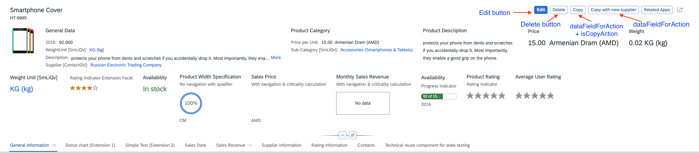
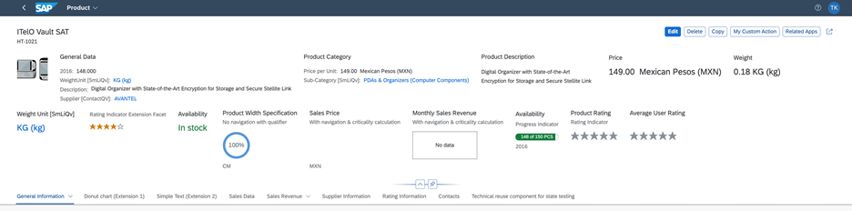

<!-- loio5fe439613f9c4e259015951594c423dc -->

# Enabling Actions in the Object Page Header

You can enable generic actions in the object page header.

*Edit*, *Delete*, and *Copy* are the generic actions.

All `com.sap.vocabularies.UI.v1.DataFieldForAction` within the unqualified `UI.Identification` are interpreted as actions. The system renders a button in the header displaying the text of the data field label.

  
  
**Object Page: Enable Actions in Header**



The object page context is only passed for bound header actions. For unbound actions, no context is passed.


<a name="loio5fe439613f9c4e259015951594c423dc__section_l4n_yjw_4pb"/>

## Annotations for the *Copy with new supplier* Button

> ### Sample Code:  
> XML Annotation
> 
> ```xml
> <Annotation Term="UI.Identification">
>       <Collection>
>             <Record Type="UI.DataFieldForAction">
>                   <PropertyValue Property="Label" String="Copy with new supplier" />
>                   <PropertyValue Property="Action"
>                         String="STTA_PROD_MAN.STTA_PROD_MAN_Entities/STTA_C_MP_ProductCopy_new_supplier" />
>                   <Annotation Term="UI.Importance" EnumMember="UI.ImportanceType/High" />
>             </Record>
>             ...
>       </Collection>
> </Annotation>
> 
> ```

> ### Sample Code:  
> ABAP CDS Annotation
> 
> ```
> 
> @UI.identification: [
>   {
>     importance: #HIGH,
>     label: 'Copy with new supplier',
>     dataAction: 'PUSHDOWN:STTA_C_MP_ProductCopy_new_supplier',
>     type: #FOR_ACTION,
>     position: 1 
>   }
> ]
> product;
> ```

> ### Sample Code:  
> CAP CDS Annotation
> 
> ```
> 
> UI.Identification : [
>     {
>         $Type : 'UI.DataFieldForAction',
>         Label : 'Copy with new supplier',
>         Action : 'STTA_PROD_MAN.STTA_PROD_MAN_Entities/STTA_C_MP_ProductCopy_new_supplier',
>         ![@UI.Importance] : #High
>     }
> ]
> 
> ```


## Edit Action on Subobject Page

The edit action is also available on the subobject page. Its behavior depends on the annotations on both levels:

-   The *Edit* button is displayed on the subobject page only if it is also visible on the object page and if the subobject page entity is not annotated to hide it.

-   The *Edit* button is enabled on the subobject page only if it is also enabled on the object page and if the subobject page entity is not annotated to disable it.


> ### Note:  
> Selecting the *Edit* button on the subobject page enables the edit action for the entire object page, not just the subobject page where it was selected.


## Copy Action

The *Copy* button is not available by default. However, applications can define a standard copy action by annotating a `dataFieldForAction` with `isCopyAction`.

This *Copy* button is placed after the *Delete* button.



> ### Sample Code:  
> XML Annotation
> 
> ```xml
> <Annotation Term="UI.Identification">
>   <Collection>
>       <Record Type="UI.DataFieldForAction">
>           <PropertyValue Property="Label" String="Copy" />
>           <PropertyValue Property="Action" String="STTA_PROD_MAN.STTA_PROD_MAN_Entities/STTA_C_MP_ProductCopy" />
>           <Annotation Term="UI.IsCopyAction" Bool="true" />
>      </Record>
> 
> ```

> ### Sample Code:  
> CAP CDS Annotation
> 
> ```
> UI.Identification : [
>     {
>         $Type : 'UI.DataFieldForAction',
>         Label : 'Copy',
>         Action : 'STTA_PROD_MAN.STTA_PROD_MAN_Entities/STTA_C_MP_ProductCopy',
>         ![@UI.IsCopyAction] : true,
>     },
> ],
> ```

Applications can define a label for this button. If a label is not provided, then by default this button is labeled as *Copy*.

> ### Note:  
> The copy action is only available on the object page, not on the subobject pages.


<a name="loio5fe439613f9c4e259015951594c423dc__section_aj2_5wx_qmb"/>

## *Edit* and *Delete* Buttons

The *Edit* button allows users to edit the instance of the object page.

The *Delete* button allows users to delete the instance of the object page.

> ### Note:  
> 1.  When determining the enablement of the *Edit* button on the object page, `updateRestrictions` are ignored because draft applications always have an `EditAction`, as shown in the following sample code:
> 
>     ```xml
>     <Annotation Term="com.sap.vocabularies.Common.v1.DraftRoot">
>         <Record>
>             <PropertyValue Property="EditAction" String="com.sap.gateway.srvd.sadl_gw_appmusicdr_definition.v0001.EditAction"/>
>         </Record>
>     </Annotation>
>     ```
> 
>     For more information, see the [Edit Enablement](enabling-actions-in-the-object-page-header-5fe4396.md#loio5fe439613f9c4e259015951594c423dc__edit_enablement) section in this topic.
> 
> 2.  The visibility of the *Edit* button can be controlled by the `updateHidden` annotation under the entity set \(it can be path-based if the apps need to hide the *Edit* button, for example for specific instances only\).
> 
>     > ### Sample Code:  
>     > XML Annotation
>     > 
>     > ```
>     > <Annotations Target="com.c_salesordermanage_sd.EntityContainer/HeaderPartner"> 
>     >    <Annotation Term="UI.UpdateHidden" Bool="true"/> 
>     > </Annotations>
>     > 
>     > OR
>     > 
>     > <Annotations Target="com.c_salesordermanage_sd.EntityContainer/SalesOrderManage"> 
>     >    <Annotation Term="UI.UpdateHidden" Path="isUpdateHidden"/> 
>     > </Annotations>
>     > 
>     > ```
> 
>     > ### Sample Code:  
>     > ABAP CDS Annotation
>     > 
>     > ```
>     > @UI.updateHidden:true 
>     > 
>     > OR
>     > 
>     > @UI.updateHidden: #('isUpdateHidden')
>     > 
>     > ```
> 
>     > ### Sample Code:  
>     > CAP CDS Annotation
>     > 
>     > ```
>     > annotate com.c_salesordermanage_sd.SalesOrderManage with @( UI.UpdateHidden: true);
>     > 
>     > OR
>     > 
>     > annotate com.c_salesordermanage_sd.SalesOrderManage with @( UI.UpdateHidden: isUpdateHidden);
>     > 
>     > ```
> 
>     For more information about the visibility of the *Delete* button, see the [Showing or Hiding the Delete Button](adding-actions-to-tables-b623e0b.md#loiob623e0bbbb2b4147b2d0516c463921a0__ShowHideDelete) section in [Adding Actions to Tables](adding-actions-to-tables-b623e0b.md).


<a name="loio5fe439613f9c4e259015951594c423dc__edit_enablement"/>

## Edit Enablement

As shown in the sample annotation above, the `UpdateRestrictions` are completely ignored. Instead, `OperationAvailable` determines the enablement of the button. For more information about `OperationAvailable`, see the [Enabling Custom Actions Defined Using Annotations](actions-cbf16c5.md#loiocbf16c599f2d4b8796e3702f7d4aae6c__subsection_xkx_gwq_nsb) section in [Actions](actions-cbf16c5.md).

-   If `OperationAvailable` = true \(static\) OR if `OperationAvailable` is not defined, the *Edit* button is visible \(provided that `updateHidden` doesn't evaluate to false\) and enabled.

-   If `OperationAvailable` = false \(static\), the `Edit` button is not visible.

-   If `OperationAvailable` = <path\>, the enablement of the `Edit` button depends on whether the path returns true or false. If the path returns null, the button is visible but disabled.


## Custom Global Actions

Applications can define their own global actions. The actions defined under the unqualified `UI.Identification`, that are not set to `determining=true`, are considered global actions and rendered next to the standard actions in the header. The object page context is passed to the action if the action is configured as a bound action or as a `DataFieldForIBN`. For an unbound action, no context is passed. For information about custom annotation actions, see [Setting the Criticality for Actions](setting-the-criticality-for-actions-12f2ba2.md) and [Actions](actions-cbf16c5.md).

The following sample shows examples of global actions:

> ### Sample Code:  
> XML Annotation
> 
> ```xml
> <Annotation Term="UI.Identification">
>     <Collection>
>         ...
>         <Record Type="UI.DataFieldForAction">
>             <PropertyValue Property="Label" String="Break Up" />
>             <PropertyValue Property="Action" String="com.sap.gateway.srvd.sadl_gw_appmusicdr_definition.v0001.BREAK_UP" />
>         </Record>
>         <Record Type="UI.DataFieldForIntentBasedNavigation">
>             <PropertyValue Property="Label" String="SampleIBN"/>
>             <PropertyValue Property="SemanticObject" String="MySemanticObject"/>
>             <PropertyValue Property="Action" String="manage"/>
>             <PropertyValue Property="RequiresContext" Bool="false"/> // For header IBN buttons, this should only be false or not specified!
>         </Record>
>         ...
>     </Collection>
> </Annotation>
> ```

> ### Sample Code:  
> ABAP CDS Annotation
> 
> ```
> @UI.identification: [
>   {
>     label: 'Break Up',
>     dataAction: 'com.sap.gateway.srvd.sadl_gw_appmusicdr_definition.v0001.BREAK_UP',
>     type: #FOR_ACTION,
>     position: 1 
>   },
>   {
>     label: 'SampleIBN',
>     semanticObjectAction: 'manage',
>     type: #FOR_INTENT_BASED_NAVIGATION,
>     position: 2 
>   }
> ]
> TEST;
> @Consumption.semanticObject: 'MySemanticObject'
> %ENTITY;
> 
> ```

> ### Sample Code:  
> CAP CDS Annotation
> 
> ```
> UI : {
>     Identification: [
>         {
>             $Type  : 'UI.DataFieldForAction',
>             Label   : 'Break Up',
>             Action : ' com.sap.gateway.srvd.sadl_gw_appmusicdr_definition.v0001.BREAK_UP'
>         },
>         {
>             $Type              : ' UI.DataFieldForIntentBasedNavigation',
>             Label              : ' SampleIBN ',
>             SemanticObject     : 'MySemanticObject',
>             Action             : 'manage',
>             RequiresContext    : false
>         }
>     ]
> }
> 
> ```

> ### Note:  
> In the sample above, "UI" is used as an alias for `com.sap.vocabularies.UI.v1`.

You control the visibility of the custom global actions by using the `UI.Hidden` annotation. If static true or path-based evaluate to true, the action button is hidden.

You also control the enablement of the `DataFieldForAction` buttons through the `OperationAvailable` mechanism in the same way as described in the [Enabling Custom Actions Defined Using Annotations](actions-cbf16c5.md#loiocbf16c599f2d4b8796e3702f7d4aae6c__subsection_xkx_gwq_nsb) section in [Actions](actions-cbf16c5.md).

The enablement of intent-based navigation \(IBN\) buttons can be controlled using the `"NavigationAvailable"` property, as described in the [Using a Button](navigation-from-an-app-outbound-navigation-d782acf.md#loiod782acf8bfd74107ad6a04f0361c5f62__NavigationButton) section in [Navigation from an App \(Outbound Navigation\)](navigation-from-an-app-outbound-navigation-d782acf.md).

The `UI.DataFieldForAction` can be bound or unbound actions. For more information, see the [Bound and Unbound Actions](actions-cbf16c5.md#loiocbf16c599f2d4b8796e3702f7d4aae6c__BoundUnbound) section in [Actions](actions-cbf16c5.md).


> ### Note:  
> For information about SAP Fiori elements for OData V2, see [Enabling Actions in the Object Page Header](enabling-actions-in-the-object-page-header-87566a3.md).

**Related Information**  


[Displaying Actions on the Object Page](displaying-actions-on-the-object-page-f65e8b1.md "Specific rules apply when displaying actions on the object page.")

[Actions](actions-cbf16c5.md "You can use generic actions provided by SAP Fiori elements and implement application-specific actions using annotations or extension points.")

