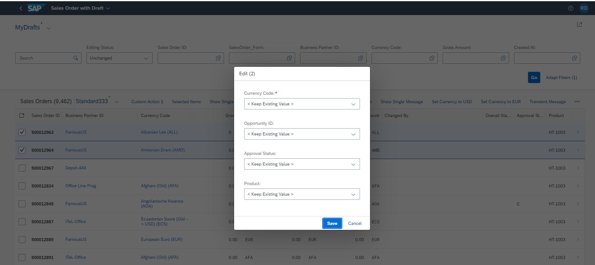

<!-- loio7cc4f04364c540c397130ff92f84c3ca -->

# Enabling Editing Using a Dialog \(Mass Edit\) in the List Report

You can edit a single object or multiple objects using a dialog in the list report page.

> ### Note:  
> For general information about enabling **Mass Edit**, see [Enabling Editing Using a Dialog \(Mass Edit\)](enabling-editing-using-a-dialog-mass-edit-965ef5b.md).
> 
> In SAP Fiori elements for OData V2, using the mass edit dialog is currently only available in the list report.

When you select multiple objects and use the mass edit dialog, the values entered are applied to all objects.

When `multiEdit` is enabled, by default the dialog displays editable fields corresponding to columns that are currently displayed in the table. You can change the columns with table personalization. To enable the editing of multiple objects, set the `multiEdit` property to `true` in the `manifest.json` file.

> ### Sample Code:  
> > ### Sample Code:  
> > ```
> > "sap.ui.generic.app": {
> >         "_version": "1.1.0",
> >         "pages": [
> >             {
> >                 "entitySet": "STTA_C_SO_SalesOrder_ND",
> >                 "component": {
> >                     "name": "sap.suite.ui.generic.template.ListReport",
> >                     "list": true,
> >                     "settings": {
> >                            "tableSettings": {
> >                                   "multiEdit": {
> >                                          "enabled" : true
> >                                    }
> > 
> >                     }
> > ```

When `MultiEdit` is enabled for an application, the option to edit appears in the table toolbar. You can select multiple records from the table and click *Edit* to launch the mass edit dialog, as shown in the following screenshot.

  

You can also provide a `FieldGroup` annotation in the manifest with a particular qualifier to identify the `MultiEdit` fields. The `DataFields` in the `FieldGroup` annotation are displayed as the `MultiEdit` fields.

To use a `fieldgroup`, add its annotation path in the `manifest.json` file:

> ### Sample Code:  
> ```
> "sap.ui.generic.app": {
>         "_version": "1.1.0",
>         "pages": [
>             {
>                 "entitySet": "STTA_C_SO_SalesOrder_ND",
>                 "component": {
>                     "name": "sap.suite.ui.generic.template.ListReport",
>                     "list": true,
>                     "settings": {
>                            "tableSettings": {
>                                   "multiEdit": {
>                                          "enabled" : true,
>                                          "annotationPath" : "com.sap.vocabularies.UI.v1.FieldGroup#MultiEdit"
>                                    }
>                     }
> ```

> ### Sample Code:  
> Annotation for the `FieldGroup` :
> 
> ```
> <Annotation Term="UI.FieldGroup" Qualifier="MultiEdit">
>           <Record>
>               <PropertyValue Property="Data">
>                      <Collection>
>                           <Record Type="UI.DataField">
>                                 <PropertyValue Property="Value" Path="NetAmount"/>
>                           </Record>
>                           <Record Type="UI.DataField">
>                                 <PropertyValue Property="Value" Path="TaxAmount"/>
>                           </Record>
>                           <Record Type="UI.DataField">
>                            <PropertyValue Property="Value" Path="LifecycleStatus"/>
>                           </Record>
>                       </Collection>
>             	 </PropertyValue>
>           </Record>
> </Annotation>
> ```

> ### Note:  
> -   This feature is only supported for responsive tables.
> 
> -   This feature isnot supported for smart multi-input fields, custom columns, and `DataFieldForAnnotations`.
> 
> -   Only the properties of the entity sets are supported for mass edit.
> 
> -   The request for each selected instance is sent in a separate changeset within a single batch. If an error occurs for one or more selected instances when the update is executed, the other selected instances are still executed.


<a name="loio7cc4f04364c540c397130ff92f84c3ca__section_avc_gtw_nsb"/>

## Option to Ignore Certain Fields from the Mass Edit Dialog

For key user adaptation, you can choose to hide certain fields from being displayed. You can do this to restrict the fields from being added to the mass edit dialog. You can restrict the fields by adding an `ignoredFields` list in the manifest, as shown in the following example:

> ### Sample Code:  
> Input for `ignoredFields` key must have comma separated values
> 
> ```
> manifest.json:
> "tableSettings": {
>                             "multiEdit": {
>                                 "enabled": true,
>                                 "annotationPath": "com.sap.vocabularies.UI.v1.FieldGroup#MultiEdit",
>                                 "ignoredFields":"NetAmount,TaxAmount" // comma separated values
>                             }
> }
> 
> ```


<a name="loio7cc4f04364c540c397130ff92f84c3ca__section_bfv_hkg_wsb"/>

## Changing the Default Title

Currently, the default title for the edit dialog is `Edit(X)`. You can override the default title of the `MultiEdit` dialog by adding the `MULTI_EDIT_DIALOG_TITLE` key in the i18n file of the list report.

**Related Information**  


[Replacing the Standard Save Functionality in Mass Edit Dialog](replacing-the-standard-save-functionality-in-the-mass-edit-dialog-492d8a9.md "You can enable custom save functionality for the mass edit dialog.")

[Enabling Editing Using a Dialog \(Mass Edit\)](enabling-editing-using-a-dialog-mass-edit-965ef5b.md "Mass editing allows users to simultaneously change multiple objects that share the same editable properties.")

[Adding a Custom ViewExtension in the Mass Edit Dialog](adding-a-custom-viewextension-in-the-mass-edit-dialog-fd26fee.md "You can add a custom ViewExtension to the mass edit dialog by defining it in the manifest.")

