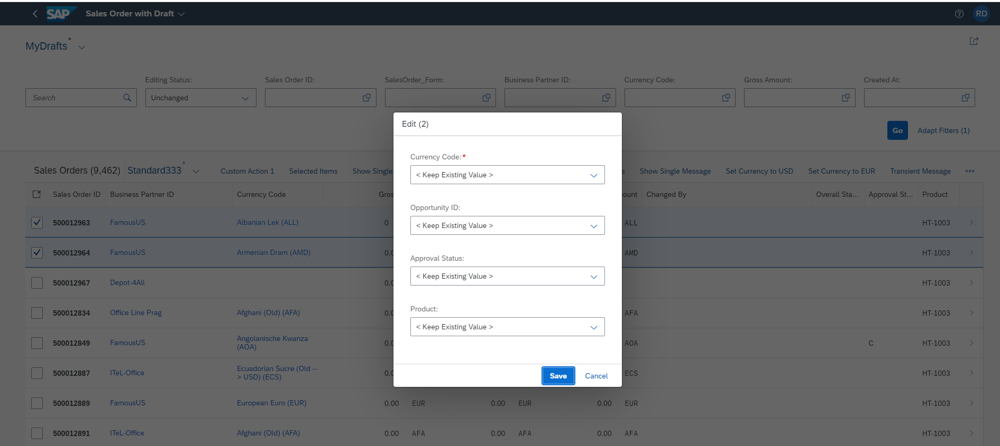

<!-- loio7cc4f04364c540c397130ff92f84c3ca -->

# Enabling Editing Using a Dialog \(Mass Edit\) on the List Report Page

You can edit a single object or multiple objects using a dialog on the list report page.

> ### Note:  
> For general information about enabling **Mass Edit**, see [Enabling Editing Using a Dialog \(Mass Edit\)](enabling-editing-using-a-dialog-mass-edit-e67782c.md).
> 
> Using the mass edit dialog is only available on the list report page.

When you select multiple objects and use the mass edit dialog, the values entered are applied to all objects.

When `multiEdit` is enabled, by default the dialog displays editable fields corresponding to columns that are currently displayed in the table. You can change the columns with table personalization. To enable the editing of multiple objects, set the `multiEdit` property to `true` in the `manifest.json` file.

> ### Sample Code:  
> `manifest.json`
> 
> ```
> 
> "sap.ui.generic.app": {
>     "pages": [
>         {
>             "entitySet": "STTA_C_SO_SalesOrder_ND",
>             "component": {
>                 "name": "sap.suite.ui.generic.template.ListReport",
>                 "list": true,
>                 "settings": {
>                     "tableSettings": {
>                         "multiEdit": {
>                             "enabled": true
>                         }
>                     }
>                 }
>             }
>         }
>     ]
> }
> 
> ```

When `MultiEdit` is enabled for an application, the option to edit appears in the table toolbar. You can select multiple records from the table and click *Edit* to launch the mass edit dialog, as shown in the following screenshot:



You can also provide a `FieldGroup` annotation with a specific qualifier in the `manifest.json` file to identify the `MultiEdit` fields. The `DataFields` in the `FieldGroup` annotation are displayed as the `MultiEdit` fields. We recommend this approach to improve the performance of your app.

To use `FieldGroup`, add its annotation path in the `manifest.json` file:

> ### Sample Code:  
> `manifest.json`
> 
> ```
> 
> "sap.ui.generic.app": {
>     "pages": [
>         {
>             "entitySet": "STTA_C_SO_SalesOrder_ND",
>             "component": {
>                 "name": "sap.suite.ui.generic.template.ListReport",
>                 "list": true,
>                 "settings": {
>                     "tableSettings": {
>                         "multiEdit": {
>                             "enabled": true,
>                             "annotationPath": "com.sap.vocabularies.UI.v1.FieldGroup#MultiEdit"
>                         }
>                     }
>                 }
>             }
>         }
>     ]
> }
> ```

> ### Sample Code:  
> Annotation for the `FieldGroup` :
> 
> ```
> 
> <Annotation Term="UI.FieldGroup" Qualifier="MultiEdit">
>     <Record>
>         <PropertyValue Property="Data">
>             <Collection>
>                 <Record Type="UI.DataField">
>                     <PropertyValue Property="Value" Path="NetAmount"/>
>                 </Record>
>                 <Record Type="UI.DataField">
>                     <PropertyValue Property="Value" Path="TaxAmount"/>
>                 </Record>
>                 <Record Type="UI.DataField">
>                     <PropertyValue Property="Value" Path="LifecycleStatus"/>
>                 </Record>
>             </Collection>
>         </PropertyValue>
>     </Record>
> </Annotation>
> ```

> ### Note:  
> -   This feature is only applicable to responsive tables and grid tables.
> 
> -   This feature is not supported for smart multi-input fields, custom columns, and `DataFieldForAnnotations`.
> 
> -   Only the properties of the entity sets are supported for mass edit.
> 
> -   The request for each selected instance is sent in a separate change set within a single batch. If an error occurs for one or more selected instances when the update is executed, the other selected instances are still executed.


<a name="loio7cc4f04364c540c397130ff92f84c3ca__section_avc_gtw_nsb"/>

## Option to Ignore Certain Fields from the Mass Edit Dialog

For key user adaptation, you can choose to hide certain fields from being displayed. You can do this to restrict the fields from being added to the mass edit dialog. You can restrict the fields by adding an `ignoredFields` list in the manifest. Separate the values for the `ignoredFields` key with a comma as shown in the following example:

> ### Sample Code:  
> `manifest.json`
> 
> ```
> 
> "tableSettings": {
>     "multiEdit": {
>         "enabled": true,
>         "annotationPath": "com.sap.vocabularies.UI.v1.FieldGroup#MultiEdit",
>         "ignoredFields": "NetAmount,TaxAmount" // comma separated values
>     }
> }
> 
> ```


<a name="loio7cc4f04364c540c397130ff92f84c3ca__section_bfv_hkg_wsb"/>

## Changing the Default Title

The default title for the edit dialog is `Edit(X)`. You can override the default title of the `MultiEdit` dialog by adding the `MULTI_EDIT_DIALOG_TITLE` key in the i18n file of the list report page.

