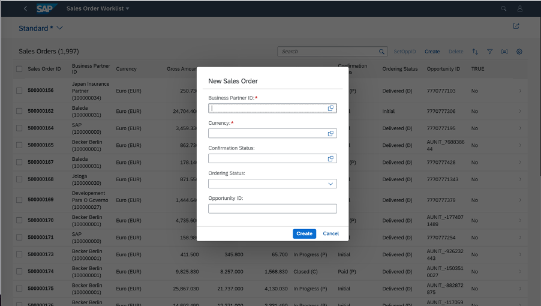

<!-- loioceb9284b16f64f30865ce999dbd56064 -->

# Enabling Object Creation Using the Dialog in the List Report

You can enable the creation of objects that have a maximum of 8 data fields using a dialog in the list report page.


<a name="loioceb9284b16f64f30865ce999dbd56064__section_wxx_bvy_cnb"/>

## Additional Features in SAP Fiori Elements for OData V2



You can enable this feature on list reports or worklist applications. You can do this in the manifest settings by adding the property `createWithParameterDialog` and passing the properties of related entity set as follows:

> ### Sample Code:  
> ```
> 
> "createWithParameterDialog" : {
>                "fields" : {
>                   "<fieldName>" : {"path":"<fieldname>"},
>                   "<fieldName>" : {"path":"<fieldname>"}
>              }
> 
> ```

The option to create objects using a dialog now appears in the list report application.

> ### Sample Code:  
> ```
> 
> "sap.ui.generic.app": {
>     "_version": "1.3.0",
>     "pages": {
>         "ListReport|STTA_C_SO_SalesOrder_ND": {
>             "entitySet": "STTA_C_SO_SalesOrder_ND",
>             "component": {
>                 "name": "sap.suite.ui.generic.template.ListReport",
>                 "list": true,
>                 "settings": {
>                     "multiSelect": true,
>                     "isWorklist": true,
>                     "tableSettings": {
>                         "createWithParameterDialog" : {
>                             "fields" : {
>                                 "BusinessPartnerID":{"path": "BusinessPartnerID"},
>                                 "CurrencyCode" : {"path":"CurrencyCode"},
>                                 "BillingStatus" : {"path":"BillingStatus"},
>                                 "DeliveryStatus" : {"path":"DeliveryStatus"},
>                                 "OpportunityID" : {"path":"OpportunityID"}
>                             }
>                         }
>                     }
>                 }
>             },
>             "pages": {
>                 ..............
>                 ..............
>             }
>         }
>     }
> }
> ```

> ### Sample Code:  
> Sample Manifest Setting for Enabling createWithParameterDialog in Multiview List Report/Worklist Page
> 
> ```
> "sap.ui.generic.app": {
>               "pages": [{
> "entitySet": "C_STTA_SalesOrder_WD_20",
> "component": {
>               "name": "sap.suite.ui.generic.template.ListReport",
>               "list": true,
>               "settings": {
>                              "quickVariantSelectionX": {
>                                            "showCounts": true,
>                                            "variants": {
>                                                           "0":
> 
>                                                           {
>                                                                         "key": "_tab1",
>                                                                         "annotationPath": "com.sap.vocabularies.UI.v1.SelectionVariant#Expensive"
>                                                           },
>                                                           "1": {
>                                                                         "key": "_tab2",
>                                                                         "annotationPath": "com.sap.vocabularies.UI.v1.SelectionPresentationVariant#Cheap",
>                                                                         "tableSettings": {
>                                                                                       "createWithParameterDialog": {
>                                                                                                      "fields": {
>                                                                                                                    "bp_id":
> 
>                                                                                                                    {
>                                                                                                                                  "path": "bp_id"
>                                                                                                                    },
>                                                                                                                    "currency_code":
> 
>                                                                                                                    {
>                                                                                                                                  "path": "currency_code"
>                                                                                                                    },
>                                                                                                                    "op_id":
> 
>                                                                                                                    {
>                                                                                                                                  "path": "op_id"
>                                                                                                                    }
>                                                                                                      }
>                                                                                       }
>                                                                         }
>                                                           }
>                                            }
>                              }
>               }
> },
> 
> ```

If this feature is enabled, you cannot navigate to an object page in create mode. However, you can navigate to the object page in display mode to modify objects.

Draft state is not maintained when an object is created using the dialog.

> ### Note:  
> -   Ensure that the properties are related to the entities.
> 
> -   Ensure that all the mandatory fields of the entities are part of the create dialog.
> 
> -   Object creation using the dialog is only supported in list report page with the single view or multiple views. For more information, see [Defining Multiple Views on a List Report Table - Single Table Mode](defining-multiple-views-on-a-list-report-table-single-table-mode-0d390fe.md) and[Defining Multiple Views on a List Report Table - Multiple Table Mode](defining-multiple-views-on-a-list-report-table-multiple-table-mode-37aeed7.md).
> 
> -   You can also create objects using a dialog by prefilling fields from the filter values that you entered. For more information, see [Prefilling Fields When Creating a New Entity Using an Extension Point](prefilling-fields-when-creating-a-new-entity-using-an-extension-point-189e2d8.md).
> 
> -   When you click on *Create* while creating an object, the message displayed in the popup is the same as the transient message if it is received from the backend.
> 
> -   If a state message is received from the backend upon clicking *Create*, it is then mandatory to send a target for each message pointing to a particular field. The same message is then displayed on the respective field with a red box and text.


### Customizing the Dialog Title and Buttons

The default title of the dialog is *New Object* and the key in the i18n file is `CREATE_DIALOG_TITLE`. You can change this by redefining the key in the application or in the SAPUI5 Visual Editor. The default values of the buttons on the dialog are *Create* and *Cancel*, which you can also change in SAPUI5 Visual Editor.


<a name="loioceb9284b16f64f30865ce999dbd56064__section_r2b_hvy_cnb"/>

## Additional Features in SAP Fiori Elements for OData V4

The content for this feature for SAP Fiori elements for OData V4 is covered in the topic [Prefilling Fields When Creating a New Entity](prefilling-fields-when-creating-a-new-entity-11ff444.md).

