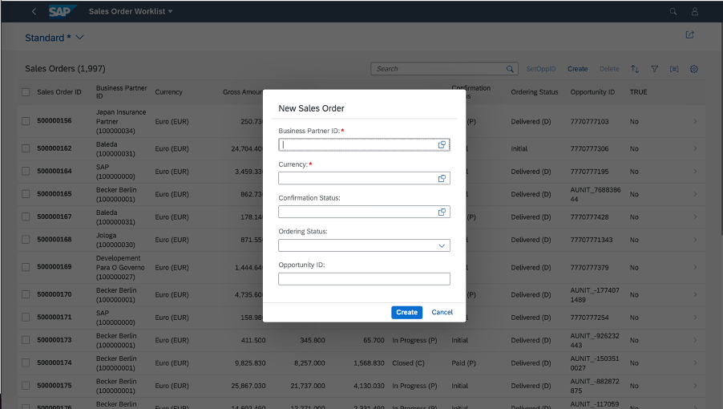

<!-- loio2d04f60da84a49f6bb8617fbf1d3d2aa -->

# Enabling Object Creation Using the Dialog on the List Report Page

You can enable the creation of objects with a dialog.

> ### Note:  
> For information about SAP Fiori elements for OData V4, see [Enabling Object Creation Using the Dialog on the List Report Page](enabling-object-creation-using-the-dialog-on-the-list-report-page-ceb9284.md).



You can enable the creation of objects that have a maximum of eight data fields using a dialog on the list report page. You can enable this feature in list report page or worklist applications. To do this, configure the `manifest.json` file by adding the property `createWithParameterDialog` and passing the properties of the related entity set, as shown in the following sample code:

> ### Sample Code:  
> `manifest.json`
> 
> ```
> 
> "createWithParameterDialog" : {
>     "fields" : {
>         "<fieldName>" : {"path":"<fieldname>"},
>         "<fieldName>" : {"path":"<fieldname>"}
>     }
> }
> 
> ```

The option to create objects using a dialog now appears in the list report page application.

> ### Sample Code:  
> ```
> 
> "sap.ui.generic.app": {
>     "pages": {
>         "ListReport|STTA_C_SO_SalesOrder_ND": {
>             "entitySet": "STTA_C_SO_SalesOrder_ND",
>             "component": {
>                 "name": "sap.suite.ui.generic.template.ListReport",
>                 "list": true,
>                 "settings": {
>                     "multiSelect": true,
>                     "isWorklist": true,
>                     "tableSettings": {
>                         "createWithParameterDialog" : {
>                             "fields" : {
>                                 "BusinessPartnerID":{"path": "BusinessPartnerID"},
>                                 "CurrencyCode" : {"path":"CurrencyCode"},
>                                 "BillingStatus" : {"path":"BillingStatus"},
>                                 "DeliveryStatus" : {"path":"DeliveryStatus"},
>                                 "OpportunityID" : {"path":"OpportunityID"}
>                             }
>                         }
>                     }
>                 }
>             },
>             "pages": {
>                 ..............
>                 ..............
>             }
>         }
>     }
> }
> ```

> ### Sample Code:  
> Enabling `createWithParameterDialog` on the list report page or the worklist in multi-view mode in the `manifest.json` file
> 
> ```
> "sap.ui.generic.app": {
>     "pages": {
>         "ListReport|STTA_C_SO_SalesOrder_ND": {
>             "entitySet": "C_STTA_SalesOrder_WD_20",
>             "component": {
>                 "name": "sap.suite.ui.generic.template.ListReport",
>                 "list": true,
>                 "settings": {
>                     "quickVariantSelectionX": {
>                         "showCounts": true,
>                         "variants": {
>                             "0": {
>                                 "key": "_tab1",
>                                 "annotationPath": "com.sap.vocabularies.UI.v1.SelectionVariant#Expensive"
>                             },
>                             "1": {
>                                 "key": "_tab2",
>                                 "annotationPath": "com.sap.vocabularies.UI.v1.SelectionPresentationVariant#Cheap",
>                                 "tableSettings": {
>                                     "createWithParameterDialog": {
>                                         "fields": {
>                                             "bp_id": { "path": "bp_id" },
>                                             "currency_code": { "path": "currency_code" },
>                                             "op_id": { "path": "op_id" }
>                                         }
>                                     }
>                                 }
>                             }
>                         }
>                     }
>                 }
>             },
>             ...
>         }
>     }
> }
> ```

If this feature is enabled, you cannot navigate to an object page in create mode. However, you can navigate to the object page in display mode to modify objects.

The draft state is not maintained when an object is created using the dialog.

> ### Note:  
> -   Ensure that the properties are related to the entities.
> 
> -   Ensure that all the mandatory fields of the entities are part of the create dialog.
> 
> -   Only the list report page supports object creation using the dialog. On the list report page, this feature is available in both single view and multiple views scenarios. For more information, see [Defining Multiple Views on a List Report Table - Single Table Mode](defining-multiple-views-on-a-list-report-page-table-single-table-mode-0f6901e.md) and [Defining Multiple Views on a List Report Table - Multiple Table Mode](defining-multiple-views-in-a-list-report-page-table-multiple-table-mode-97dfeea.md).
> 
> -   You can also create objects using a dialog by prefilling fields from the filter values that you entered. For more information, see [Prefilling Fields When Creating a New Entity Using an Extension Point](prefilling-fields-when-creating-a-new-entity-using-an-extension-point-189e2d8.md).
> 
> -   When you click on *Create* while creating an object, the message displayed in the popup is the same as the transient message if it is received from the back end.
> 
> -   If a state message is received from the back end when clicking *Create*, it is then mandatory to send a target for each message pointing to a particular field. The same message is then displayed on the respective field with a red box and a text.


<a name="loio2d04f60da84a49f6bb8617fbf1d3d2aa__section_mty_znd_fhc"/>

## Customizing the Dialog Title and Buttons

The default title of the dialog is *New Object*, and the key in the `i18n` file is `CREATE_DIALOG_TITLE`. You can change this by redefining the key in the application or in the Adaptation Editor. The default values of the buttons on the dialog are *Create* and *Cancel*. You can also change them in the Adaptation Editor.

