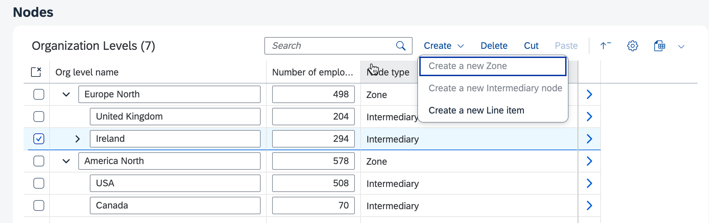

<!-- loio123e7ad551224ec3b07e5ba999d3a4b9 -->

# Enabling or Disabling the Create Button or the Create Menu Button

Extension point for controlling the availability of Create and Create Menu buttons in tree tables in SAP Fiori elements for OData V4.

For both the standard create mode and the custom create mode, you can define an `isCreateEnabled` extension point to control whether the *Create* button or *Create Menu* buttons are enabled or disabled. The extension point callback needs to be added to the page controller extension.

The following parameters are provided to the callback:

-   The `value` associated with the selected menu item.

    If the standard create mode is used, the `value` is `null`.

-   The `parent context` of the parent under which the new node is created.

    If no node is selected \(creation at the root level of the hierarchy\), the `parent context` is `undefined`.


> ### Sample Code:  
> `manifest.json`
> 
> ```json
> sap.ui.define(["sap/ui/core/mvc/ControllerExtension"], function (ControllerExtension) {
>     "use strict";
>  
>     return ControllerExtension.extend("hierarchy-edit.custom.OPExtend", {
>         // this section allows to extend lifecycle hooks or override public methods of the base controller
>  
>         //Callback to enable Create actions
>         enableCreate: function (value, parentContext) {
>             switch (parentContext?.getProperty("nodeType")) {
>                 case "Zone":
>                     return value !== "Zone"; // Anything but 'Zone' under 'Zone'
>  
>                 case "Intermediary":
>                     return value === "Line"; // Only 'Line' under 'Intermediary'
>  
>                 case "Line":
>                     return false; // Nothing under 'Line'
>  
>                 default:
>                     return value === "Zone"; // Only 'Zone' at root level
>             }
>         }
>     }
> }
> ```

The following screenshot shows an example of the outcome. Under an "Intermediary" parent, only a "Line" node type can be created.

  
  
**Disabled Create Menu Buttons**



