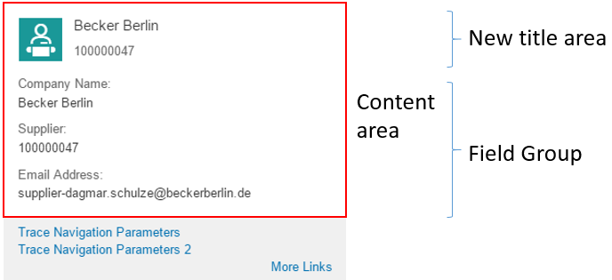
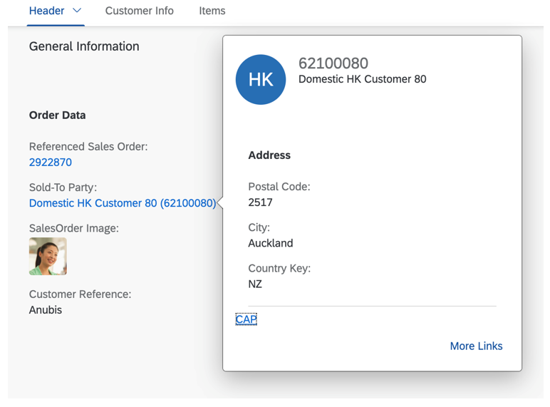

<!-- loio307ced1bc98c4e3d93ecbe9658dc9176 -->

# Enabling Quick Views for Link Navigation

You can enrich the popovers for link navigation with additional information to display quick views.

 <a name="task_v3l_y2y_xmb"/>

<!-- task\_v3l\_y2y\_xmb -->

## Additional Features in SAP Fiori Elements for OData V2


<a name="task_v3l_y2y_xmb__context_w3l_y2y_xmb"/>

## Context

You can display information about the navigation target already on the source entity. This information - the quick view - is stored in the association end type. To enable the quick views, you must annotate `com.sap.vocabularies.UI.v1.QuickViewFacets` and `QuickViewFacets` for the popover. A new title area and additional information, such as a field group, is displayed according to the association end type of the property that has been annotated as a semantic object.

> ### Note:  
> `QuickViewFacets` can only be annotated for those `EntityTypes` that are in the same service. Only these are referenced with referential constraints in the metadata document.

This video shows the step-by-step procedure for enabling quick views for link navigation: 

To do so, perform the following steps:


<a name="task_v3l_y2y_xmb__steps_x3l_y2y_xmb"/>

## Procedure

1.  Identify the property that has been annotated as a semantic object.

    > ### Sample Code:  
    > XML Annotation
    > 
    > ```xml
    > 
    > <Annotations Target="STTA_PROD_MAN.STTA_C_MP_ProductType/Supplier">
    >    <Annotation Term="Common.SemanticObject" String="EPMProduct"/>
    > </Annotations>
    > 
    > ```

    > ### Sample Code:  
    > ABAP CDS Annotation
    > 
    > ```
    > annotate view STTA_C_MP_PRODUCT with {
    >   @Consumption.semanticObject: 'EPMProduct'
    >   supplier;
    > }
    > ```

2.  In the metadata document, you can find the reference to the association end type. Check for a referential constraint that includes the identified property as `Dependent`. For the `Supplier` property in the entity type STTA\_C\_MP\_ProductType, that has a set of navigation properties, only `to_Supplier` includes the `Supplier` property as `Dependent`.

    ```
    
    <Association Name="assoc_2CCAF987BA334B3BD1DF2404F50BC9C5" sap:content-version="1">
        <End Type="STTA_PROD_MAN.STTA_C_MP_ProductType" Multiplicity="1" Role="FromRole_assoc_2CCAF987BA334B3BD1DF2404F50BC9C5"/>
        <End Type="STTA_PROD_MAN.STTA_C_MP_SupplierType" Multiplicity="0..1" Role="ToRole_assoc_2CCAF987BA334B3BD1DF2404F50BC9C5"/>
        <ReferentialConstraint>
            <Principal Role="ToRole_assoc_2CCAF987BA334B3BD1DF2404F50BC9C5">
                <PropertyRef Name="Supplier"/>
            </Principal>
            <Dependent Role="FromRole_assoc_2CCAF987BA334B3BD1DF2404F50BC9C5">
                <PropertyRef Name="Supplier"/>
            </Dependent>
        </ReferentialConstraint>
    </Association>
    
    ```

3.  Annotate `UI.QuickViewFacets` under the association end type of the `Dependent` property as follows:

    > ### Sample Code:  
    > XML Annotation
    > 
    > ```xml
    > 
    > <!-- QuickViewFacets annotation for Supplier-->
    > 
    > <Annotations Target="STTA_PROD_MAN.STTA_C_MP_SupplierType">
    >     <Annotation Term="UI.QuickViewFacets">
    >         <Collection>
    >             <Record Type="UI.ReferenceFacet">
    >                 <PropertyValue Property="Target" AnnotationPath="@UI.FieldGroup#SupplierQuickViewPOC_FieldGroup_1" />
    >             </Record> 
    >         </Collection>
    >     </Annotation>
    >     <Annotation Term="UI.FieldGroup" Qualifier="SupplierQuickViewPOC_FieldGroup_1">
    >         <Record>
    >             <PropertyValue Property="Data">
    >                 <Collection>
    >                     <Record Type="UI.DataField">
    >                         <PropertyValue Property="Label" String="Company Name" />
    >                         <PropertyValue Property="Value" Path="CompanyName"/>
    >                     </Record>
    >                     <Record Type="UI.DataField">
    >                         <PropertyValue Property="Label" String="Supplier" />
    >                         <PropertyValue Property="Value" Path="Supplier"/>
    >                     </Record>
    >                     <Record Type="UI.DataField">
    >                         <PropertyValue Property="Label" String="Email Address" />
    >                         <PropertyValue Property="Value" Path="EmailAddress"/>
    >                     </Record>                           
    >                 </Collection>
    >             </PropertyValue>
    >         </Record>
    >     </Annotation>    
    > </Annotations>
    > 
    > ```

    > ### Sample Code:  
    > ABAP CDS Annotation
    > 
    > ```
    > annotate view STTA_C_MP_SUPPLIER with {
    > @UI.Facet: [
    >   {
    >     targetQualifier: 'SupplierQuickViewPOC_FieldGroup_1',
    >     type: #FIELDGROUP_REFERENCE,
    >     purpose: #QUICK_VIEW
    >   }
    > ]
    > @UI.fieldGroup: [
    >   {
    >     label: 'Company Name',
    >     value: 'COMPANYNAME',
    >     type: #STANDARD,
    >     position: 1 ,
    >     qualifier: 'SupplierQuickViewPOC_FieldGroup_1'
    >   }
    > ]
    > companyname;
    > @UI.fieldGroup: [
    >   {
    >     label: 'Supplier',
    >     value: 'SUPPLIER',
    >     type: #STANDARD,
    >     position: 2 ,
    >     qualifier: 'SupplierQuickViewPOC_FieldGroup_1'
    >   }
    > ]
    > supplier;
    > @UI.fieldGroup: [
    >   {
    >     label: 'Email Address',
    >     value: 'EMAILADDRESS',
    >     type: #STANDARD,
    >     position: 3 ,
    >     qualifier: 'SupplierQuickViewPOC_FieldGroup_1'
    >   }
    > ]
    > emailaddress;
    > }
    > 
    > ```


<a name="task_v3l_y2y_xmb__result_y3l_y2y_xmb"/>

## Results

A quick view for link navigation is generated and can look like this:

  

For more information about the system behavior and configuration options, see [Configuring the Content of Quick Views](configuring-the-content-of-quick-views-c245ad7.md).

 <a name="task_hck_y5k_hmb"/>

<!-- task\_hck\_y5k\_hmb -->

## Additional Features in SAP Fiori Elements for OData V4


<a name="task_hck_y5k_hmb__context_a12_bvk_hmb"/>

## Context

You can display information about the navigation target already on the source entity. This information – the quick view – is stored in the association end type. To enable the quick views, you have to annotate `com.sap.vocabularies.UI.v1.QuickViewFacets` at the association end type of the property that has been annotated as a semantic object. If you annotate `QuickViewFacets` for the popover, a new title area and additional information, such as a field group, are displayed according to the `QuickViewFacets`.

Quick views are supported as follows:

-   For a source property defined with a `ReferentialConstraint` on a target entity

-   For a source property where the target property is a semantic key or an entity key


To define a quick view for a source property with a `ReferentialConstraint` on a target entity, perform the following steps:

1.  Identify the property that has been annotated as a semantic object.

    > ### Sample Code:  
    > XML Annotation
    > 
    > ```xml
    > 
    > <Annotations Target="com.c_salesordermanage_sd.ProductSupplier/Supplier">
    >    <Annotation Term="Common.SemanticObject" String="EPMProduct"/>
    > </Annotations>
    > 
    > ```

    > ### Note:  
    > The `SemanticObject` annotation can also be a path to a property of type `String:`.

    > ### Sample Code:  
    > ABAP CDS Annotation
    > 
    > ```
    > annotate view ProductSupplier with {
    >   @Consumption.semanticObject: 'EPMProduct'
    >   supplier;
    > }
    > ```

    > ### Sample Code:  
    > CAP CDS Annotation:
    > 
    > ```
    > annotate ProductSupplier with {
    >     @Common.SemanticObject : 'EPMProduct'
    >     Supplier
    > };
    > ```

2.  In the metadata document, you can find the reference to the association end type. In the `navigationProperties` of your entity, check for a `ReferentialConstraint` that includes the previously identified property \(`Supplier`\). This property must be in the property attributes of the `ReferentialConstraint`. In this example, it references the “`CustomerID`” property of the “`Customer`” entity \(the association end type\).

    ```xml
    <NavigationProperty Name="_ShipToPartyVH" Type="com.c_salesordermanage_sd.Customer">
          <ReferentialConstraint Property="Supplier" ReferencedProperty="CustomerID" />
    </NavigationProperty>
    
    ```

    > ### Sample Code:  
    > CDS Annotation
    > 
    > ```
    > _ShipToPartyVH  : Association to Customer
    >                     on _ShipToPartyVH.CustomerID = Supplier;
    > ```

3.  Annotate `UI.QuickViewFacets` under the association end type of the `referentialConstraint` property as follows:

    > ### Sample Code:  
    > XML Annotation
    > 
    > ```xml
    > <Annotations Target="com.c_salesordermanage_sd.Customer">
    > <Annotation Term="UI.QuickViewFacets">
    >    <Collection>
    >     <Record Type="UI.ReferenceFacet">
    >       <PropertyValue Property="Label" String="Address"/>
    >       <PropertyValue Property="Target" AnnotationPath="@UI.FieldGroup#SoldToQuickView"/>
    >     </Record>
    >    </Collection>
    > </Annotation>
    > <Annotation Term="UI.FieldGroup" Qualifier="SoldToQuickView">
    >    <Record Type="UI.FieldGroupType">
    >      <PropertyValue Property="Data">
    >       <Collection>
    >        <Record Type="UI.DataField">
    >         <PropertyValue Property="Value" Path="PostalCode"/>
    >        </Record>
    >        <Record Type="UI.DataField">
    >         <PropertyValue Property="Value" Path="CityName"/>
    >        </Record>
    >        <Record Type="UI.DataField">
    >         <PropertyValue Property="Value" Path="Country"/>
    >        </Record>
    >       </Collection>
    >      </PropertyValue>
    >    </Record>
    > </Annotation>
    > </Annotations>
    > ```

    > ### Sample Code:  
    > ABAP CDS Annotation
    > 
    > ```
    > 
    > annotate view CUSTOMER with {
    > @UI.Facet: [
    >   {
    >     label: 'Address',
    >     targetQualifier: 'SoldToQuickView',
    >     type: #FIELDGROUP_REFERENCE,
    >     purpose: #QUICK_VIEW
    >   }
    > ]
    > @UI.fieldGroup: [
    >   {
    >     value: 'POSTALCODE',
    >     type: #STANDARD,
    >     position: 1 ,
    >     qualifier: 'SoldToQuickView'
    >   }
    > ]
    > postalcode;
    > @UI.fieldGroup: [
    >   {
    >     value: 'CITYNAME',
    >     type: #STANDARD,
    >     position: 2 ,
    >     qualifier: 'SoldToQuickView'
    >   }
    > ]
    > cityname;
    > @UI.fieldGroup: [
    >   {
    >     value: 'COUNTRY',
    >     type: #STANDARD,
    >     position: 3 ,
    >     qualifier: 'SoldToQuickView'
    >   }
    > ]
    > country;
    > }
    > 
    > ```

    > ### Sample Code:  
    > CAP CDS Annotation
    > 
    > ```
    > 
    > annotate schema.Customer with @(UI : {
    > QuickViewFacets             : [
    >     {
    >         $Type  : 'UI.ReferenceFacet',
    >         Label  : 'Address',
    >         Target : '@UI.FieldGroup#SoldToQuickView'
    >     }
    > ],
    > FieldGroup #SoldToQuickView : {Data : [
    >     {
    >         $Type : 'UI.DataField',
    >         Value : PostalCode
    >     },
    >     {
    >         $Type : 'UI.DataField',
    >         Value : CityName
    >     },
    >     {
    >         $Type : 'UI.DataField',
    >         Value : Country
    >     }
    > ]}
    > })
    > ```


To define a quick view for a source property where the target property is a semantic key or an entity key, perform the following steps:

1.  On the source entity define an association to the target entity:

    > ### Sample Code:  
    > CAP CDS Annotation:
    > 
    > ```
    > entity ProductSupplier {
    >      CustomerReference: String;
    >      _NavigationProperty: Association to Customer
    >           on _NavigationProperty.Customer = CustomerReference @(Common : {
    >                SemanticObject             : 'Customer'
    >            });
    > }
    > ```

2.  The property on the target entity must be defined as a semantic key or an entity key:

    > ### Sample Code:  
    > CAP CDS Annotation:
    > 
    > ```
    > annotate Customer with @(
    >      //…
    >      Common.SemanticKey : [CustomerName],
    >      //…
    > ) {
    >  key Customer: String;
    >      CustomerName: String;
    > }
    > ```

3.  Annotate `UI.QuickViewFacets` on the target entity of the navigation property as follows:

    > ### Sample Code:  
    > XML Annotation
    > 
    > ```xml
    > <Annotations Target="com.c_salesordermanage_sd.Customer">
    >     <Annotation Term="UI.QuickViewFacets">
    >         <Collection>
    >             <Record Type="UI.ReferenceFacet">
    >                 <PropertyValue Property="Label" String="Address" />
    >                 <PropertyValue Property="Target" AnnotationPath="@UI.FieldGroup#SoldToQuickView" />
    >             </Record>
    >         </Collection>
    >     </Annotation>
    >     <Annotation Term="UI.FieldGroup" Qualifier="SoldToQuickView">
    >         <Record Type="UI.FieldGroupType">
    >             <PropertyValue Property="Data">
    >                 <Collection>
    >                     <Record Type="UI.DataField">
    >                         <PropertyValue Property="Value" Path="PostalCode" />
    >                     </Record>
    >                     <Record Type="UI.DataField">
    >                         <PropertyValue Property="Value" Path="CityName" />
    >                     </Record>
    >                     <Record Type="UI.DataField">
    >                         <PropertyValue Property="Value" Path="Country" />
    >                     </Record>
    >                 </Collection>
    >             </PropertyValue>
    >         </Record>
    >     </Annotation>
    > </Annotations>
    > ```

    > ### Sample Code:  
    > ABAP CDS Annotation
    > 
    > ```
    > 
    > annotate view CUSTOMER with {
    > @UI.Facet: [
    >   {
    >     label: 'Address',
    >     targetQualifier: 'SoldToQuickView',
    >     type: #FIELDGROUP_REFERENCE,
    >     purpose: #QUICK_VIEW
    >   }
    > ]
    > @UI.fieldGroup: [
    >   {
    >     value: 'POSTALCODE',
    >     type: #STANDARD,
    >     position: 1 ,
    >     qualifier: 'SoldToQuickView'
    >   }
    > ]
    > postalcode;
    > @UI.fieldGroup: [
    >   {
    >     value: 'CITYNAME',
    >     type: #STANDARD,
    >     position: 2 ,
    >     qualifier: 'SoldToQuickView'
    >   }
    > ]
    > cityname;
    > @UI.fieldGroup: [
    >   {
    >     value: 'COUNTRY',
    >     type: #STANDARD,
    >     position: 3 ,
    >     qualifier: 'SoldToQuickView'
    >   }
    > ]
    > country;
    > }
    > 
    > ```

    > ### Sample Code:  
    > CAP CDS Annotation
    > 
    > ```
    > 
    > annotate schema.Customer with @(UI : {
    > QuickViewFacets             : [
    >     {
    >         $Type  : 'UI.ReferenceFacet',
    >         Label  : 'Address',
    >         Target : '@UI.FieldGroup#SoldToQuickView'
    >     }
    > ],
    > FieldGroup #SoldToQuickView : {Data : [
    >     {
    >         $Type : 'UI.DataField',
    >         Value : PostalCode
    >     },
    >     {
    >         $Type : 'UI.DataField',
    >         Value : CityName
    >     },
    >     {
    >         $Type : 'UI.DataField',
    >         Value : Country
    >     }
    > ]}
    > })
    > ```


<a name="task_hck_y5k_hmb__result_xjz_wzk_hmb"/>

## Results

A quick view for link navigation is generated and can look like this:

  

This video shows the step-by-step procedure for enabling quick views for link navigation: 

For more information about the system behavior and configuration options, see [Configuring the Content of Quick Views](configuring-the-content-of-quick-views-c245ad7.md).

