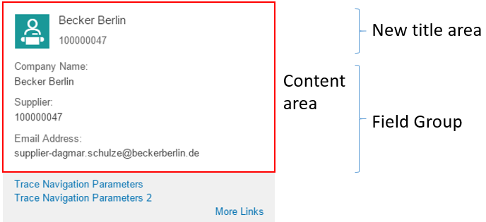

<!-- loioe5b509c270364982917db480c8598f82 -->

# Enabling Quick Views for Link Navigation

You can enrich the popovers for link navigation with additional information to display quick views.


> ### Note:  
> For information about SAP Fiori elements for OData V4, see [Enabling Quick Views for Link Navigation](enabling-quick-views-for-link-navigation-307ced1.md).


<a name="loioe5b509c270364982917db480c8598f82__section_p1j_yw3_tgc"/>

## Context

You can display information about the navigation target already on the source entity. This information - the quick view - is stored in the association end type. To enable the quick views, you must annotate `com.sap.vocabularies.UI.v1.QuickViewFacets` and `QuickViewFacets` for the popover. A new title area and additional information, such as a field group, is displayed according to the association end type of the property that has been annotated as a semantic object.

> ### Note:  
> `QuickViewFacets` can only be annotated for those `EntityTypes` that are in the same service. Only these are referenced with referential constraints in the metadata document.

This video shows the step-by-step procedure for enabling quick views for link navigation:

To do so, perform the following steps:


<a name="loioe5b509c270364982917db480c8598f82__section_ilg_2x3_tgc"/>

## Procedure

1.  Identify the property that has been annotated as a semantic object. In this case, the field is shown as a link. For more information, see [Navigation from an App \(Outbound Navigation\)](navigation-from-an-app-outbound-navigation-c35fa60.md).

    > ### Sample Code:  
    > XML Annotation
    > 
    > ```xml
    > 
    > <Annotations Target="STTA_PROD_MAN.STTA_C_MP_ProductType/Supplier">
    >    <Annotation Term="Common.SemanticObject" String="EPMProduct"/>
    > </Annotations>
    > 
    > ```

    > ### Sample Code:  
    > ABAP CDS Annotation
    > 
    > ```
    > annotate view STTA_C_MP_PRODUCT with {
    >   @Consumption.semanticObject: 'EPMProduct'
    >   supplier;
    > }
    > ```

2.  In the metadata document, you can find the reference to the association end type. Check for a referential constraint that includes the identified property as `Dependent`. For the `Supplier` property in the entity type STTA\_C\_MP\_ProductType, that has a set of navigation properties, only `to_Supplier` includes the `Supplier` property as `Dependent`.

    > ### Sample Code:  
    > ABAP CDS Annotation
    > 
    > ```
    > <Association Name="assoc_2CCAF987BA334B3BD1DF2404F50BC9C5" sap:content-version="1">
    >     <End Type="STTA_PROD_MAN.STTA_C_MP_ProductType" Multiplicity="1" Role="FromRole_assoc_2CCAF987BA334B3BD1DF2404F50BC9C5"/>
    >     <End Type="STTA_PROD_MAN.STTA_C_MP_SupplierType" Multiplicity="0..1" Role="ToRole_assoc_2CCAF987BA334B3BD1DF2404F50BC9C5"/>
    >     <ReferentialConstraint>
    >         <Principal Role="ToRole_assoc_2CCAF987BA334B3BD1DF2404F50BC9C5">
    >             <PropertyRef Name="Supplier"/>
    >         </Principal>
    >         <Dependent Role="FromRole_assoc_2CCAF987BA334B3BD1DF2404F50BC9C5">
    >             <PropertyRef Name="Supplier"/>
    >         </Dependent>
    >     </ReferentialConstraint>
    > </Association>
    > ```

3.  Annotate `UI.QuickViewFacets` under the association end type of the `Dependent` property as follows:

    > ### Sample Code:  
    > XML Annotation
    > 
    > ```xml
    > 
    > <!-- QuickViewFacets annotation for Supplier-->
    > 
    > <Annotations Target="STTA_PROD_MAN.STTA_C_MP_SupplierType">
    >     <Annotation Term="UI.QuickViewFacets">
    >         <Collection>
    >             <Record Type="UI.ReferenceFacet">
    >                 <PropertyValue Property="Target" AnnotationPath="@UI.FieldGroup#SupplierQuickViewPOC_FieldGroup_1" />
    >             </Record> 
    >         </Collection>
    >     </Annotation>
    >     <Annotation Term="UI.FieldGroup" Qualifier="SupplierQuickViewPOC_FieldGroup_1">
    >         <Record>
    >             <PropertyValue Property="Data">
    >                 <Collection>
    >                     <Record Type="UI.DataField">
    >                         <PropertyValue Property="Label" String="Company Name" />
    >                         <PropertyValue Property="Value" Path="CompanyName"/>
    >                     </Record>
    >                     <Record Type="UI.DataField">
    >                         <PropertyValue Property="Label" String="Supplier" />
    >                         <PropertyValue Property="Value" Path="Supplier"/>
    >                     </Record>
    >                     <Record Type="UI.DataField">
    >                         <PropertyValue Property="Label" String="Email Address" />
    >                         <PropertyValue Property="Value" Path="EmailAddress"/>
    >                     </Record>                           
    >                 </Collection>
    >             </PropertyValue>
    >         </Record>
    >     </Annotation>    
    > </Annotations>
    > 
    > ```

    > ### Sample Code:  
    > ABAP CDS Annotation
    > 
    > ```
    > annotate view STTA_C_MP_SUPPLIER with {
    > @UI.Facet: [
    >   {
    >     targetQualifier: 'SupplierQuickViewPOC_FieldGroup_1',
    >     type: #FIELDGROUP_REFERENCE,
    >     purpose: #QUICK_VIEW
    >   }
    > ]
    > @UI.fieldGroup: [
    >   {
    >     label: 'Company Name',
    >     value: 'COMPANYNAME',
    >     type: #STANDARD,
    >     position: 1 ,
    >     qualifier: 'SupplierQuickViewPOC_FieldGroup_1'
    >   }
    > ]
    > companyname;
    > @UI.fieldGroup: [
    >   {
    >     label: 'Supplier',
    >     value: 'SUPPLIER',
    >     type: #STANDARD,
    >     position: 2 ,
    >     qualifier: 'SupplierQuickViewPOC_FieldGroup_1'
    >   }
    > ]
    > supplier;
    > @UI.fieldGroup: [
    >   {
    >     label: 'Email Address',
    >     value: 'EMAILADDRESS',
    >     type: #STANDARD,
    >     position: 3 ,
    >     qualifier: 'SupplierQuickViewPOC_FieldGroup_1'
    >   }
    > ]
    > emailaddress;
    > }
    > ```


<a name="loioe5b509c270364982917db480c8598f82__section_v44_bz3_tgc"/>

## Results

A quick view for link navigation is generated and can look like this:



For more information about the system behavior and configuration options, see [Configuring the Content of Quick Views](configuring-the-content-of-quick-views-e598e59.md).

