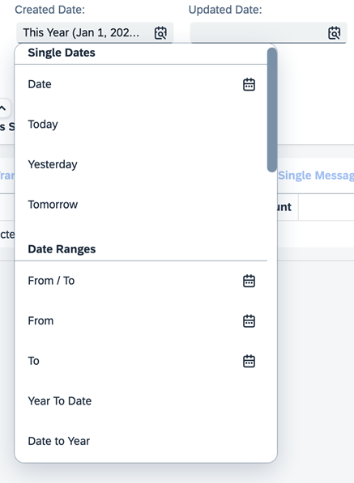
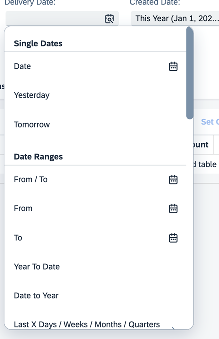

<!-- loioc2b916c44abf4936a5b22cc47c0bf29e -->

# Enabling Semantic Operators in the Filter Bar

You can use semantic date values, such as *Today* or *Last Week*, on the filter bar of the list report page and analytical list page applications.

> ### Note:  
> For information about SAP Fiori elements for OData V4, see [Enabling Semantic Operators in the Filter Bar](enabling-semantic-operators-in-the-filter-bar-fef65d0.md).

The semantic date control can be enabled for the fields in the filter bar by setting the `useDateRange` flag to `true` in the manifest. By default, the value is `false` and date picker control is rendered by the filter bar.

The property must have `sap:filter-restriction="interval"` in the metadata. For example:

> ### Sample Code:  
> ```
> <Property Name="DeliveryDate" Type="Edm.DateTime" sap:label="Delivery Date" Precision="0" sap:display-format="Date" sap:filter-restriction="interval" />
> ```

> ### Sample Code:  
> Example for CDS
> 
> ```
> @Consumption.filter.selectionType: #INTERVAL
> ```

> ### Sample Code:  
> Enable a date range filter with all default range types
> 
> ```
> 
> "sap.ui.generic.app": {
>     "pages": {
>         "ListReport|SEPMRA_C_PD_Product: {
>             "component": {
>                 "settings" : {
>                     "filterSettings": {
>                         "dateSettings":{
>                             "useDateRange": true //Default value of the property is false. If set to true all date types will get default date ranges.
>                         }
>                     }
>                 }
>             }
>         }
>     }
> }
> ```

This date range shows all the default settings listed in the [Sample Posting Date](https://ui5.sap.com/#/entity/sap.ui.comp.smartfilterbar.SmartFilterBar/sample/sap.ui.comp.sample.smartfilterbar.UseDateRangeType).



You can modify the default date range options by specifying the required options as shown in the sample code here. For date fields without specific date range options, the default semantic date range values are displayed because `useDateRange` is set to `true`.

> ### Sample Code:  
> ```
> 
> "sap.ui.generic.app": {
>    "pages": {
>         "component": {
>            "settings" : {
>                 ...
>                 "filterSettings": {
>                     "dateSettings":{
> 			            "useDateRange": true,
>                         "fields": {
>                             "DateProperty1": {
>                                 //Override for a specific property of type sap:date DateProperty1. This is the most simplest way of removing selected values
>                                 // from the standard date range. The values which you want to remove or keep needs to be mentioned as selectedValues 
>                                 // in a comma separated format
>                                 "selectedValues": "TOMORROW,NEXT,LASTYEAR,LAST2WEEKS,LAST3WEEKS,LAST4WEEKS,LAST5WEEKS,YEARTODATE,QUARTER1,QUARTER2,QUARTER3,QUARTER4",
>                                 //Below is an optional property. Default value "exclude" property is true. If set to false, values listed in the "selectedValues" above are shown in the drop down
>                                 "exclude": true
>                             }
>                         }
>                     }
>                 }
>             }
>         }
>     }
> }
> 
> ```


<a name="loioc2b916c44abf4936a5b22cc47c0bf29e__section_c15_fxv_2hc"/>

## Date Range Options for Individual Fields

Date range options on the field level can be enabled by specifying options for individual properties, as shown here.

> ### Sample Code:  
> ```
> "sap.ui.generic.app": {
>    "pages": {
>       "component": {
>          "settings" : {
>             ...
>             "filterSettings": {
>                 "dateSettings":{
>                     "selectedValues": "DAYS,WEEK,MONTH,DATERANGE ",
>                     "fields": {
>                         "DateProperty1": {
>                             "selectedValues": "TOMORROW,NEXT,LASTYEAR,LAST2WEEKS,LAST3WEEKS,LAST4WEEKS,LAST5WEEKS,YEARTODATE,QUARTER1,QUARTER2,QUARTER3,QUARTER4",
>                             "exclude": true
>                         },
>                         "DateProperty2": {
>                             "customDateRangeImplementation": "SOMULTIENTITY.ext.controller.customDateRangeType",
>                             "selectedValues": "FROM,TO,DAYS,WEEK,MONTH,DATERANGE,TODAY,TOMORROW,YEAR,YESTERDAY",
>                             "exclude": true
>                         },
>                         "DateProperty3": { 
>                             "selectedValues": "YESTERDAY",
>                             "exclude": false 
>                         },
> 		            "DateTimeProperty1": { 
>                             "selectedValues": "MONTH",
>                             "exclude": true 
>                         }
> 
>                         }
>                     }
>                 }
>             }
>         }
>     }
> }
> 
> ```

The following types of settings exist, either at the property level or at the default level, under `dateSettings`:

-   The settings maintained at the default level are applicable to all of the date properties and they're overridden if settings are maintained for individual properties.

    In the code sample above, the date ranges mentioned in `selectedValues`\(`DAYS,WEEK,MONTH,DATERANGE`\) are applicable for all of the date fields, and the date ranges control is rendered.

    Settings that are maintained under the `fields` level take precedence over the setting maintained at the `dateSettings` level. For example, setting maintained at `DateProperty1` takes precedence over `selectedValues` defined a level above.

-   The date picker control is rendered for a date field if `selectedValues` does not exist under `dateSettings`, the property-specific setting is not maintained under `fields`, and the `useDateRange` property is not set at the filter bar level.

-   The `customDateRangeImplementation` property references a JavaScript class that you use to modify the value list of the date range. You can either remove standard data range values or add custom values.

-   The `SelectedValues` property is a set of standard date range values that you want to include or exclude. The `exclude` property is set to `true` by default. This means that all values given as `selectedValues` from the list of date range filters are excluded. If the `exclude` property is set to `false`, the application shows only selected values in the list of date range filters.

    For example, in the code sample above, the `DateTimeProperty1` filter for all the options that contain `MONTH`, such as `THISMONTH`, `LASTMONTH`, in the date range are excluded.

    > ### Tip:  
    > -   Navigation to an external application always passes the actual date value that corresponds to the semantic date value that is used.
    > 
    > -   The date range configuration that is defined in the manifest file is not applied to custom filters of type date range. For more information on custom filters, see [Adding Custom Fields to the Filter Bar](adding-custom-fields-to-the-filter-bar-b56bc11.md).

    > ### Note:  
    > -   The `customDateRangeImplementation` property takes precedence over the `selectedValues` and `exclude` properties.
    > 
    >     > ### Example:  
    >     > Suppose we have 5 date filters, namely, `DateProperty1`, `DateProperty2`, `DateProperty3`, `DateProperty4`, and `DateProperty5`. As shown in the sample code above, `DateProperty1`, `DateProperty2`, and `DateProperty3` take the settings defined for the respective properties, whereas `DateProperty4` and `DateProperty5` take the default `SelectedValues` settings one level above the field-specific configuration.
    > 
    > -   If you define the semantic date range feature by providing specific fields, you cannot render the fields from the navigation property of the leading entity set as a semantic date range in the filter bar.
    > 
    > -   Filter fields with `sap:filter-restriction= "single-value"` or `"multi-value"` are rendered as date pickers on both the list report page and the analytical list page.

-   You can also set a default value for a semantic date range. The default value can be used together with `customdateRangeImplementation`, `filter`, or `selectedValues`. It can also be added without any filters. The default value should be part of the list of values for the field. For example, if you exclude `TOMORROW` as a value for the field `CreatedDate`, do not add `TOMORROW` as a `defaultValue`.

    > ### Sample Code:  
    > ```
    > 
    > "filterSettings": {
    > 	"dateSettings": {
    > 		"fields": {
    > 			"CreatedDate": {
    > 				"defaultValue": {
    > 					"operation": "TOMORROW"
    > 				}
    > 			},
    > 			"DeliveryDate": {
    > 				"defaultValue": {
    > 					"operation": "TOMORROW"
    > 				},
    > 				"filter": [{
    > 					"path": "key",
    > 					"equals": "TODAY",
    > 					"exclude": true
    > 				}]
    > 			}
    > 		}
    > 	}
    > }
    > ```

    When the semantic date is part of a navigation context, an app state, or a URL, then the `defaultValue` set in the manifest file is not considered.

    > ### Note:  
    > Do not provide numeric values as a `defaultValue`. For example, if the `defaultValue` is `TODAYFROMTO`, do not add `FROM(val1)` and `TO(val2)` as the range.


<a name="loioc2b916c44abf4936a5b22cc47c0bf29e__section_lhl_txv_2hc"/>

## Excluding Certain Date Range Types

You can use the `filter` settings to include and exclude specific date range values.

Example 1: If you want to remove `TODAY` from the date range, see the following sample code:

> ### Sample Code:  
> ```
> 
> filterSettings: {
> 	dateSettings: { 
> 		useDateRange: false 
> 		fields: {
> 			"PostingDate": {
> 				//Alternate way of configuring is using the Filter option. Here the developer should be able to specify
> 				// the condition specific to each and every value (whether it is a key/category), needs to be excluded
> 				// or included. You could also specify the operator whether it is contains or equal. This configuration
> 				// passed directly to the filter bar and therefore anything that is possible in SFB can be configured
> 				// here as well
> 				//Application can use this for more complex and detailed configuration
> 				"filter": [{
> 						path: 'key',
> 						equals: 'TODAY',
> 						exclude: true
> 					} // TODAY filter will be removed
> 				]
> 			}
> 		}
> 	}
> }
> ```



Example 2: If you want to include `TODAY` and exclude `Today -X/+Y Days`, see the following sample code:

> ### Sample Code:  
> ```
> 
> "filter": [{
> 		"path": "key",
> 		"equals": "TODAY",
> 		"exclude": false
> 	},
> 	{
> 		"path": "key",
> 		"equals": "TODAYFROMTO",
> 		"exclude": true
> 	}
> ]
> // 
> ```

> ### Note:  
> The`customDateRangeImplementation` setting takes priority, followed by `filter` and `selectedValues`, when excluding date range types.


<a name="loioc2b916c44abf4936a5b22cc47c0bf29e__section_vv3_wxv_2hc"/>

## Using the `DateRangeType` Category

The `DateRangeType` category contains a group of `DateRangeType` keys. You can use a category to remove all keys in that category.

For example, if the `DYNAMIC` category is excluded then keys such as `FROM` and `TO` \(category : `DYNAMIC.DATE` \) and `LASTDAYS` and `NEXTDAYS` \(category : `DYNAMIC.DATE.INT`\), are not displayed.

If the category `FIXED` is excluded, then keys such as `TODAY,THISWEEK,THISYEAR, LAST2WEEKS, QUARTER1`, etc. are hidden.

.

> ### Sample Code:  
> ```
> 
> "filter": [{
> 	"path": "category",
> 	"contains": "FIXED",
> 	"exclude": true
> }]
> // this will remove all the keys under the category that "contains" FIXED
> ```


<a name="loioc2b916c44abf4936a5b22cc47c0bf29e__section_q5w_tgf_nmb"/>

## More Information

For more information about configuring filter bars on a list report page, see [Adapting the Filter Bar](adapting-the-filter-bar-c7a7ac4.md).

Depending on the use of the date range filter, the default tile type also varies. For more information about creating tiles for the semantic date range configuration, see [Extending the Bookmark Function to Save Static Tiles to the SAP Fiori Launchpad](extending-the-bookmark-function-to-save-static-tiles-to-the-sap-fiori-launchpad-7e34ea9.md).

