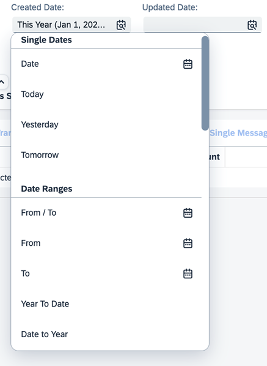
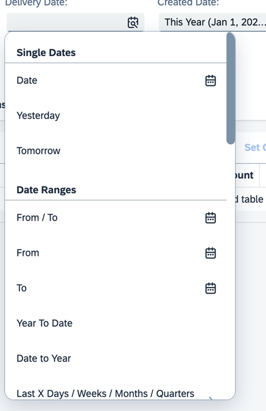
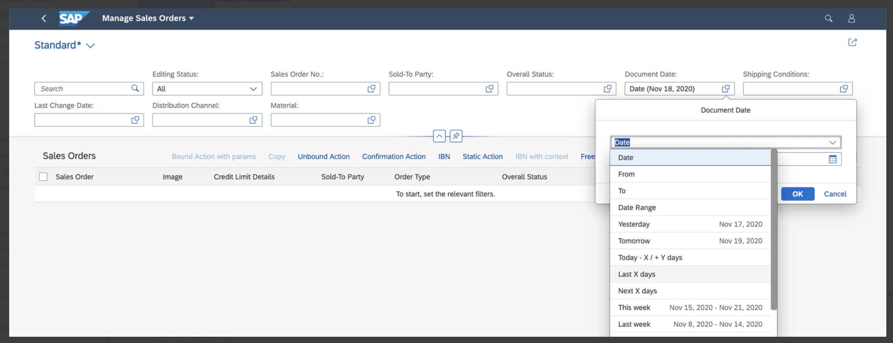

<!-- loiofef65d03d01a4b2baca28983a5449cf7 -->

# Enabling Semantic Operators in the Filter Bar

You can use semantic date values, such as *Today* or *Last Week*, on the filter bar of list report and analytical list page applications.


## Additional Features in SAP Fiori Elements for OData V2

> ### Tip:  
> -   Navigation to an external application always passes the actual date value that corresponds to the semantic date value that is used.
> 
> -   The date range configuration that is defined in the manifest file is not applied to custom filters of type date range. For more information on custom filters, see [Adding Custom Fields to the Filter Bar](adding-custom-fields-to-the-filter-bar-5fb9f57.md).

The semantic date control can be enabled for the fields in the filter bar by setting the `useDateRange` flag to `true` in the manifest. By default, the value is `false` and date picker control is rendered by the filter bar.

> ### Sample Code:  
> Enable a date range filter with all default range types
> 
> ```
> 
> "sap.ui.generic.app": {
>     “pages”: {
>         "ListReport|SEPMRA_C_PD_Product: {
>             “component”: {
>                 "settings" : {
>                     "filterSettings": {
>                         "dateSettings":{
>                             "useDateRange": true //Default value of the property is false. If set to true all date types will get default date ranges.
>                         }
>                     }
>                 }
>             }
>         }
>     }
> }
> ```

This date range shows all the default settings listed in the [Sample Posting Date](https://ui5.sap.com/#/entity/sap.ui.comp.smartfilterbar.SmartFilterBar/sample/sap.ui.comp.sample.smartfilterbar.UseDateRangeType).

  

You can modify the default date range options by specifying the required options as shown in the sample code here. For date fields without specific date range options, the default semantic date range values are displayed because `useDateRange` is set to `true`.

> ### Sample Code:  
> ```
> 
> "sap.ui.generic.app": {
>    “pages”: {
>         “component”: {
>            "settings" : {
>                 ...
>                 "filterSettings": {
>                     "dateSettings":{
> 			            "useDateRange": true,
>                         "fields": {
>                             "DateProperty1": {
>                                 //Override for a specific property of type sap:date DateProperty1. This is the most simplest way of removing selected values
>                                 // from the standard date range. The values which you want to remove or keep needs to be mentioned as selectedValues 
>                                 // in a comma separated format
>                                 "selectedValues": "TOMORROW,NEXT,LASTYEAR,LAST2WEEKS,LAST3WEEKS,LAST4WEEKS,LAST5WEEKS,YEARTODATE,QUARTER1,QUARTER2,QUARTER3,QUARTER4",
>                                 //Below is an optional property. Default value "exclude" property is true. If set to false, values listed in the "selectedValues" above are shown in the drop down
>                                 "exclude": true
>                             }
>                         }
>                     }
>                 }
>             }
>         }
>     }
> }
> 
> ```


### Date Range Options for Individual Fields

Date range options on the field level can be enabled by specifying options for individual properties, as shown here.

> ### Sample Code:  
> ```
> "sap.ui.generic.app": {
>    “pages”: {
>       “component”: {
>          "settings" : {
>             ...
>             "filterSettings": {
>                 "dateSettings":{
>                     "selectedValues": "DAYS,WEEK,MONTH,DATERANGE ",
>                     "fields": {
>                         "DateProperty1": {
>                             "selectedValues": "TOMORROW,NEXT,LASTYEAR,LAST2WEEKS,LAST3WEEKS,LAST4WEEKS,LAST5WEEKS,YEARTODATE,QUARTER1,QUARTER2,QUARTER3,QUARTER4",
>                             "exclude": true
>                         },
>                         "DateProperty2": {
>                             "customDateRangeImplementation": "SOMULTIENTITY.ext.controller.customDateRangeType",
>                             "selectedValues": "FROM,TO,DAYS,WEEK,MONTH,DATERANGE,TODAY,TOMORROW,YEAR,YESTERDAY",
>                             "exclude": true
>                         },
>                         "DateProperty3": { 
>                             "selectedValues": "YESTERDAY",
>                             "exclude": false 
>                         },
> 		            "DateTimeProperty1": { 
>                             "selectedValues": "MONTH",
>                             "exclude": true 
>                         }
> 
>                         }
>                     }
>                 }
>             }
>         }
>     }
> }
> 
> ```

The following types of settings exist, either at the property level or at the default level, under `dateSettings`:

-   The settings maintained at the default level are applicable to all of the date properties and they're overridden if settings are maintained for individual properties.

    In the code sample above, the date ranges mentioned in `selectedValues`\(`DAYS,WEEK,MONTH,DATERANGE`\) are applicable for all of the date fields, and the date ranges control is rendered.

    Settings that are maintained under the `fields` level take precendence over the setting maintained at the `dateSettings` level. For example, setting maintained at `DateProperty1` takes precendence over `selectedValues` defined a level above.

-   The date picker control is rendered for a date field if `selectedValues` does not exist under `dateSettings`, the property-specific setting is not maintained under `fields`, and the `useDateRange` property is not set at the filter bar level.

-   The `customDateRangeImplementation` property references a JavaScript class that you use to modify the value list of the date range. You can either remove standard data range values or add custom values.

-   The `SelectedValues` property is a set of standard date range values that you want to include or exclude. The `exclude` property is set to `true` by default. This means that all values given as `selectedValues` from the list of date range filters are excluded. If the `exclude` property is set to `false`, the application shows only selected values in the list of date range filters.

    For example, in the code sample above, the `DateTimeProperty1` filter for all the options that contain `MONTH`, such as `THISMONTH`, `LASTMONTH`, in the date range are excluded.

    > ### Note:  
    > -   The `customDateRangeImplementation` property takes precedence over the `selectedValues` and `exclude` properties.
    > 
    >     > ### Example:  
    >     > Suppose we have 5 date filters, namely, `DateProperty1`, `DateProperty2`, `DateProperty3`, `DateProperty4`, and `DateProperty5`. As shown in the sample code above, `DateProperty1`, `DateProperty2`, and `DateProperty3` take the settings defined for the respective properties, whereas `DateProperty4` and `DateProperty5` take the default `SelectedValues` settings one level above the field-specific configuration.
    > 
    > -   If you define the semantic date range feature by providing specific fields, you cannot render the fields from the navigation property of the leading entity set as a semantic date range in the filter bar.
    > 
    > -   `DateTimeOffset` fields with filter restrictions as intervals are rendered as a date range control. Fields with `sap:filter-restriction="single-value"` are rendered as date pickers in both the list report and the analytical list page.
    > 
    > -   Fields with `sap:filter-restriction="multi-value"` are rendered as date pickers in both the list report and the analytical list page.

-   You can also set a default value for a semantic date range. The default value can be used together with `customdateRangeImplementation`, `filter`, or `selectedValues`. It can also be added without any filters. The default value should be part of the list of values for the field. For example, if you exclude `TOMORROW` as a value for the field `CreatedDate`, do not add `TOMORROW` as a `defaultValue`.

    > ### Sample Code:  
    > ```
    > 
    > "filterSettings": {
    > 	"dateSettings": {
    > 		"fields": {
    > 			"CreatedDate": {
    > 				"defaultValue": {
    > 					"operation": "TOMORROW"
    > 				}
    > 			},
    > 			"DeliveryDate": {
    > 				"defaultValue": {
    > 					"operation": "TOMORROW"
    > 				},
    > 				"filter": [{
    > 					"path": "key",
    > 					"equals": "TODAY",
    > 					"exclude": true
    > 				}]
    > 			}
    > 		}
    > 	}
    > }
    > ```

    When the semantic date is part of a navigation context, an app state, or a URL, then the `defaultValue` set in the manifest file is not considered.

    > ### Note:  
    > Do not provide numeric values as a `defaultValue`. For example, if the `defaultValue` is `TODAYFROMTO`, do not add `FROM(val1)` and `TO(val2)` as the range.


### Excluding Certain Date Range Types

You can use the `filter` settings to include and exclude specific date range values.

Example 1: If you want to remove `TODAY` from the date range, see the following sample code:

> ### Sample Code:  
> ```
> 
> filterSettings: {
> 	dateSettings: { 
> 		useDateRange: false 
> 		fields: {
> 			"PostingDate": {
> 				//Alternate way of configuring is using the Filter option. Here the developer should be able to specify
> 				// the condition specific to each and every value (whether it is a key/category), needs to be excluded
> 				// or included. You could also specify the operator whether it is contains or equal. This configuration
> 				// passed directly to the filter bar and therefore anything that is possible in SFB can be configured
> 				// here as well
> 				//Application can use this for more complex and detailed configuration
> 				"filter": [{
> 						path: 'key',
> 						equals: 'TODAY',
> 						exclude: true
> 					} // TODAY filter will be removed
> 				]
> 			}
> 		}
> 	}
> }
> ```

  

Example 2: If you want to include `TODAY` and exclude `Today -X/+Y Days`, see the following sample code:

> ### Sample Code:  
> ```
> 
> "filter": [{
> 		"path": "key",
> 		"equals": "TODAY",
> 		"exclude": false
> 	},
> 	{
> 		"path": "key",
> 		"equals": "TODAYFROMTO",
> 		"exclude": true
> 	}
> ]
> // 
> ```

> ### Note:  
> The`customDateRangeImplementation` setting takes priority, followed by `filter` and `selectedValues`, when excluding date range types.


### Using the `DateRangeType` Category

The `DateRangeType` category contains a group of `DateRangeType` keys. You can use a category to remove all keys in that category.

For example, if the `DYNAMIC` category is excluded then keys such as `FROM` and `TO` \(category : `DYNAMIC.DATE` \) and `LASTDAYS` and `NEXTDAYS` \(category : `DYNAMIC.DATE.INT`\), are not displayed.

If the category `FIXED` is excluded, then keys such as `TODAY,THISWEEK,THISYEAR, LAST2WEEKS, QUARTER1`, etc. are hidden.

.

> ### Sample Code:  
> ```
> 
> "filter": [{
> 	"path": "category",
> 	"contains": "FIXED",
> 	"exclude": true
> }]
> // this will remove all the keys under the category that "contains" FIXED
> ```


<a name="loiofef65d03d01a4b2baca28983a5449cf7__section_otf_dzw_jnb"/>

## Additional Features in SAP Fiori Elements for OData V4

Semantic operators are enabled by default for the following fields:

-   `Edm.Date`-based fields for which `FilterRestrictions.AllowedExpressions` is set to `SingleRange` or `SingleValue`.

-   `Edm.DateTimeOffset`-based fields for which `FilterRestrictions.AllowedExpressions` is set to `SingleRange`.


You can set the `FilterRestrictions` to `SingleRange` as shown in the following sample code:

> ### Sample Code:  
> XML Annotation
> 
> ```
> <Annotations Target="com.c_salesordermanage_sd.EntityContainer/SalesOrderManage">
>     <Annotation Term="Capabilities.FilterRestrictions">
>         <RecordType="Capabilities.FilterRestrictionsType">
>             <PropertyValue Property="FilterExpressionRestrictions">
>                 <Collection>
>                     <RecordType="Capabilities.FilterExpressionRestrictionType">
>                         <PropertyValueProperty="Property"PropertyPath="myDate"/>
>                         <PropertyValueProperty="AllowedExpressions"String="SingleRange"/>
>                     </Record>
>                     …
>                     …
>                 </Collection>
>             </PropertyValue>
>         </Record>
>     </Annotation>
>     …
>     …
> </Annotations>
> 
> ```

> ### Sample Code:  
> ABAP CDS Annotation
> 
> No ABAP CDS annotation sample is available. Please use the local XML annotation.

> ### Sample Code:  
> CAP CDS Annotation
> 
> ```
> @Capabilities : {
>    FilterRestrictions : {
>       FilterExpressionRestrictions :
>          [{
>             Property : 'myDate',
>             AllowedExpressions : 'SingleRange'
>          }]
>       }
> }
> ...
> entity MyEntity {
> ...
>     myDate: Date;
> }
> ```


### Setting a Default Value for a Semantic Date Field

Extend the manifest for the filter field as follows to set a default value for a semantic date:

> ### Sample Code:  
> Default value for semantic date field
> 
> ```
> "settings" : {  
>    "entitySet" : "SalesOrderManage",
>    "controlConfiguration" : {
>       "@com.sap.vocabularies.UI.v1.SelectionFields" : {
>    …
>    …
>          "filterFields": {
>             "SalesOrderDate": { 
>                "settings": {
>                   "defaultValues": [{"operator": "YESTERDAY"}] 
>                }
>             }
>          }
>    …
>    …
>       }
>    }
> }
> 
> ```

The value set to `operator` is set as the default operator for the semantic date field. In this case, the default value is `"YESTERDAY"`. Currently, `"defaultValues"` support only operators that don't need parameter values: `NextXDays`, for example, isn’t supported because it requires `"X"` \(the number of days as a parameter\).

Here's a list of fully supported operators:

-   Single date-based operators

    -   `"YESTERDAY"`

    -   `"TOMORROW"`

    -   `"TODAY"`

    -   `"FIRSTDAYWEEK"`

    -   `"LASTDAYWEEK"`

    -   `"FIRSTDAYMONTH"`

    -   `"LASTDAYMONTH"`

    -   `"FIRSTDAYQUARTER"`

    -   `"LASTDAYQUARTER"`

    -   `"FIRSTDAYYEAR"`

    -   `"LASTDAYYEAR"`


-   Date range-based operators

    -   `"THISWEEK"`

    -   `"LASTWEEK"`

    -   `"NEXTWEEK"`

    -   `"THISMONTH"`

    -   `"LASTMONTH"`

    -   `"NEXTMONTH"`

    -   `"THISQUARTER"`

    -   `"LASTQUARTER"`

    -   `"NEXTQUARTER"`

    -   `"QUARTER1"`

    -   `"QUARTER2"`

    -   `"QUARTER3"`

    -   `"QUARTER4"`

    -   `"THISYEAR"`

    -   `"LASTYEAR"`

    -   `"NEXTYEAR"`

    -   `"YEARTODATE"`

    -   `"DATETOYEAR"`


> ### Note:  
> -   Default values coming from the `SelectionVariant` for the semantic date fields are ignored – only the manifest-based default values are considered.
> 
> -   When using the default operators, check what the operator you're using evaluates to on the UI to ensure it matches your use case.
> 
>     > ### Example:  
>     > The standard fiscal quarter `"QUARTER1"` evaluates to the period between January and March. If you're using non-standard fiscal quarters, the default value won't be suitable for you.


### Defining Default Values for Operators That Require Parameters

If applications want to provide a default value for the semantic date field that requires an operator that needs a parameter value \(for example, an application developer wants to set NEXT "X" DAYS as the default operator and a default value for "X"\), the manifest must be configured accordingly. The following table provides the manifest settings for the various operators that need a parameter value:

**Defining Default Values for Operators That Require Parameters**


<table>
<tr>
<th valign="top">

Operator


</th>
<th valign="top">

`manifest.json` Sample


</th>
<th valign="top">

Comment


</th>
</tr>
<tr>
<td valign="top">

DATE


</td>
<td valign="top">

```
"@com.sap.vocabularies.UI.v1.SelectionFields": {
   "useSemanticDateRange": true,
   "filterFields": {
      "SalesOrderDate": {
         "settings": {
            "defaultValues" : [ {"operator": "DATE",   "values": ["2018-12-28"]}]             }
      }
   }
}
```


</td>
<td valign="top">

Required date format: YYYY-MM-DD


</td>
</tr>
<tr>
<td valign="top">

FROM


</td>
<td valign="top">

```
"@com.sap.vocabularies.UI.v1.SelectionFields": {
   "useSemanticDateRange": true,
   "filterFields": {
      "SalesOrderDate": {
         "settings": {
            "defaultValues" : [ {"operator": "FROM",   "values": ["2018-11-28"]}]

         }
      }
   }
}
```


</td>
<td valign="top">

Required date format: YYYY-MM-DD


</td>
</tr>
<tr>
<td valign="top">

TO


</td>
<td valign="top">

```
"@com.sap.vocabularies.UI.v1.SelectionFields": {
   "useSemanticDateRange": true,
   "filterFields": {
      "SalesOrderDate": {
         "settings": {
            "defaultValues" : [ {"operator": "TO",   "values": ["2019-11-02"]}]

         }
      }
   }
}
```


</td>
<td valign="top">

Required date format: YYYY-MM-DD


</td>
</tr>
<tr>
<td valign="top">

DATERANGE


</td>
<td valign="top">

```
"@com.sap.vocabularies.UI.v1.SelectionFields": {
   "useSemanticDateRange": true,
   "filterFields": {
      "SalesOrderDate": {
         "settings": {
            "defaultValues" : [ {"operator": "DATERANGE",   "values": ["2019-11-02","2022-01-01"]}]

         }
      }
   }
}
```


</td>
<td valign="top">

Required date format: YYYY-MM-DD


</td>
</tr>
<tr>
<td valign="top">

TODAYFROMTO


</td>
<td valign="top">

```
"@com.sap.vocabularies.UI.v1.SelectionFields": {
   "useSemanticDateRange": true,
   "filterFields": {
      "SalesOrderDate": {
         "settings": {
            "defaultValues" : [ {"operator": "TODAYFROMTO", "values":[5,6]}]

         }
      }
   }
}
```


</td>
<td valign="top">

First value: days before TODAY

Second value: Number of days after TODAY


</td>
</tr>
<tr>
<td valign="top">

LastXDays / LastXWeeks / LastXMonths / LastXQuarters / LastXYears


</td>
<td valign="top">

```
"@com.sap.vocabularies.UI.v1.SelectionFields": {
   "useSemanticDateRange": true,
   "filterFields": {
      "SalesOrderDate": {
         "settings": {
            "defaultValues" : [ {"operator": "LASTDAYS", "values":[6]}]
         }

      }
   }
}
```


</td>
<td valign="top">

 


</td>
</tr>
<tr>
<td valign="top">

NextXDays / NextXWeeks / NextXMonths / NextXQuarters / NextXYears


</td>
<td valign="top">

```
"@com.sap.vocabularies.UI.v1.SelectionFields": {
   "useSemanticDateRange": true,
   "filterFields": {
      "SalesOrderDate": {
         "settings": {
            "defaultValues" : [ {"operator": "NEXTDAYS", "values":[6]}]
         }
      }
   }

}
```


</td>
<td valign="top">

 


</td>
</tr>
<tr>
<td valign="top">

SpecificMonth


</td>
<td valign="top">

```
"@com.sap.vocabularies.UI.v1.SelectionFields": {
   "useSemanticDateRange": true,
   "filterFields": {
      "SalesOrderDate": {
         "settings": {
            "defaultValues" : [ {"operator": "SPECIFICMONTH", "values":[1]}]
         }
      }
   }

} 
```


</td>
<td valign="top">

The numeric assignment is zero \(for example, January is 0\)


</td>
</tr>
</table>

> ### Tip:  
> If the semantic filter field is from a navigation entity set, you must specify the filter field name in the `"<navigationProperty>::<filterField>"` format. In the following example, the `"SalesOrderDate"` comes from a navigation entity set where `"_Item"` is the name of the associated navigation property:
> 
> > ### Sample Code:  
> > Semantic filter field from navigation entity set
> > 
> > ```
> > "@com.sap.vocabularies.UI.v1.SelectionFields": {
> >    "useSemanticDateRange": true,
> >    "filterFields": {
> >       "_Item::SalesOrderDate": {
> >          "settings": {
> >             "defaultValues" : [ {"operator": "SPECIFICMONTH", "values":[1]}]
> >          }
> >       }
> >    }
> >  
> > }
> > ```

> ### Note:  
> You can't define default values as described in this section for `Edm.DateTime`-based fields.


### Excluding Certain Date Range Types

You can use the `operatorConfiguration` settings to include and exclude specific date range values. Applications can use this setting for more complex and detailed configuration.

-   Example 1

    To remove `"TODAY"` from the date range, proceed as shown in the following sample code:

    > ### Sample Code:  
    > ```
    > "filterFields": {
    >     "SalesOrderDate": {
    >        "settings": {
    >            "operatorConfiguration": [
    >                  {
    >                      "path": "key",
    >                       "equals": "TODAY",
    >                       "exclude": true
    >                   } // TODAY filter will be removed
    >             ]
    >        }
    >     }
    >  }
    > ```

    You can see the result in the following screenshot:

      

-   Example 2

    To include `"TODAY"` and exclude "Today -X/+Y Days", proceed as shown in the following sample code:

    > ### Sample Code:  
    > ```
    > "filterFields": {
    >     "SalesOrderDate": {
    >        "settings": {
    >            "operatorConfiguration": [
    >                  {
    >                      "path": "key",
    >                       "equals": "TODAY",
    >                       "exclude": false
    >                   },
    >                   {
    >                     "path": "key",
    >                      "equals": "TODAYXYDAYS",
    >                      "exclude": true
    >                   }
    >             ]
    >        }
    >     }
    >  }
    > ```

    You can see the result in the following screenshot:

      

    You can find all supported operators for the `"exclude"` configuration in the following list:

    -   `"DATE"`

    -   `"FROM"`

    -   `"TO"`

    -   `"DATERANGE"`

    -   `"TODAY"`

    -   `"YESTERDAY"`

    -   `"TOMORROW"`

    -   `"TODAYFROMTO"`

    -   `"LASTDAYS"`

    -   `"NEXTDAYS"`

    -   `"THISWEEK"`

    -   `"LASTWEEK"`

    -   `"LASTWEEKS"`

    -   `"NEXTWEEK"`

    -   `"NEXTWEEKS"`

    -   `"SPECIFICMONTH"`

    -   `"THISMONTH"`

    -   `"LASTMONTH"`

    -   `"LASTMONTHS"`

    -   `"NEXTMONTH"`

    -   `"NEXTMONTHS"`

    -   `"THISQUARTER"`

    -   `"LASTQUARTER"`

    -   `"LASTQUARTERS"`

    -   `"NEXTQUARTER"`

    -   `"NEXTQUARTERS"`

    -   `"QUARTER1"`

    -   `"QUARTER2"`

    -   `"QUARTER3"`

    -   `"QUARTER4"`

    -   `"THISYEAR"`

    -   `"LASTYEAR"`

    -   `"LASTYEARS"`

    -   `"NEXTYEAR"`

    -   `"NEXTYEARS"`

    -   `"YEARTODATE"`

    -   `"DATETOYEAR"`


    > ### Note:  
    > -   Excluding specific semantic operators is only allowed for `SingleRange`-based *Date* fields.
    > 
    > -   When you exclude an operator for a filter field that's based on a semantic date and comes from a navigation entity set, ensure that you specify the `filterField` using the following format:
    > 
    >     ```
    >     "<navigationProperty>::<propertyName>"
    >     ```
    > 
    >     > ### Example:  
    >     > If `"_Items"` is the navigation property and `"DispatchDate"` is the property, then the `filterField` for which `"settings"` is defined will be `"_Items::DispatchDate"`.


<a name="loiofef65d03d01a4b2baca28983a5449cf7__section_q5w_tgf_nmb"/>

## More Information

For more information about configuring filter bars in a list report, see [Adapting the Filter Bar](adapting-the-filter-bar-609c39a.md).

Depending on the use of the date range filter, the default tile type also varies. For more information about creating tiles for the semantic date range configuration, see [Extending the Bookmark Function to Save Static Tiles to the SAP Fiori Launchpad](extending-the-bookmark-function-to-save-static-tiles-to-the-sap-fiori-launchpad-7e34ea9.md).

