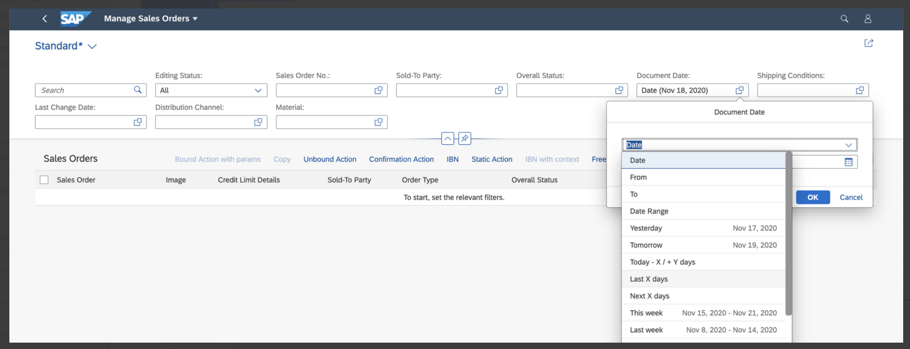
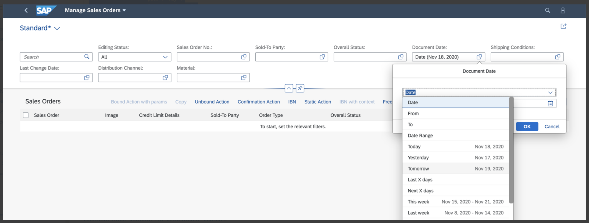

<!-- loiofef65d03d01a4b2baca28983a5449cf7 -->

# Enabling Semantic Operators in the Filter Bar

You can use semantic date values, such as *Today* or *Last Week*, on the filter bar of list report page and analytical list page applications.

Semantic operators are enabled by default for the following fields:

-   `Edm.Date`-based fields for which `FilterRestrictions.AllowedExpressions` is set to `SingleRange` or `SingleValue`.

-   `Edm.DateTimeOffset`-based fields for which `FilterRestrictions.AllowedExpressions` is set to `SingleRange`.


You can set the `FilterRestrictions` to `SingleRange` as shown in the following sample code:

> ### Sample Code:  
> XML Annotation
> 
> ```
> 
> <edmx:Reference Uri="https://oasis-tcs.github.io/odata-vocabularies/vocabularies/Org.OData.Capabilities.V1.xml">
>    <edmx:Include Namespace="Org.OData.Capabilities.V1" Alias="Capabilities" />
> </edmx:Reference>
> <Annotations Target="com.c_salesordermanage_sd.EntityContainer/SalesOrderManage">
>     <Annotation Term="Capabilities.FilterRestrictions">
>         <Record Type="Capabilities.FilterRestrictionsType">
>             <PropertyValue Property="FilterExpressionRestrictions">
>                 <Collection>
>                     <Record Type="Capabilities.FilterExpressionRestrictionType">
>                         <PropertyValueProperty="Property"PropertyPath="myDate"/>
>                         <PropertyValueProperty="AllowedExpressions"String="SingleRange"/>
>                     </Record>
>                     …
>                     …
>                 </Collection>
>             </PropertyValue>
>         </Record>
>     </Annotation>
>     …
>     …
> </Annotations>
> 
> ```

> ### Sample Code:  
> ABAP CDS Annotation
> 
> No ABAP CDS annotation sample is available. Please use the local XML annotation.

> ### Sample Code:  
> CAP CDS Annotation
> 
> ```
> @Capabilities : {
>    FilterRestrictions : {
>       FilterExpressionRestrictions :
>          [{
>             Property : 'myDate',
>             AllowedExpressions : 'SingleRange'
>          }]
>       }
> }
> ...
> entity MyEntity {
> ...
>     myDate: Date;
> }
> ```


<a name="loiofef65d03d01a4b2baca28983a5449cf7__section_otf_dzw_jnb"/>

## Setting a Default Value for a Semantic Date Field

Extend the manifest for the filter field as follows to set a default value for a semantic date:

> ### Sample Code:  
> Default value for semantic date field
> 
> ```
> "settings" : {  
>    "contextPath" : "/SalesOrderManage",
>    "controlConfiguration" : {
>       "@com.sap.vocabularies.UI.v1.SelectionFields" : {
>    …
>    …
>          "filterFields": {
>             "SalesOrderDate": { 
>                "settings": {
>                   "defaultValues": [{"operator": "YESTERDAY"}] 
>                }
>             }
>          }
>    …
>    …
>       }
>    }
> }
> 
> ```

The value set to `operator` is set as the default operator for the semantic date field. In this case, the default value is `"YESTERDAY"`.

Here's a list of fully supported operators:

-   Single date-based operators

    -   `"YESTERDAY"`

    -   `"TOMORROW"`

    -   `"TODAY"`

    -   `"FIRSTDAYWEEK"`

    -   `"LASTDAYWEEK"`

    -   `"FIRSTDAYMONTH"`

    -   `"LASTDAYMONTH"`

    -   `"FIRSTDAYQUARTER"`

    -   `"LASTDAYQUARTER"`

    -   `"FIRSTDAYYEAR"`

    -   `"LASTDAYYEAR"`


-   Date range-based operators

    -   `"THISWEEK"`

    -   `"LASTWEEK"`

    -   `"NEXTWEEK"`

    -   `"THISMONTH"`

    -   `"LASTMONTH"`

    -   `"NEXTMONTH"`

    -   `"THISQUARTER"`

    -   `"LASTQUARTER"`

    -   `"NEXTQUARTER"`

    -   `"QUARTER1"`

    -   `"QUARTER2"`

    -   `"QUARTER3"`

    -   `"QUARTER4"`

    -   `"THISYEAR"`

    -   `"LASTYEAR"`

    -   `"NEXTYEAR"`

    -   `"YEARTODATE"`

    -   `"DATETOYEAR"`

    -   `"NEXTXDAYSINCLUDED"`

    -   `"LASTXDAYSINCLUDED"`

    -   `"LASTXWEEKSINCLUDED"`

    -   `"NEXTXWEEKSINCLUDED"`

    -   `"LASTXMONTHSINCLUDED"`

    -   `"NEXTXMONTHSINCLUDED"`

    -   `"LASTXQUARTERSINCLUDED"`

    -   `"NEXTXQUARTERSINCLUDED"`

    -   `"LASTXYEARSINCLUDED"`

    -   `"NEXTXYEARSINCLUDED"`

    -   `"Empty"`


> ### Note:  
> -   Default values coming from the `SelectionVariant` for the semantic date fields are ignored – only the manifest-based default values are considered.
> 
> -   When using the default operators, check what the operator you're using evaluates to on the UI to ensure it matches your use case.
> 
>     > ### Example:  
>     > The standard fiscal quarter `"QUARTER1"` evaluates to the period between January and March. If you're using non-standard fiscal quarters, the default value won't be suitable for you.


## Defining Default Values for Operators That Require Parameters

If applications want to provide a default value for the semantic date field that requires an operator that needs a parameter value \(for example, an application developer wants to set NEXT "X" DAYS as the default operator and a default value for "X"\), the manifest must be configured accordingly. The following table provides the manifest settings for the various operators that need a parameter value:

**Defining Default Values for Operators That Require Parameters**


<table>
<tr>
<th valign="top">

Operator

</th>
<th valign="top">

`manifest.json` Sample

</th>
<th valign="top">

Comment

</th>
</tr>
<tr>
<td valign="top">

DATE

</td>
<td valign="top">

```

"@com.sap.vocabularies.UI.v1.SelectionFields": {
    "filterFields": {
        "SalesOrderDate": {
            "settings": {
                "defaultValues": [{"operator": "DATE", "values": ["2018-12-28"]}]
            }
        }
    }
}

```


</td>
<td valign="top">

Required date format: YYYY-MM-DD

</td>
</tr>
<tr>
<td valign="top">

FROM

</td>
<td valign="top">

```

"@com.sap.vocabularies.UI.v1.SelectionFields": {
    "filterFields": {
        "SalesOrderDate": {
            "settings": {
                "defaultValues": [{"operator": "FROM", "values": ["2018-12-28"]}]
            }
        }
    }
}

```


</td>
<td valign="top">

Required date format: YYYY-MM-DD

</td>
</tr>
<tr>
<td valign="top">

TO

</td>
<td valign="top">

```
"@com.sap.vocabularies.UI.v1.SelectionFields": {
    "filterFields": {
        "SalesOrderDate": {
            "settings": {
                "defaultValues": [{"operator": "TO", "values": ["2018-12-28"]}]
            }
        }
    }
}
```


</td>
<td valign="top">

Required date format: YYYY-MM-DD

</td>
</tr>
<tr>
<td valign="top">

DATERANGE

</td>
<td valign="top">

```

"@com.sap.vocabularies.UI.v1.SelectionFields": {
    "filterFields": {
        "SalesOrderDate": {
            "settings": {
                "defaultValues": [{"operator": "DATERANGE", "values": ["2019-11-02", "2022-01-01"]}]
            }
        }
    }
}
```


</td>
<td valign="top">

Required date format: YYYY-MM-DD

</td>
</tr>
<tr>
<td valign="top">

TODAYFROMTO

</td>
<td valign="top">

```
"@com.sap.vocabularies.UI.v1.SelectionFields": {
    "filterFields": {
        "SalesOrderDate": {
            "settings": {
                "defaultValues": [{"operator": "TODAYFROMTO", "values": [5, 6]}]
            }
        }
    }
}
```


</td>
<td valign="top">

First value: days before TODAY

Second value: Number of days after TODAY

</td>
</tr>
<tr>
<td valign="top">

LastXDays / LastXWeeks / LastXMonths / LastXQuarters / LastXYears

</td>
<td valign="top">

```
"@com.sap.vocabularies.UI.v1.SelectionFields": {
    "filterFields": {
        "SalesOrderDate": {
            "settings": {
                "defaultValues": [{"operator": "LASTDAYS", "values": [6]}]
            }
        }
    }
}
```


</td>
<td valign="top">

 

</td>
</tr>
<tr>
<td valign="top">

NextXDays / NextXWeeks / NextXMonths / NextXQuarters / NextXYears

</td>
<td valign="top">

```

"@com.sap.vocabularies.UI.v1.SelectionFields": {
    "filterFields": {
        "SalesOrderDate": {
            "settings": {
                "defaultValues": [{"operator": "NEXTDAYS", "values": [6]}]
            }
        }
    }
}

```


</td>
<td valign="top">

 

</td>
</tr>
<tr>
<td valign="top">

LastXDaysIncluded

</td>
<td valign="top">

```

"@com.sap.vocabularies.UI.v1.SelectionFields": {
   "filterFields": {
      "SalesOrderDate": {
         "settings": {
            "defaultValues" : [ {"operator": "LASTXDAYSINCLUDED", "values":[6]}]
         }
      }
   }
}

```


</td>
<td valign="top">

The range contains the last X days including the current one.

</td>
</tr>
<tr>
<td valign="top">

NextXDaysIncluded

</td>
<td valign="top">

```

"@com.sap.vocabularies.UI.v1.SelectionFields": {
   "filterFields": {
      "SalesOrderDate": {
         "settings": {
            "defaultValues" : [ {"operator": "NEXTXDAYSINCLUDED", "values":[6]}]
         }
      }
   }
}

```


</td>
<td valign="top">

The range contains the next X days including the current one.

</td>
</tr>
<tr>
<td valign="top">

LastXWeeksIncluded

</td>
<td valign="top">

```

"@com.sap.vocabularies.UI.v1.SelectionFields": {
   "filterFields": {
      "SalesOrderDate": {
         "settings": {
            "defaultValues" : [ {"operator": "LASTXWEEKSINCLUDED", "values":[6]}]
         }
      }
   }
}

```


</td>
<td valign="top">

The range contains the last X weeks including the current one.

</td>
</tr>
<tr>
<td valign="top">

NextXWeeksIncluded

</td>
<td valign="top">

```

"@com.sap.vocabularies.UI.v1.SelectionFields": {
   "filterFields": {
      "SalesOrderDate": {
         "settings": {
            "defaultValues" : [ {"operator": "NEXTXWEEKSINCLUDED", "values":[6]}]
         }
      }
   }
}

```


</td>
<td valign="top">

The range contains the next X weeks including the current one.

</td>
</tr>
<tr>
<td valign="top">

LastXMonthsIncluded

</td>
<td valign="top">

```

"@com.sap.vocabularies.UI.v1.SelectionFields": {
   "filterFields": {
      "SalesOrderDate": {
         "settings": {
            "defaultValues" : [ {"operator": "LASTXMONTHSINCLUDED", "values":[6]}]
         }
      }
   }
}

```


</td>
<td valign="top">

The range contains the last X months including the current one.

</td>
</tr>
<tr>
<td valign="top">

NextXMonthsIncluded

</td>
<td valign="top">

```

"@com.sap.vocabularies.UI.v1.SelectionFields": {
   "filterFields": {
      "SalesOrderDate": {
         "settings": {
            "defaultValues" : [ {"operator": "NEXTXMONTHSINCLUDED", "values":[6]}]
         }
      }
   }
}

```


</td>
<td valign="top">

The range contains the next X months including the current one.

</td>
</tr>
<tr>
<td valign="top">

LastXQuartersIncluded

</td>
<td valign="top">

```

"@com.sap.vocabularies.UI.v1.SelectionFields": {
   "filterFields": {
      "SalesOrderDate": {
         "settings": {
            "defaultValues" : [ {"operator": "LASTXQUARTERSINCLUDED", "values":[6]}]
         }
      }
   }
}

```


</td>
<td valign="top">

The range contains the last X quarters including the current one.

</td>
</tr>
<tr>
<td valign="top">

NextXQuartersIncluded

</td>
<td valign="top">

```

"@com.sap.vocabularies.UI.v1.SelectionFields": {
   "filterFields": {
      "SalesOrderDate": {
         "settings": {
            "defaultValues" : [ {"operator": "NEXTXQUARTERSINCLUDED", "values":[6]}]
         }
      }
   }
}

```


</td>
<td valign="top">

The range contains the next X quarters including the current one.

</td>
</tr>
<tr>
<td valign="top">

LastXYearsIncluded

</td>
<td valign="top">

```

"@com.sap.vocabularies.UI.v1.SelectionFields": {
   "filterFields": {
      "SalesOrderDate": {
         "settings": {
            "defaultValues" : [ {"operator": "LASTXYEARSINCLUDED", "values":[6]}]
         }
      }
   }
}

```


</td>
<td valign="top">

The range contains the last X years including the current one.

</td>
</tr>
<tr>
<td valign="top">

NextXYearsIncluded

</td>
<td valign="top">

```

"@com.sap.vocabularies.UI.v1.SelectionFields": {
   "filterFields": {
      "SalesOrderDate": {
         "settings": {
            "defaultValues" : [ {"operator": "NEXTXYEARSINCLUDED", "values":[6]}]
         }
      }
   }
}

```


</td>
<td valign="top">

The range contains the next X years including the current one.

</td>
</tr>
<tr>
<td valign="top">

SpecificMonth

</td>
<td valign="top">

```
"@com.sap.vocabularies.UI.v1.SelectionFields": {
   "filterFields": {
      "SalesOrderDate": {
         "settings": {
            "defaultValues" : [ {"operator": "SPECIFICMONTH", "values":[1]}]
         }
      }
   }

} 
```


</td>
<td valign="top">

The numeric assignment is zero \(for example, January is 0\)

</td>
</tr>
</table>

> ### Tip:  
> If the semantic filter field is from a navigation entity set, you must specify the filter field name in the `"<navigationProperty>::<filterField>"` format. In the following example, the `"SalesOrderDate"` comes from a navigation entity set where `"_Item"` is the name of the associated navigation property:
> 
> > ### Sample Code:  
> > Semantic filter field from navigation entity set
> > 
> > ```
> > "@com.sap.vocabularies.UI.v1.SelectionFields": {
> > 
> >    "filterFields": {
> >       "_Item::SalesOrderDate": {
> >          "settings": {
> >             "defaultValues" : [ {"operator": "SPECIFICMONTH", "values":[1]}]
> >          }
> >       }
> >    }
> >  
> > }
> > ```

> ### Note:  
> You can't define default values as described in this section for `Edm.DateTime`-based fields.


## Excluding Certain Date Range Types

You can use the `operatorConfiguration` settings to include and exclude specific date range values. Applications can use this setting for more complex and detailed configuration.

-   Example 1

    To remove `"TODAY"` from the date range, proceed as shown in the following sample code:

    > ### Sample Code:  
    > ```
    > "filterFields": {
    >     "SalesOrderDate": {
    >        "settings": {
    >            "operatorConfiguration": [
    >                  {
    >                      "path": "key",
    >                       "equals": "TODAY",
    >                       "exclude": true
    >                   } // TODAY filter will be removed
    >             ]
    >        }
    >     }
    >  }
    > ```

    You can see the result in the following screenshot:

    

-   Example 2

    To include `"TODAY"` and exclude "Today -X/+Y Days", proceed as shown in the following sample code:

    > ### Sample Code:  
    > ```
    > "filterFields": {
    >     "SalesOrderDate": {
    >        "settings": {
    >            "operatorConfiguration": [
    >                  {
    >                      "path": "key",
    >                       "equals": "TODAY",
    >                       "exclude": false
    >                   },
    >                   {
    >                     "path": "key",
    >                      "equals": "TODAYXYDAYS",
    >                      "exclude": true
    >                   }
    >             ]
    >        }
    >     }
    >  }
    > ```

    You can see the result in the following screenshot:

    

    You can find all supported operators for the `"exclude"` configuration in the following list:

    -   `"DATE"`

    -   `"FROM"`

    -   `"TO"`

    -   `"DATERANGE"`

    -   `"TODAY"`

    -   `"YESTERDAY"`

    -   `"TOMORROW"`

    -   `"TODAYFROMTO"`

    -   `"LASTDAYS"`

    -   `"NEXTDAYS"`

    -   `"THISWEEK"`

    -   `"LASTWEEK"`

    -   `"LASTWEEKS"`

    -   `"NEXTWEEK"`

    -   `"NEXTWEEKS"`

    -   `"SPECIFICMONTH"`

    -   `"THISMONTH"`

    -   `"LASTMONTH"`

    -   `"LASTMONTHS"`

    -   `"NEXTMONTH"`

    -   `"NEXTMONTHS"`

    -   `"THISQUARTER"`

    -   `"LASTQUARTER"`

    -   `"LASTQUARTERS"`

    -   `"NEXTQUARTER"`

    -   `"NEXTQUARTERS"`

    -   `"QUARTER1"`

    -   `"QUARTER2"`

    -   `"QUARTER3"`

    -   `"QUARTER4"`

    -   `"THISYEAR"`

    -   `"LASTYEAR"`

    -   `"LASTYEARS"`

    -   `"NEXTYEAR"`

    -   `"NEXTYEARS"`

    -   `"YEARTODATE"`

    -   `"DATETOYEAR"`

    -   `"Empty"`


    > ### Note:  
    > -   Excluding specific semantic operators is only allowed for `SingleRange`-based *Date* fields.
    > 
    > -   When you exclude an operator for a filter field that's based on a semantic date and comes from a navigation entity set, ensure that you specify the `filterField` using the following format:
    > 
    >     ```
    >     "<navigationProperty>::<propertyName>"
    >     ```
    > 
    >     > ### Example:  
    >     > If `"_Items"` is the navigation property and `"DispatchDate"` is the property, then the `filterField` for which `"settings"` is defined will be `"_Items::DispatchDate"`.


## Enabling Additional Date Range Operators

You can now use additional date range operators for single range-based fields of type `Edm.Date` or `Edm.DateTimeOffset`. Using these operators, you can combine the single value date operators, such as `TODAY` or `TOMORROW,` with the *FROM* or *TO* operations.

The following additional operators are available:

-   "FROMTODAY"

-   "FROMTOMORROW"

-   "FROMYESTERDAY"

-   "FROMFIRSTDAYWEEK"

-   "FROMLASTDAYWEEK"

-   "FROMFIRSTDAYMONTH"

-   "FROMLASTDAYMONTH"

-   "FROMFIRSTDAYQUARTER"

-   "FROMLASTDAYQUARTER"

-   "FROMFIRSTDAYYEAR"

-   "FROMLASTDAYYEAR"

-   "TOTODAY"

-   "TOTOMORROW"

-   "TOYESTERDAY"

-   "TOFIRSTDAYWEEK"

-   "TOLASTDAYWEEK"

-   "TOFIRSTDAYMONTH"

-   "TOLASTDAYMONTH"

-   "TOFIRSTDAYQUARTER"

-   "TOLASTDAYQUARTER"

-   "TOFIRSTDAYYEAR"

-   "TOLASTDAYYEAR"


These additional semantic date operators are not available by default. To enable them, you can extend the manifest configuration as shown in the following sample code:

> ### Sample Code:  
> ```
> "targets": {
>    "SalesOrderManageList": {
>       "options": {
>          "settings": {
>             "controlConfiguration": {
>                "@com.sap.vocabularies.UI.v1.SelectionFields": {
>                   "filterFields": {
>                      "SalesOrderDate": {
>                         "settings": {
>                            "operatorConfiguration": [
>                            {
>                               "path": "key",
>                               "equals": "FROMTODAY",
>                               "exclude": false // By default, "exclude" is set to true for all these additional date range operators and have to be explicitly set to false in case the operator needs to be enabled
>                            },
>                           {
>                              "path": "key",
>                              "equals": "TOYESTERDAY",
>                              "exclude": false
>                           }]
>                        }
>                     },
>                     …….
>                     …….
>                  }
> ```

You can also use these additional semantic date range operators as default values for the filter fields.

> ### Note:  
> These operators are not available when using the `Filter Bar` building block. They are also not available as filters in the table or chart within the object page.


<a name="loiofef65d03d01a4b2baca28983a5449cf7__section_q5w_tgf_nmb"/>

## More Information

For more information about configuring filter bars on a list report page, see [Adapting the Filter Bar](adapting-the-filter-bar-609c39a.md).

