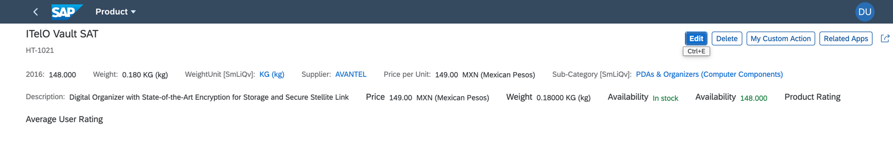

<!-- loio9422074471ef4db9a7ee6b519102f0d1 -->

# Enabling Simple Header Facets

If you want to display more content in your header facet, you can enable the simple header facet.

> ### Note:  
> This topic is currently only applicable to SAP Fiori elements for OData V2.

To do so, you must add the `simpleHeaderFacets:true` flag manually in the app's `manifest.json` file.

> ### Note:  
> The simple header facet does not support the use of complex data points and `DataFieldForAnnotation`, such as ratings, progress indicators, or charts.

The following figure shows a sample simple header facet:

   
  
**Simple Header Facet**

  

> ### Sample Code:  
> Enabling simple header facet
> 
> ```
> 
> "sap.ui.generic.app": {
>         "_version": "1.2.0",
>         
>         "pages": [{
>                 "entitySet": "STTA_C_MP_Product",
>                 "component": {
>                         "name": "sap.suite.ui.generic.template.ListReport",
>                         "list": true,
>                         "settings": {
>                                 "gridTable": false,
>                                 "multiSelect": true,
>                                 "smartVariantManagement": true
>                         }
>                 },
>                 "pages": [{
>                         "entitySet": "STTA_C_MP_Product",
>                         "component": {
>                                 "name": "sap.suite.ui.generic.template.ObjectPage",
>                                 "settings": {
>                                         "showRelatedApps": true,
>                                         "gridTable": false,
>                                         "editableHeaderContent": true,
>                                         "simpleHeaderFacets":true, // This Enables Simple Header Facet on the Object Page
>                                 }
>                         },
>                         "pages": [{
>                                 "navigationProperty": "to_ProductText",
>                                 "entitySet": "STTA_C_MP_ProductText",
>                                 "component": {
>                                         "name": "sap.suite.ui.generic.template.ObjectPage"
>                                 }
>                         }]
>                 }]
>         }]
> },
> ```

