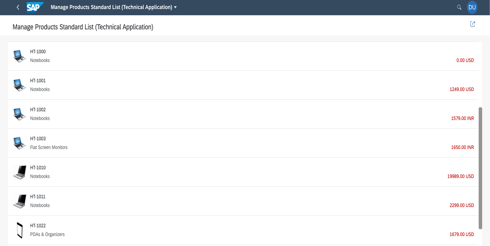
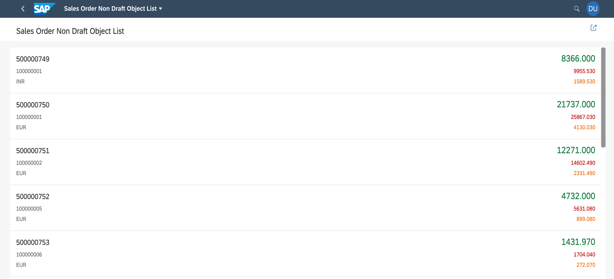

<!-- loio4ed47aade93b4a24948f44b12b20c69b -->

# Enabling Standard List Items and Object List Items

You can configure standard list items and object list items in list reports.

> ### Note:  
> This topic is currently only applicable to SAP Fiori elements for OData V2.

Both list items can display standard, numeric, and date fields.

Note the following:

-   `UI.LineItem` is the default annotation term used to render a list item similar to a table. To render the list, the `UI.LineItem` should contain only `DataField` and `DataFieldForAnnotation` elements. Any other kind of `DataFieldAbstract` is not supported.

-   `DataFieldForAnnotation` with a `DataPoint` target is used for all fields shown on the right side of the list item. `DataField` is used for these fields if no data points are defined. These fields are optional.

-   The fields are sorted by their importance. However, if a data point exists, it will be used regardless of its importance. The default importance is taken as `Medium` for data fields and data points in which the `UI.Importance` property has not been defined.

-   The standard and object list items support the `UI.Criticality` property so that all data points have semantic coloring enabled.

-   `onListNavigationExtension` is enabled for internal navigation. For more information, see [Example: Enable Internal Navigation to Different Detail Page](example-enable-internal-navigation-to-different-detail-page-75002b3.md).


<a name="loio4ed47aade93b4a24948f44b12b20c69b__section_ptm_ljl_4pb"/>

## Standard List Item

You can define the annotation for the standard list item as follows:

> ### Sample Code:  
> ```
> 
> <Annotation Term="UI.LineItem">
> 	<Collection>
> 		<Record Type="UI.DataField">
> 			<PropertyValue Property="Value" Path="ProductForEdit" />
> 			<Annotation Term="UI.Importance" EnumMember="UI.ImportanceType/High" />
> 		</Record>
> 		<Record Type="UI.DataField">
> 			<PropertyValue Property="Value" Path="ProductCategory" />
> 			<Annotation Term="UI.Importance" EnumMember="UI.ImportanceType/Medium" />
> 		</Record>
> 		<Record Type="UI.DataField">
> 			<PropertyValue Property="Value" Path="ProductPictureURL" />
> 		</Record>
> 		<Record Type="UI.DataFieldForAnnotation">
> 			<PropertyValue Property="Target" AnnotationPath="@UI.DataPoint#Price" /> 
> 		</Record>
> 	</Collection>
> </Annotation>
> 
> <Annotation Term="UI.DataPoint" Qualifier="Price">
> 	<Record>
> 		<PropertyValue Property="Value" Path="Price" />
> 		<PropertyValue Property="Criticality" Path="PriceCriticality" />
> 	</Record>
> </Annotation>
> 
> ```

You need to update the `manifest.json` file of the app as follows:

> ### Sample Code:  
> ```
> 
> "pages": {
> 	"ListReport|STTA_C_MP_Product": {
> 		"entitySet": "STTA_C_MP_Product",
> 		"component": {
> 			"settings": {
> 				"isWorklist": true,
> 				"tableSettings": {
> 					type: "StandardList"
> 				},
> 				"smartVariantManagement": false
> 			}
> 		}
> 	}
> }
> ```

  

Follow the guidelines mentioned in the following table for adding `DataFields` and `DataPoints` under the `UI.LineItem` annotation:

****


<table>
<tr>
<th valign="top">

Standard List Item Property


</th>
<th valign="top">

Entity Annotation


</th>
<th valign="top">

Location of the Property on the List Item UI


</th>
<th valign="top">

Additional Comments


</th>
</tr>
<tr>
<td valign="top">

`title`


</td>
<td valign="top">

First data field of `UI.LineItem`


</td>
<td valign="top">

Top left


</td>
<td valign="top">

 


</td>
</tr>
<tr>
<td valign="top">

`description`


</td>
<td valign="top">

Second data field of `UI.LineItem`


</td>
<td valign="top">

Bottom left


</td>
<td valign="top">

 


</td>
</tr>
<tr>
<td valign="top">

`info`


</td>
<td valign="top">

First data point


</td>
<td valign="top">

Top right


</td>
<td valign="top">

If no data point exists, then the next data field is used, that is, the third data field.


</td>
</tr>
<tr>
<td valign="top">

`infoState`


</td>
<td valign="top">

First data point or criticality, or first data point or `CriticalityCalculation` 


</td>
<td valign="top">

Color


</td>
<td valign="top">

If no data point exists, then the default state is set to `None`.


</td>
</tr>
<tr>
<td valign="top">

`icon`


</td>
<td valign="top">

First data field marked with the `UI.IsImageURL` annotation


</td>
<td valign="top">

 


</td>
<td valign="top">

The order of this data field is not important. It can be placed anywhere under the `UI.LineItem`.


</td>
</tr>
</table>


<a name="loio4ed47aade93b4a24948f44b12b20c69b__section_oh5_zll_4pb"/>

## Object List Item

You can define the annotation for an object list item as follows:

> ### Sample Code:  
> ```
> 
> <Annotation Term="UI.LineItem">
> 	<Collection>
> 		<Record Type="UI.DataField">
> 			<PropertyValue Property="Label" String="Sales Order ID" />
> 			<PropertyValue Property="Value" Path="SalesOrderID"/>
> 			<Annotation Term="UI.Importance" EnumMember="UI.ImportanceType/High"/>
> 		</Record>
> 		<Record Type="UI.DataField">
> 			<PropertyValue Property="Value" Path="BusinessPartnerID"/>
> 			<Annotation Term="UI.Importance" EnumMember="UI.ImportanceType/Medium"/>
> 		</Record>
> 		<Record Type="UI.DataField">
> 			<PropertyValue Property="Value" Path="CurrencyCode"/>
> 			<Annotation Term="UI.Importance" EnumMember="UI.ImportanceType/Low"/>
> 		</Record>
> 		<Record Type="UI.DataFieldForAnnotation">
> 			<Annotation Term="UI.Importance" EnumMember="UI.ImportanceType/High"/>
> 			<PropertyValue Property="Target" AnnotationPath="@UI.DataPoint#NetAmount" /> 
> 		</Record>
> 		<Record Type="UI.DataFieldForAnnotation">
> 			<PropertyValue Property="Target" AnnotationPath="@UI.DataPoint#GrossAmount" /> 
> 		</Record>
> 		<Record Type="UI.DataFieldForAnnotation">
> 		<Annotation Term="UI.Importance" EnumMember="UI.ImportanceType/Low"/>
> 			<PropertyValue Property="Target" AnnotationPath="@UI.DataPoint#TaxAmount" /> 
> 		</Record>
>     </Collection>
> </Annotation>
> 
> <Annotation Term="UI.DataPoint" Qualifier="NetAmount">
> 	<Record>
> 		<PropertyValue Property="Value" Path="NetAmount" />
> 		<PropertyValue Property="Criticality" EnumMember="com.sap.vocabularies.UI.v1.CriticalityType/Positive" />
> 	</Record>
> </Annotation>
> <Annotation Term="UI.DataPoint" Qualifier="GrossAmount">
> 	<Record>
> 		<PropertyValue Property="Value" Path="GrossAmount" />
> 		<PropertyValue Property="Criticality" EnumMember="com.sap.vocabularies.UI.v1.CriticalityType/Negative" />
> 	</Record>
> </Annotation>
> <Annotation Term="UI.DataPoint" Qualifier="TaxAmount">
> 	<Record>
> 		<PropertyValue Property="Value" Path="TaxAmount" />
> 		<PropertyValue Property="Criticality" EnumMember="com.sap.vocabularies.UI.v1.CriticalityType/Critical" />
> 	</Record>
> </Annotation>
> 
> ```

You need to update the `manifest.json` file of the app as follows:

> ### Sample Code:  
> ```
> 
> "pages": {
> 	"ListReport|STTA_C_MP_Product": {
> 		"entitySet": "STTA_C_MP_Product",
> 		"component": {
> 			"settings": {
> 				"isWorklist": true,
> 				"tableSettings": {
> 					type: "ObjectList"
>  				},
> 				"smartVariantManagement": false
> 			}
> 		}
> 	}
> }
> ```

  

Follow the guidelines in the following table for adding `DataFields` and `DataPoints` under the `UI.LineItem` annotation:

****


<table>
<tr>
<th valign="top">

Object List Item Property


</th>
<th valign="top">

Entity Annotation


</th>
<th valign="top">

Location of the Property on the List Item UI


</th>
<th valign="top">

Additional Comments


</th>
</tr>
<tr>
<td valign="top">

`title`


</td>
<td valign="top">

First data field of `UI.LineItem`


</td>
<td valign="top">

Top left


</td>
<td valign="top">

 


</td>
</tr>
<tr>
<td valign="top">

First`ObjectAttribute`\(under the attributes aggregation\)


</td>
<td valign="top">

Second data field of `UI.LineItem`


</td>
<td valign="top">

Middle left


</td>
<td valign="top">

 


</td>
</tr>
<tr>
<td valign="top">

`number`


</td>
<td valign="top">

First data point


</td>
<td valign="top">

Top right


</td>
<td valign="top">

If no data point exists, then the next data field is used, that is, the third data field.


</td>
</tr>
<tr>
<td valign="top">

`numberState`


</td>
<td valign="top">

First data point or criticality, or first data point or `CriticalityCalculation` 


</td>
<td valign="top">

Color


</td>
<td valign="top">

If no data point exists, then the default state is set to `None`.


</td>
</tr>
<tr>
<td valign="top">

`firstStatus`


</td>
<td valign="top">

Second data point


</td>
<td valign="top">

Middle right


</td>
<td valign="top">

If no data point exists, then the next data field is used. That is, the third data field is used if one data point is provided, or the fourth data field is used if none is provided.


</td>
</tr>
<tr>
<td valign="top">

Second `ObjectAttribute`\(under the attributes aggregation\)


</td>
<td valign="top">

Third data field


</td>
<td valign="top">

Bottom left


</td>
<td valign="top">

If the third data field is already used, the next available data field is used. For example, the fifth data field is used if no data points were provided, or the fourth data field is used if only one data point was provided.


</td>
</tr>
<tr>
<td valign="top">

`secondStatus`


</td>
<td valign="top">

Third data point


</td>
<td valign="top">

Bottom right


</td>
<td valign="top">

If no data points exist, the next data field is used. That is, the fourth data field is used if two data points were provided, or the fifth data field is used if only one data point was provided, or sixth data field if none is provided.


</td>
</tr>
</table>

