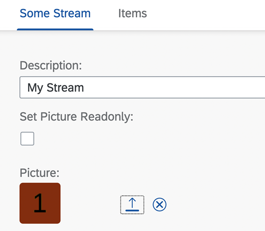
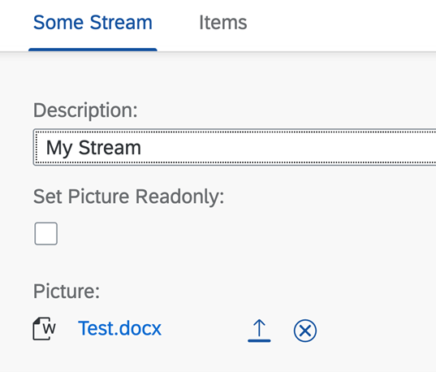
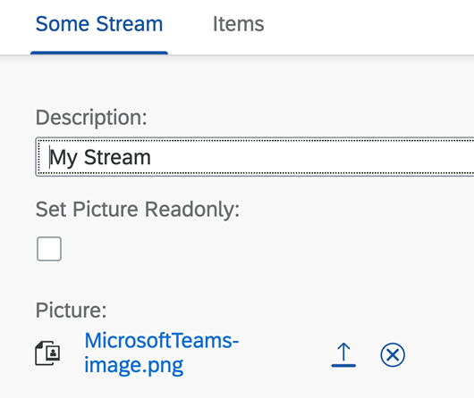
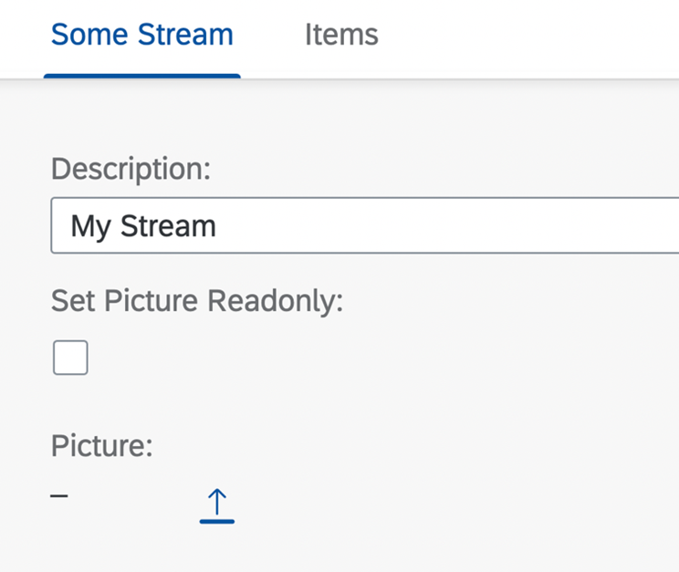
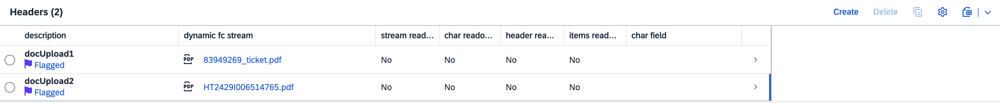

<!-- loio7e28569a7f8c47ed9302854c06a2d10a -->

# Enabling Stream Support

You can enable users to upload, download, and delete files.

> ### Note:  
> For information about SAP Fiori elements for OData V4, see [Enabling Stream Support](enabling-stream-support-b236d32.md).

> ### Note:  
> To prevent security issues and protect data from being created or processed with malicious content, you must ensure the following security measures are in place:
> 
> -   Define `@Core.AcceptableMediaTypes` to specify allowed file types.
> 
> -   The back-end service framework must ensure a virus scan and other security measures, such as maximum file size limitations and MIME-type restrictions, are in place.
> 
> -   You must also implement file validation and data sanitization in the back end.

You can upload or download different `MediaType` files from an object page using stream support.


<a name="loio7e28569a7f8c47ed9302854c06a2d10a__section_kqw_x3n_psb"/>

## Prerequisites

The service must have an entity that is stream enabled because the `Edm.Stream` type is not supported.

> ### Sample Code:  
> XML Annotation
> 
> ```
> 
> <EntityType Name="MyStreamType" m:HasStream="true" sap:label="Stream Test" sap:content-version="1">
>     <Key>
>         <PropertyRef Name="Streamuuid" />
>         <PropertyRef Name="IsActiveEntity" />
>     </Key>
> <Property Name="Edit_ac" Type="Edm.Boolean" sap:label="Dyn. Action Control" sap:creatable="false" sap:updatable="false" sap:sortable="false" sap:filterable="false" />
> 
> ```


<a name="loio7e28569a7f8c47ed9302854c06a2d10a__section_igr_q2t_ghc"/>

## Enabling Stream Support

To make stream support available on the object page, annotate the following in the `UI.FieldGroup` or `UI.Identification` annotation:

> ### Sample Code:  
> XML Annotation
> 
> ```
> 
> <Record Type="UI.DataField">
>      <PropertyValue Property="Value" Path="$value"/>
> </Record>
> 
> ```

> ### Note:  
> `$value` is a reserved text, and it is used only to support stream.

The following `MediaType` annotation represents the stream type that displays each record. This annotation is mandatory and exists on the entity level.

> ### Sample Code:  
> XML Annotation
> 
> ```
> <Annotation Term="Org.OData.Core.V1.MediaType" Path="ThisMimeType"></Annotation>
> ```

The following annotation must be set on the `entitylevel` if the stream is displayed as image.

> ### Sample Code:  
> XML Annotation
> 
> ```
> <Annotation Term="UI.IsImage"/>
> ```

If the entity is annotated with `UI.IsImage`, then both the images and the media files are displayed on the UI as thumbnails.



If the entity is not annotated with `UI.IsImage`, then both the images and the media files are displayed on the UI with icon and hyperlink.





Label for the file uploader is picked from the `dataField` annotation.

Based on the `MediaType`, the icon for the non-image media type is shown differently in the UI.

The following annotation must exist on the `entitylevel` to set the text for the file name. If the annotations are not included, the hyperlink displays the text *Open File*.

> ### Sample Code:  
> XML Annotation
> 
> ```
> 
> <Annotation Term="SAP__core.ContentDisposition">
>     <Record>
>         <PropertyValue Property="Filename" Path="ThisFileName" />
>     </Record>
> </Annotation>
> 
> ```

You can restrict a `MediaType` from being uploaded by using the following annotation:

> ### Sample Code:  
> XML Annotation
> 
> ```
> 
> <Annotation Term="Core.AcceptableMediaTypes">
>     <Collection>
>         <String>text/plain</String>
>     </Collection>
> </Annotation>
> 
> ```

In draft apps, you can only upload or delete a stream when the UI is editable. However, in non-draft apps, the upload and delete is supported only in display mode.

If no file is present, a placeholder is displayed:



> ### Note:  
> The uploaded file name is visible in the list report page or the object page table but cannot be edited from the table.
> 
> To upload a file, navigate to the corresponding object page.
> 
> Only one file can be uploaded for a record; uploading a second file can replace the existing one.
> 
> 

