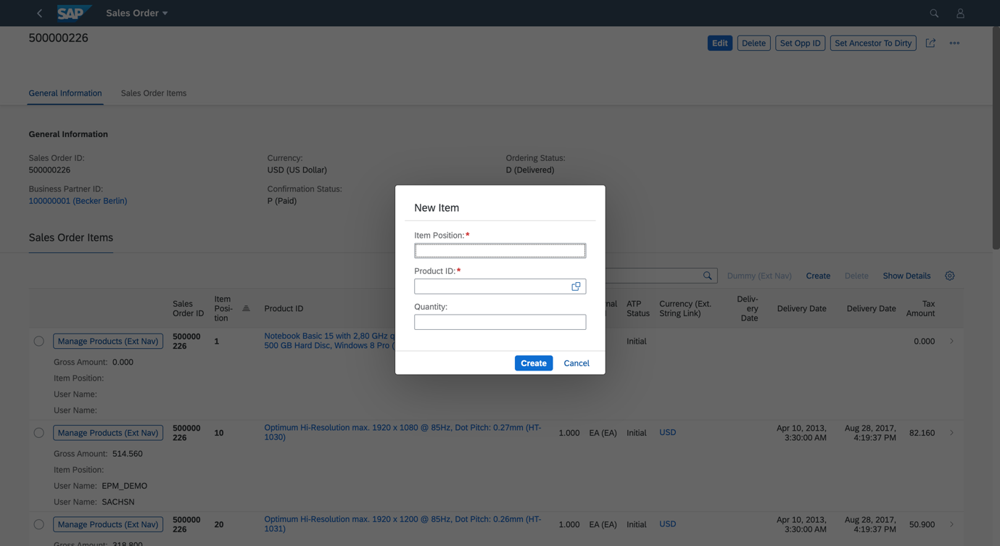

<!-- loiod7be84d86ad94078b0ba4cc820753c0c -->

# Enabling Sub-object Creation Through Dialog on a Non-draft Object Page

You can enable creation of sub-objects having a maximum of 8 data fields through a dialog on an object page of a non-draft aplication.

> ### Note:  
> This topic is currently only applicable to SAP Fiori elements for OData V2.



You can enable this feature in the manifest setting by adding the property `createWithParameterDialog` and passing the properties of related entity set as follows:

> ### Sample Code:  
> ```
> 
> "createWithParameterDialog" : {
>        "fields" : {
>          "<fieldName>" : {"path":"<fieldname>"},
>          "<fieldName>" : {"path":"<fieldname>"}
>         }
> 
> ```

With this setting, the option to create sub-objects using a dialog appears on the object page.

> ### Sample Code:  
> ```
> 
> "pages": [
>            {
>              "entitySet": "STTA_C_SO_SalesOrder_ND",
>               "component": {
>                   "name": "sap.suite.ui.generic.template.ObjectPage",
>                   "settings": {
>                     "showRelatedApps": true,
>                      "gridTable": false,
>                       "sections": {
>                          "to_Item::com.sap.vocabularies.UI.v1.LineItem": {
>                          "navigationProperty": "to_Item",
>                           "entitySet": "STTA_C_SO_SalesOrderItem_ND",
>                            "tableSettings": {
>                              "createWithParameterDialog" : {
>                                "fields" : {
>                                  "SalesOrderItemID":{"path": "SalesOrderItemID"},
>                                   "ProductID" : {"path":"ProductID"},
>                                   "Quantity" : {"path":"Quantity"}
>                                  }
>                                }
>                             }
>                           }
>                        }
>                     }                    
>                   },
> ```

> ### Note:  
> -   Ensure that the properties are related to the entities.
> 
> -   Ensure that all the mandatory fields of the entities are part of the create dialog.
> 
> -   Ensure that the application is non-draft.


<a name="loiod7be84d86ad94078b0ba4cc820753c0c__section_p3l_jgt_3lb"/>

## Customization of Dialog Title and Success Toast Message

The default title of the dialog is *New Item* and the key in i18n file is `CREATE_DIALOG_TITLE`. The default toast message is*Item Created* and the key in i18n file is `ITEM_CREATED`. You can override these i18n keys.

**Related Information**  


[Enabling Object Creation Using the Dialog in the List Report](enabling-object-creation-using-the-dialog-in-the-list-report-ceb9284.md "You can enable the creation of objects that have a maximum of 8 data fields using a dialog in the list report page.")

