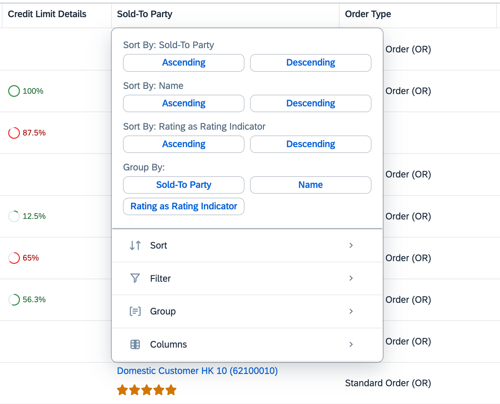

<!-- loio3e2b4d212b66481a829ccef1dc0ca16b -->

# Enabling Table Personalization

You can use table personalization to modify the settings of a table.

You can control the table personalization options that end users see.


<a name="loio3e2b4d212b66481a829ccef1dc0ca16b__section_jpy_ctx_gqb"/>

## Filter Option

The default settings for filtering are as follows:

-   Disabled in the page-level variant

-   Enabled in the control-level variant


> ### Note:  
> The filter option is available in the table personalization settings for responsive tables. For other table types, the filter option, when enabled, is also available after selecting the column header in addition to the personalization settings.


<a name="loio3e2b4d212b66481a829ccef1dc0ca16b__section_a2h_ntx_gqb"/>

## Additional Features in SAP Fiori Elements for OData V2


### Enabling Table Filters

In harmonized variant management, by default, end users cannot set a filter in the table personalization settings. To enable filtering for end users, set the `enableTableFilterInPageVariant` property in the manifest. If `smartVariantManagement` is set to `false`, then table filter is enabled by default.

> ### Sample Code:  
> `manifest.json`
> 
> ```
> 
> "sap.ui.generic.app": {
>     "_version": "1.3.0",
>         "settings": {
>         "forceGlobalRefresh": true
>         },
>         "pages": {
>             "ListReport|STTA_C_MP_Product": {
>                 "entitySet": "STTA_C_MP_Product",
>                 "component": {
>                     "name": "sap.suite.ui.generic.template.ListReport",
>                     "list": true,
>                     "settings": {
>                         "smartVariantManagement": true,
>                         "enableTableFilterInPageVariant": true
>                     }
>                 },
> ```


<a name="loio3e2b4d212b66481a829ccef1dc0ca16b__section_hgz_b5x_gqb"/>

## Additional Features in SAP Fiori Elements for OData V4


### Enabling and Disabling Table Personalization

The `"variantManagement"` setting in the `manifest.json` file allows you to enable or disable the table personalization settings for end users.

> ### Sample Code:  
> Enable or disable table personalization
> 
> ```
> "BusinessPartnersList": {
>    "type": "Component",
>    "id": "BusinessPartnersList",
>    "name": "sap.fe.templates.ListReport",
>    "options": {
>       "settings": {
>          "contextPath": "/BusinessPartners",
>          "variantManagement": "Control"
>       }
>    }
> },
> 
> ```

In the list report, you can set the variant management to `"Page"` level or to `"Control"` level. On an object page, you can set the variant management to `"Control"` level or to `"None"`.

-   `"Page"` level \(list report\): With this setting, filtering using the table personalization settings is disabled and users can filter the table from the `filterBar`. The filters applied in the `filterBar` can be saved as a page variant.

-   `"None"` \(object page\): With this setting, variant management is disabled.

-   `"Control"` level: With this setting, table personalization is enabled. The following settings are available:

    -   Filtering

        End users can filter table data choosing one or multiple property values \(unless filtering is disabled\). You can use the `@com.sap.vocabularies.UI.v1.HiddenFilter` annotation to exclude those columns you don't want to be filterable.

        

        > ### Note:  
        > Filtering of navigation properties is only available for properties used in the `LineItem`.

    -   Sorting

        

        You can use the `@.OData.Capabilities.V1.SortRestrictions` annotation to exclude those columns you don't want to be sortable. You can use the `@.OData.Capabilities.V1.NavigationRestrictions` annotation to exclude navigation properties.

        > ### Note:  
        > Defining sort restrictions is only possible for first-level navigation entities.

        You can use `SortRestrictions` to define your desired `RestrictedProperty` in the `NavigationRestrictions`. Use `SortRestrictions` to either restrict all properties of an entity by setting `Sortable` to `false`, or to disable sorting of individual properties using `NonSortableProperties`. To add sort retrictions for navigation properties, the list of `NonSortableProperties` must be prefixed with the `NavigationPropertyPath`.

        > ### Sample Code:  
        > XML Annotation for `SortRestrictions` in `NavigationRestrictions`
        > 
        > ```xml
        > <Annotation Term="Capabilities.NavigationRestrictions">
        >     <Record Type="Capabilities.NavigationRestrictionsType">
        >         <PropertyValue Property="RestrictedProperties">
        >             <Collection>
        >                 <Record Type="Capabilities.NavigationPropertyRestriction">
        >                     <PropertyValue Property="NavigationProperty" NavigationPropertyPath="_OverallSDProcessStatus"/>
        >                     <PropertyValue Property="SortRestrictions">
        >                         <Record Type="Capabilities.SortRestrictionsType">
        >                             <PropertyValue Property="NonSortableProperties">
        >                                 <Collection>
        >                                     <PropertyPath>_OverallSDProcessStatus/OverallSDProcessStatus_Text</PropertyPath>
        >                                 </Collection>
        >                             </PropertyValue>
        >                         </Record>
        >                     </PropertyValue>
        >                 </Record>
        >                 <Record Type="Capabilities.NavigationPropertyRestriction">
        >                     <PropertyValue Property="NavigationProperty" NavigationPropertyPath="_SalesOrderType"/>
        >                     <PropertyValue Property="SortRestrictions">
        >                         <Record Type="Capabilities.SortRestrictionsType">
        >                             <PropertyValue Property="NonSortableProperties">
        >                                 <PropertyValue Property="Sortable" Bool="false"/>
        >                             </PropertyValue>
        >                         </Record>
        >                     </PropertyValue>
        >                 </Record>
        >             </Collection>
        >         </PropertyValue>
        >     </Record>
        > </Annotation>
        > ```

        > ### Sample Code:  
        > ABAP CDS Annotation for `SortRestrictions` 
        > 
        > ```
        > @ObjectModel.sort.enabled: false
        > ```

        > ### Sample Code:  
        > CAP CDS Annotation for `SortRestrictions` in `NavigationRestrictions`
        > 
        > ```
        > NavigationRestrictions : {
        >     RestrictedProperties : [
        >         {
        >             NavigationProperty: _OverallSDProcessStatus,
        >             SortRestrictions: {NonSortableProperties: [_OverallSDProcessStatus.OverallSDProcessStatus_Text]}
        >         },
        >         {
        >             NavigationProperty: _SalesOrderType,
        >             SortRestrictions: {Sortable: false}
        >         }
        >     ]
        > }
        > ```

        > ### Note:  
        > Sorting on navigation properties can lead to issues in CAP NodeJS when using an SQLite DB.

    -   Adding or removing columns

        End users can add or remove all properties of the root entity of a given table. Selected properties are shown at the top of the list. Users can sort tables by choosing individual columns or multiple columns \(unless sorting is disabled\). Users can sort each column in ascending or descending order.

        

    -   Grouping \(available for analytical and responsive tables\)


    By default, the control variant management enables all settings, but you can enable or disable each of these separately using the `"personalization"` setting in the manifest.

    For more information, see [Managing Variants](managing-variants-8ce658e.md) and [Enabling Variant Management on the Object Page](enabling-variant-management-on-the-object-page-f26d42b.md).


For a responsive table, the user can open the sorting, filtering, and grouping dialog by clicking on the column header.



> ### Note:  
> When the end user selects the Filter menu, the default properties displayed for sorting, filtering, and grouping are the properties visible in the column. Any sorting and filtering restrictions are reflected in this dialog. The TextArrangement also has an impact as described in the [Personalization for Properties with Text Arrangement](enabling-table-personalization-3e2b4d2.md#loio3e2b4d212b66481a829ccef1dc0ca16b__personalization_text_arrangement) subsection in this topic.


### Sorting Amount with Currency or Unit of Measure

When sorting a column that contains an amount with a currency or a unit of measure, the sort is applied on the currency or the unit of measure first and then to the amount field. This sorting mechanism ensures a consistent display of the amount when different currencies or units of measure are used.


### Choosing Personalization Settings

Variant management on control level enables filtering, sorting, or removing columns, and grouping by default. Use the `"personalization"` setting in the manifest to change the default behavior.

> ### Sample Code:  
> `manifest.json`
> 
> ```
> Users can sort tables by choosing individual columns or"BusinessPartnersList": {
>     "type": "Component",
>     "id": "BusinessPartnersList",
>     "name": "sap.fe.templates.ListReport",
>     "options": {
>         "settings": {
>             "contextPath": "/BusinessPartners",
>             "variantManagement": "Control",
>             "controlConfiguration": {
>                 "@com.sap.vocabularies.UI.v1.LineItem": {
>                     "tableSettings": {
>                         "type": "AnalyticalTable",
>                         "personalization": {
>                             "column" : true,
>   	                        "sort" : false,
>   	                        "filter" : true, 
>                 	        "group": true
>  	                    }
>                     }
>                 }
>             }
>         }
>     }
> },
> 
> ```

You can use the following values for the `"personalization"` setting:

-   `true` \(default\): Every table setting is enabled. If you add a new feature, like grouping, this is enabled as well.

-   `false`: Every table setting is disabled.

-   `object`: If you use the value `"object"`, you must also define the values `"column"`, `"sort"` and `"filter"`. If the table is an analytical table, you can also configure the `"group"`. In this case omitting a setting is treated as false, which prevents apps from getting new features in upcoming releases. You can see this in the sample code above, where the object is used as a value for an analytical table.


### Personalization for Properties with Text Arrangement

Note the following when enabling personalization for properties that have a text arrangement annotation:

-   Sorting and filtering is available for the properties visible in a column. For example, for properties with text arrangement set as `#TextFirst`, the property itself or its text can be sorted or grouped. For properties with text arrangement set as `#TextOnly`, sorting and grouping is only available for their text. However, filtering for properties with text arrangement \#TextOnly applies directly on the property itself and not on its text. Filtering on its text may also be available if no filter restriction is defined for the text property. When selecting the Filter menu from the column header, the default property will be the property and not its text.

-   If a label is defined for a column within the `LineItem`, then this label is used in the *Sort* and *Group* menus if the column displays a single property. In the *Filter* menu, the property name is displayed instead.

-   For properties with text arrangement set as `#TextOnly`, if its text is annotated as `UI.Hidden = true`, then the annotation is ignored. This text property can still be sorted and grouped.

-   If a `sortOrder` is set using a presentation variant on a property with text arrangement set as `#TextOnly`, the sorting is applied on the property and not the text. The sort indicator will not appear in the header column containing the property, as the property is not visible on the table. This also applies for the sort and group tabs on the table personalization dialog.

-   If a column contains a property with a `TextArrangement` annotation and the target property of the `TextArrangement` is not part of the `lineItems`, this target property is not available in the personalization dialog under the *Columns* tab.


