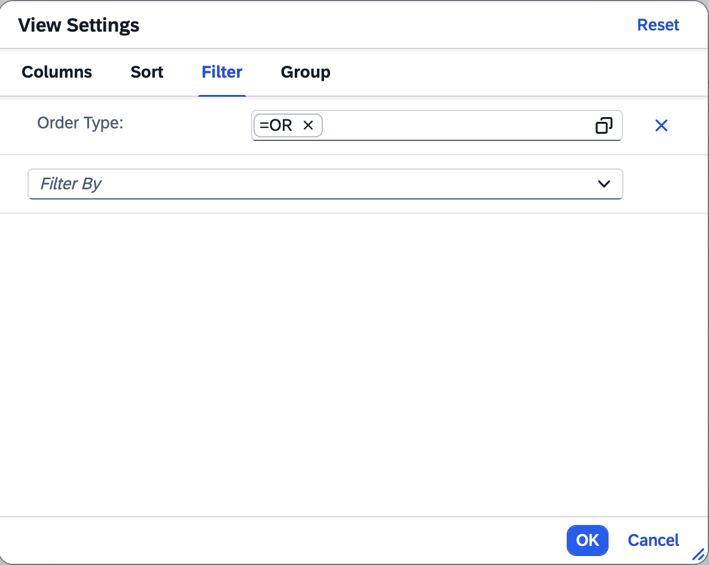
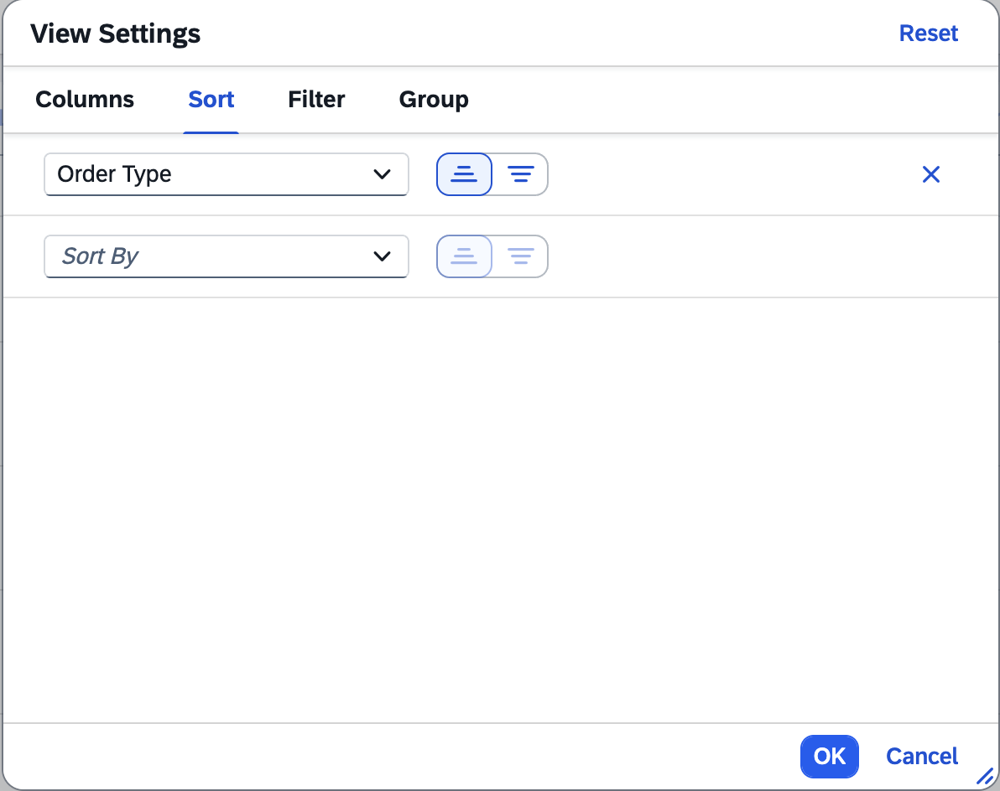
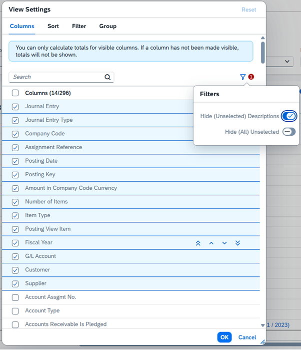

<!-- loio3e2b4d212b66481a829ccef1dc0ca16b -->

# Enabling Table Personalization

You can use table personalization to modify the settings of a table.

You can control the table personalization options that end users see.


<a name="loio3e2b4d212b66481a829ccef1dc0ca16b__section_jpy_ctx_gqb"/>

## Filter Option

The default settings for filtering in the list report page table are as follows:

-   Disabled in the page-level variant

-   Enabled in the control-level variant


<a name="loio3e2b4d212b66481a829ccef1dc0ca16b__section_a2h_ntx_gqb"/>

## Additional Features in SAP Fiori Elements for OData V2


### Enabling Table Filters

In harmonized variant management, by default, end users cannot set a filter in the table personalization settings. To enable filtering for end users, set the `enableTableFilterInPageVariant` property in the manifest. If `smartVariantManagement` is set to `false`, then table filter is enabled by default.

> ### Sample Code:  
> `manifest.json`
> 
> ```
> 
> "sap.ui.generic.app": {
>     "_version": "1.3.0",
>         "settings": {
>         "forceGlobalRefresh": true
>         },
>         "pages": {
>             "ListReport|STTA_C_MP_Product": {
>                 "entitySet": "STTA_C_MP_Product",
>                 "component": {
>                     "name": "sap.suite.ui.generic.template.ListReport",
>                     "list": true,
>                     "settings": {
>                         "smartVariantManagement": true,
>                         "enableTableFilterInPageVariant": true
>                     }
>                 },
> ```


<a name="loio3e2b4d212b66481a829ccef1dc0ca16b__section_hgz_b5x_gqb"/>

## Additional Features in SAP Fiori Elements for OData V4


### Enabling and Disabling Table Personalization

The table personalization is provided by default for all tables. Options for adding or removing columns, filtering, sorting, and grouping are available.

-   -   Filtering

    End users can filter table data by choosing one or multiple property values \(unless filtering is disabled\). You can use the `@com.sap.vocabularies.UI.v1.HiddenFilter` annotation to exclude those columns you don't want to be filterable.

    

    > ### Note:  
    > Filtering of navigation properties is only available for properties used in the `LineItem`.
    > 
    > Filtering for list report page tables is not available by default when using the variant management on page level. However, it can be enabled by explicitly setting `"filter": true` in a personalization object in the `manifest.json` file. For more information, see the Choosing Personalization Settings subsection below.

-   Sorting

    

    You can use the `@.OData.Capabilities.V1.SortRestrictions` annotation to exclude those columns you don't want to be sortable. You can use the `@.OData.Capabilities.V1.NavigationRestrictions` annotation to exclude navigation properties.

    > ### Note:  
    > Defining sort restrictions is only possible for first-level navigation entities.

    End users can sort table data by choosing one or multiple sort properties \(unless sorting is disabled\). You can use `SortRestrictions` to define your desired `RestrictedProperty` in the `NavigationRestrictions`. Use `SortRestrictions` to either restrict all properties of an entity by setting `Sortable` to `false`, or to disable sorting of individual properties using `NonSortableProperties`. To add sort restrictions for navigation properties, the list of `NonSortableProperties` must be prefixed with the `NavigationPropertyPath`.

    > ### Sample Code:  
    > XML Annotation for `SortRestrictions` in `NavigationRestrictions`
    > 
    > ```xml
    > <Annotation Term="Capabilities.NavigationRestrictions">
    >     <Record Type="Capabilities.NavigationRestrictionsType">
    >         <PropertyValue Property="RestrictedProperties">
    >             <Collection>
    >                 <Record Type="Capabilities.NavigationPropertyRestriction">
    >                     <PropertyValue Property="NavigationProperty" NavigationPropertyPath="_OverallSDProcessStatus"/>
    >                     <PropertyValue Property="SortRestrictions">
    >                         <Record Type="Capabilities.SortRestrictionsType">
    >                             <PropertyValue Property="NonSortableProperties">
    >                                 <Collection>
    >                                     <PropertyPath>_OverallSDProcessStatus/OverallSDProcessStatus_Text</PropertyPath>
    >                                 </Collection>
    >                             </PropertyValue>
    >                         </Record>
    >                     </PropertyValue>
    >                 </Record>
    >                 <Record Type="Capabilities.NavigationPropertyRestriction">
    >                     <PropertyValue Property="NavigationProperty" NavigationPropertyPath="_SalesOrderType"/>
    >                     <PropertyValue Property="SortRestrictions">
    >                         <Record Type="Capabilities.SortRestrictionsType">
    >                             <PropertyValue Property="NonSortableProperties">
    >                                 <PropertyValue Property="Sortable" Bool="false"/>
    >                             </PropertyValue>
    >                         </Record>
    >                     </PropertyValue>
    >                 </Record>
    >             </Collection>
    >         </PropertyValue>
    >     </Record>
    > </Annotation>
    > ```

    > ### Sample Code:  
    > ABAP CDS Annotation for `SortRestrictions` 
    > 
    > ```
    > @ObjectModel.sort.enabled: false
    > ```

    > ### Sample Code:  
    > CAP CDS Annotation for `SortRestrictions` in `NavigationRestrictions`
    > 
    > ```
    > NavigationRestrictions : {
    >     RestrictedProperties : [
    >         {
    >             NavigationProperty: _OverallSDProcessStatus,
    >             SortRestrictions: {NonSortableProperties: [_OverallSDProcessStatus.OverallSDProcessStatus_Text]}
    >         },
    >         {
    >             NavigationProperty: _SalesOrderType,
    >             SortRestrictions: {Sortable: false}
    >         }
    >     ]
    > }
    > ```

    > ### Note:  
    > When sorting a column that contains an amount with a currency or a unit of measure, an ascending sort is applied on the currency or the unit of measure first, and then the defined sort is applied to the amount field. This sorting mechanism ensures a consistent display of the amount when different currencies or units of measure are used.

    > ### Caution:  
    > Sorting on navigation properties can lead to issues in CAP NodeJS when using an SQLite DB.

-   Adding or removing columns

    End users can add, remove, or reorder all properties of the entity shown for a given table.

    End users can also use the filter icon buttons to do the following:

    -   To show or hide the properties which are used as text description of other properties \(properties with text arrangement\)

    -   To show only the columns already shown in the table


    

    The count on the *Columns* tab doesn’t change when the *Hide Descriptions* toggle is enabled.

-   Grouping \(available for analytical and responsive tables\)


> ### Restriction:  
> You can't perform sorting and grouping of 1:n \(multi-input\) fields.


### Choosing Personalization Settings

By default, the table personalization provides options for adding or removing columns, filtering, sorting, and grouping. Use the `"personalization"` setting in the`manifest.json` file to change the default behavior.

> ### Sample Code:  
> `manifest.json`
> 
> ```
> "BusinessPartnersList": {
>     "type": "Component",
>     "id": "BusinessPartnersList",
>     "name": "sap.fe.templates.ListReport",
>     "options": {
>         "settings": {
>             "contextPath": "/BusinessPartners",
>             "variantManagement": "Control",
>             "controlConfiguration": {
>                 "@com.sap.vocabularies.UI.v1.LineItem": {
>                     "tableSettings": {
>                         "type": "AnalyticalTable",
>                         "personalization": {
>                             "column" : true,
>   	                        "sort" : false,
>   	                        "filter" : true, 
>                 	        "group": true
>  	                    }
>                     }
>                 }
>             }
>         }
>     }
> },
> 
> ```

You can use the following values for the `"personalization"` setting:

-   `true` \(default\): Every table setting is enabled.

-   `false`: Every table setting is disabled.

-   `object`: If you use the value `"object"`, you must also define the values `"column"`, `"sort"` and `"filter"`. If the table is an analytical table, you can also configure the `"group"`. In this case omitting a setting is treated as false, which prevents apps from getting new features in upcoming releases. You can see this in the sample code above, where the object is used as a value for an analytical table.


### Personalization for Properties with Text Arrangement

Note the following when enabling personalization for properties that have a text arrangement annotation:

-   Sorting and filtering is available for the properties visible in a column. For example, for properties with text arrangement set as `#TextFirst`, the property itself or its text can be sorted or grouped. For properties with text arrangement set as `#TextOnly`, sorting and grouping is only available for their text. However, filtering for properties with text arrangement \#TextOnly applies directly on the property itself and not on its text. Filtering on its text may also be available if no filter restriction is defined for the text property. When selecting the Filter menu from the column header, the default property will be the property and not its text.

-   For properties with text arrangement set as `#TextOnly`, if its text is annotated as `UI.Hidden = true`, then the annotation is ignored. This text property can still be sorted and grouped.

-   If a `sortOrder` is set using a presentation variant on a property with text arrangement set as `#TextOnly`, the sorting is applied on the property and not the text. The sort indicator will not appear in the header column containing the property, as the property is not visible on the table. This also applies for the sort and group tabs on the table personalization dialog.

-   If a column contains a property with a `TextArrangement` annotation and the target property of the `TextArrangement` is a navigation property, this target property is not available in the personalization dialog under the *Columns* tab. The target property of the `TextArrangement` is displayed under the *Columns* tab if it is explicitly defined in the `LineItem` annotation or in a custom column.


