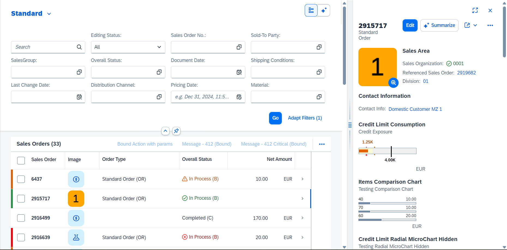
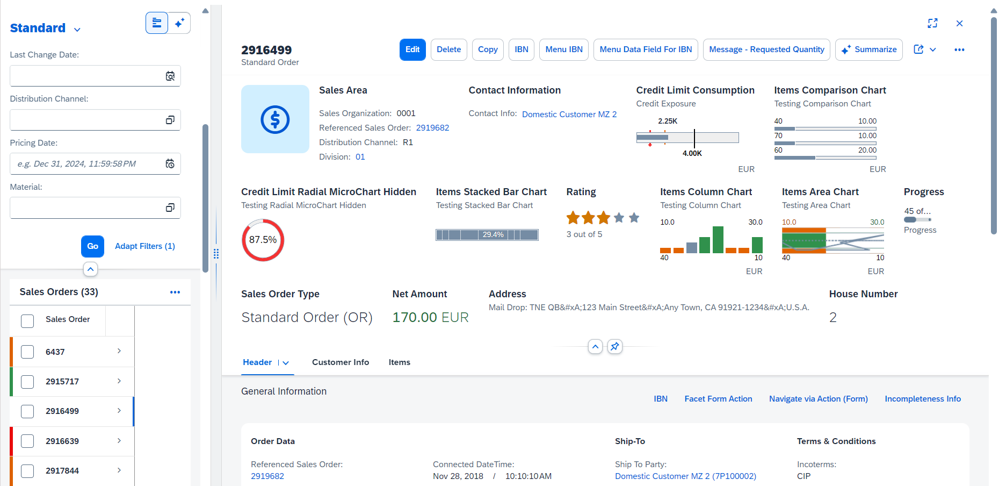
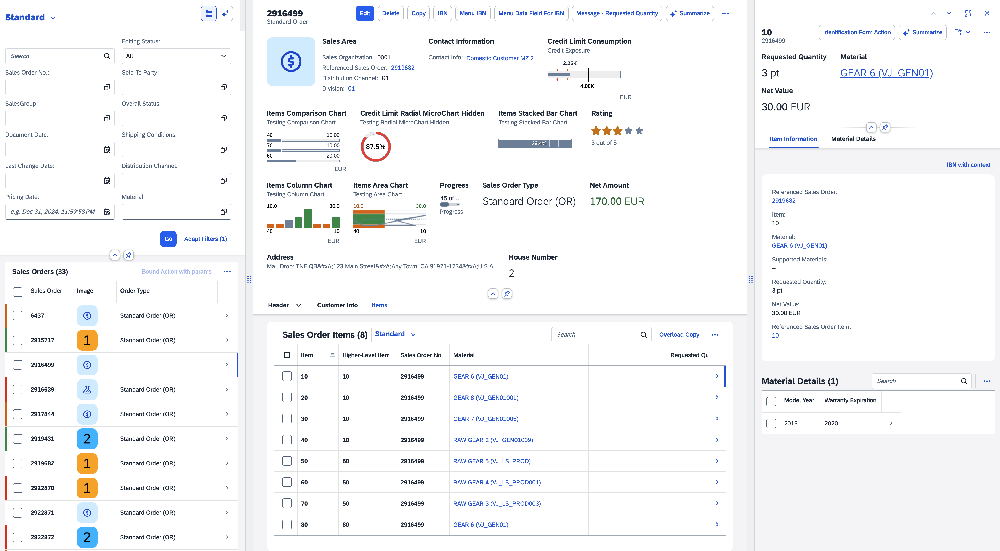
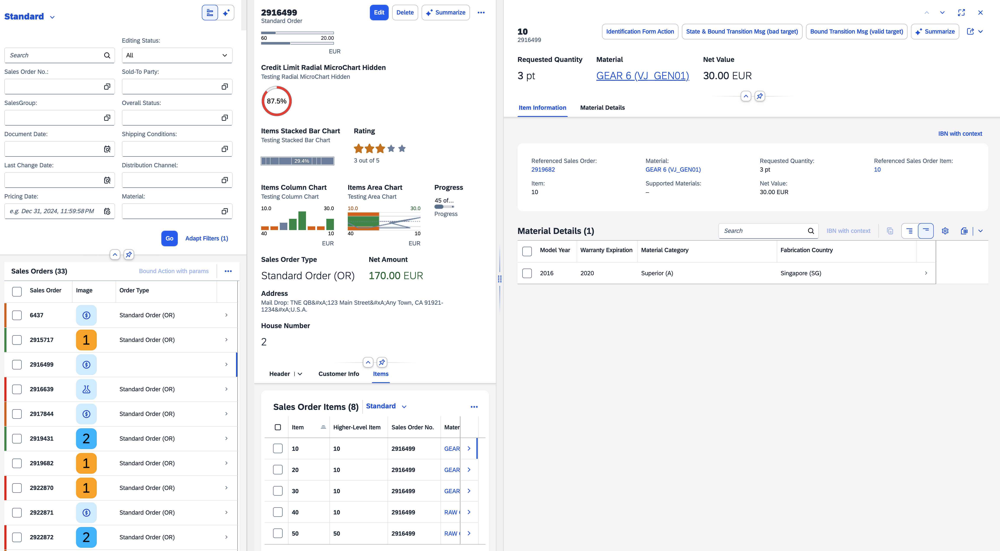
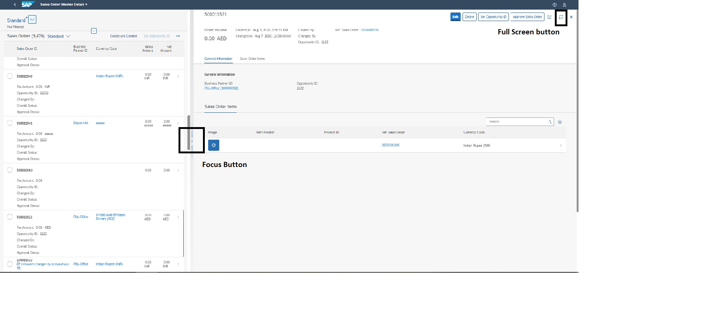

<!-- loioe762257125b34513b0859faa1610b09e -->

# Enabling the Flexible Column Layout

The flexible column layout allows users to see more details on a page, and to expand and collapse the screen areas, depending on their requirements.

The flexible column layout offers different layouts with up to three columns. Depending on which panel the user is focused on, it can be expanded. The user can also switch between different layouts and enable full-screen mode.

Use the following attributes to create the column layout you want:

-   `defaultTwoColumnLayoutType`: 2-column layout with these options:

    -   `TwoColumnsBeginExpanded`

          

    -   `TwoColumnsMidExpanded`

          


-   `defaultThreeColumnLayoutType`: 3-column layout with these options:

    -   `ThreeColumnsMidExpanded`

          

    -   `ThreeColumnsEndExpanded`

          


Users can expand and collapse the columns using the focus buttons. They can change to full-screen mode by choosing the full-screen button.

  


<a name="loioe762257125b34513b0859faa1610b09e__section_grc_dmp_gmb"/>

## Additional Features in SAP Fiori Elements for OData V2

> ### Note:  
> -   For the overview page, the flexible column layout is not relevant.
> 
> -   The analytical list page only supports the `TwoColumnsBeginExpanded` layout. For more information, see also [2409984](https://launchpad.support.sap.com/#/notes/2409984).
> 
> -   The flexible column layout can be used in draft and non-draft scenarios.
> 
> -   Both draft and non-draft apps support 2-column and 3-column layouts.
> 
>     In non-draft flexible column layout apps with create, read, update, and delete \(CRUD\) capabilities, only the last column shows the *Edit* and *Delete* buttons.

To enable the flexible column layout in an app, create an entry in manifest.json, as follows:

```
"sap.ui.generic.app": {
        "_version": "1.1.0",
        "settings": {
            "flexibleColumnLayout": {
                "defaultTwoColumnLayoutType": "TwoColumnsMidExpanded",
                "defaultThreeColumnLayoutType": "ThreeColumnsEndExpanded"
            }
        },
        "pages": [...
```

> ### Note:  
> For optimum readability, you can set the `PopinLayout` property to `Block`, `GridLarge`, or `GridSmall`. For more information, see [Adapting the UI: List Report and Object Page](adapting-the-ui-list-report-and-object-page-0d2f1a9.md).


### Defining a Default Layout

For each page configured in the manifest you can define a default layout that is used when the page is opened. You can use the `defaultLayoutType` property to do so. For example, you can use the `MidColumnFullScreen` property value to open a page in full-screen mode. This overrides the layout which has been defined in the global `flexibleColumnLayout` settings for the corresponding column. Note that this is only relevant if different pages in the same column need different default layouts.

For an object page, you can define "defaultLayoutType": "OneColumn". By doing so, in the flexible column layout, this object page moves to the first column. All other object pages that are below the first one in the hierarchy move up accordingly. If they have the same setting, they also move to the first column.

Usually, this setting is made on the main object page. After navigating from the list report, the object page is then displayed in full-screen mode, that is, the main object page replaces the list report. When navigating to an item, the main object remains in the first column and the item is displayed in the second column.

> ### Sample Code:  
> ```
> 
> "sap.ui.generic.app": {
>     "settings": {
>             "flexibleColumnLayout": {
>                 "defaultTwoColumnLayoutType": "TwoColumnsMidExpanded",
>                 "defaultThreeColumnLayoutType": "ThreeColumnsEndExpanded"
>             }
>         },
>                       "pages": [{
>                                "entitySet": "…",
>                                "component": {
>                                      "name": "sap.suite.ui.generic.template.ListReport",
>                                      "settings": {
>                                               …
>                                        }
>                                  },
>                                   "pages": [{
>                                             "entitySet": "…",
>                                              "defaultLayoutType": "OneColumn",
>                                              "component": {
>                                                       "name": "sap.suite.ui.generic.template.ObjectPage",
>                                                       "settings": {
>                                                                  …
>                                                       }
>                                              },
> 
> ```


<a name="loioe762257125b34513b0859faa1610b09e__section_enh_np2_ymb"/>

## Additional Features in SAP Fiori Elements for OData V4

To enable the flexible column layout, add the `"rootView"` object to the manifest and create an entry in `manifest.json` under the routing key to specify the `"routerClass"`. It has to be set to `"sap.f.routing.Router"`. Make sure that `"sap.f"` is added as a lib dependency under the `"sap.ui5"` key.

In `"routing.config"`, the optional `"flexibleColumnLayout"` object allows you to specify the default expansion of the columns to two columns and three columns layout.

```
"sap.ui5": {
    "rootView": {
            "viewName": "sap.fe.core.rootView.Fcl",
            "type": "XML",
            "async": true,
            "id": "appRootView"
            },
    "routing": {
            "config": {
                "routerClass": "sap.f.routing.Router",
                "flexibleColumnLayout": {
                    "defaultTwoColumnLayoutType": "TwoColumnsMidExpanded",
                    "defaultThreeColumnLayoutType": "ThreeColumnsMidExpanded"
                }
            },
            "routes": [
                       .
                       . 
                       .

```


### Routes Configuration

The route target leads to an array instead of a single element in the usual fullscreen application. The pattern key format describes the pattern to be matched from a navigation to identify the route, but it must end with an optional query parameter `:?query:`so as to add the pattern.

The following keys should be set:

-   `name`: Unique identifier of the current route

-   `target`: Array listing the targets that will be displayed


> ### Sample Code:  
> ```
> "routes": [
>      	{
>         	"pattern": ":?query:",
>             "name": "SalesOrderManageList",
>             "target": ["SalesOrderManageList"]
>         },
>         {
>         	"pattern": "SalesOrderManage({key}):?query:",
>             "name": "SalesOrderManageObjectPage",
>             "target": ["SalesOrderManageList", "SalesOrderManageObjectPage"]
>         },
>         {
>         	"pattern": "SalesOrderManage({key})/_Item({key2}):?query:",
>             "name": "SalesOrderItemObjectPage",
>             "target": ["SalesOrderManageList", "SalesOrderManageObjectPage", "SalesOrderItemObjectPage"]
>          },
>          {
>          	"pattern": "SalesOrderManage({key})/_Item({key2})/_MaterialDetails({key3}):?query:",
>             "name": "MaterialDetailsObjectPage",
>             "target": ["MaterialDetailsObjectPage"]
>          },
>          {
>          	"pattern": "SalesOrderManage({key})/_Item({key2})/_MaterialDetails({key3})/_MaterialRatings({key4}):?query:",
>             "name": "MaterialRatingsObjectPage",
>             "target": ["MaterialRatingsObjectPage"]
>          },
>          {
>           	"pattern": "SalesOrderManage({key})/_Item({key2})/_MaterialDetails({key3})/_MaterialRatings({key4})/_MaterialRatingsDetails({key5}):?query:",
>             "name": "MaterialRatingsDetailsObjectPage",
>             "target": ["MaterialRatingsDetailsObjectPage"]
>          }
> 	]
> ```


### Target Configuration

For each target, the following keys should be set:

-   `type`: Component

-   `id`: unique identifier for the current target

-   `name`: name of the template to be use by the view

    -   `sap.fe.templates.ListReport` should be used for the first level \(landing view\)

    -   `sap.fe.templates.ObjectPage` should be used for any sub-sequent level


-   `controlAggregation`: specify where the view should be located

    -   `beginColumnPages`: should be used for the first column to be displayed

    -   `midColumnPages`: should be used for the second column

    -   `endColumnPages`: should be used for any additional columns


-   `contextPattern`: navigation path of the current target

-   All other keys remain unchanged compared the fullscreen applications


> ### Sample Code:  
> ```
> "targets": {
>      	"SalesOrderManageList": {
>         	"type": "Component",
>             "id": "SalesOrderManageList",
>             "name": "sap.fe.templates.ListReport",
>             "controlAggregation": "beginColumnPages",
>             "contextPattern": "",
>              "options": {
> 				...
> 				// Same as fullscreen  //
> 				...
>              }
>          },
>          "SalesOrderManageObjectPage": {
>           	"type": "Component",
>             "id":  "SalesOrderManageObjectPage",
>             "name": "sap.fe.templates.ObjectPage",
>             "controlAggregation": "midColumnPages",
>             "contextPattern": "/SalesOrderManage({key})",
>             "options": {
>                 ...
> 				// Same as fullscreen  //
> 				...
>              }
>          },
>          "SalesOrderItemObjectPage": {
>          	"type": "Component",
>             "id":  "SalesOrderItemObjectPage",
>             "name": "sap.fe.templates.ObjectPage",
>             "controlAggregation": "endColumnPages",
>             "contextPattern": "/SalesOrderManage({key})/_Item({key2})",
>             "options": {
>                 ...
> 				// Same as fullscreen  //
> 				...
>             }
>          },
> 		 "MaterialDetailsObjectPage": {
>          	"type": "Component",
>             "id":  "MaterialDetailsObjectPage",
>             "name": "sap.fe.templates.ObjectPage",
>             "controlAggregation": "endColumnPages",
>             "contextPattern": "/SalesOrderManage({key})/_Item({key2})/_MaterialDetails({key3})",
>              "options": {
>              	...
> 				// Same as fullscreen  //
> 				...
>             }
>          },
> 		 ...
> 	}
> ```

> ### Restriction:  
> -   In edit mode on an object page, when you add a column to a table or remove it, the subobject page closes automatically.
> 
> -   If you have a list report or an object page with multiple tables that are based on the same entity, only the first table is synchronized with its associated subobject page.
> 
> -   When you update a multi-input field on an object page, you need to first refresh the parent page \(either an object page or a list report\) before the changes are visible.

