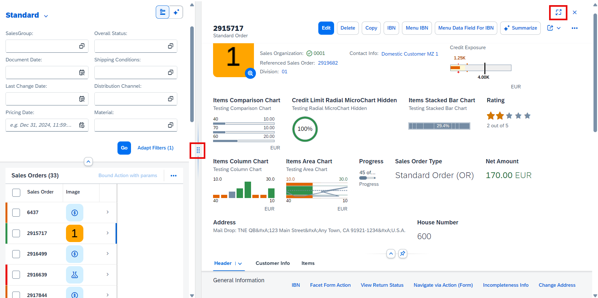
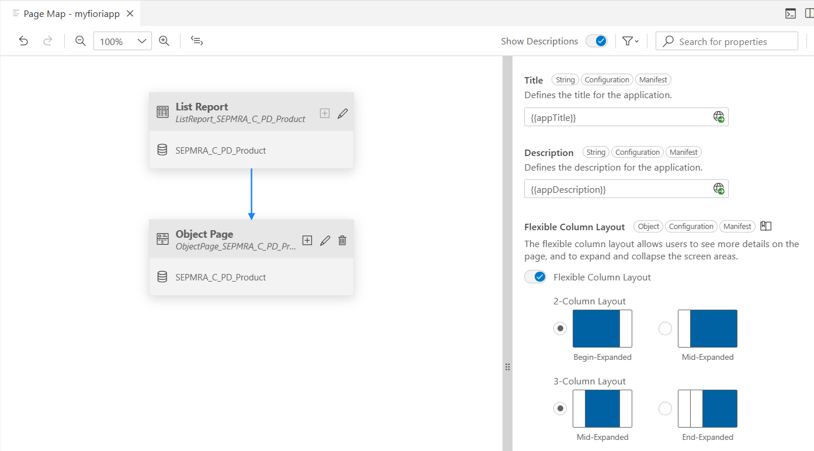
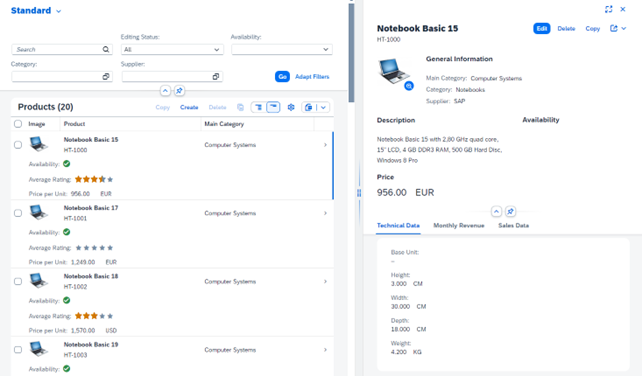

<!-- loioe762257125b34513b0859faa1610b09e -->

# Enabling the Flexible Column Layout

The flexible column layout is a feature that can show two or three columns on a single page.

For example, a list of items is shown in the first column, and when you choose an item to see its details, the related object page is shown in the second or third column. You can expand the column you want to focus on, switch between different layouts, and view the column on the right-hand side in full-screen mode.

Use the following attributes to create the column layout you want:

-   `defaultTwoColumnLayoutType`: A 2-column layout with the following options:

    -   `TwoColumnsBeginExpanded`

        

    -   `TwoColumnsMidExpanded`

        


-   `defaultThreeColumnLayoutType`: A 3-column layout with the following options:

    -   `ThreeColumnsMidExpanded`

        

    -   `ThreeColumnsEndExpanded`

        


End users can expand and collapse the columns using the focus buttons. They can change to full-screen mode by choosing the full-screen button.




<a name="loioe762257125b34513b0859faa1610b09e__section_e2b_ptj_3cc"/>

## Enabling the Flexible Column Layout Using SAP Fiori Tools

> ### Remember:  
> The flexible column layout isn't available for the overview page floorplan.

1.  Launch the *Page Map*. You can launch the *Page Map* in several ways, for example by right-clicking the project folder and selecting *Show Page Map*. For more information, see [Define Application Structure](https://help.sap.com/docs/SAP_FIORI_tools/17d50220bcd848aa854c9c182d65b699/bae38e6216754a76896b926a3d6ac3a9.html).

2.  To select the flexible column layout configuration, go to the *Property Panel* and switch on *Flexible Column Layout*.

3.  Select your desired layout. You can select a layout for two or three columns. You can also customize your layout settings further in the `manifest.json` file. For more information, see [Additional Features in SAP Fiori Elements for OData V2](enabling-the-flexible-column-layout-e762257.md#loioe762257125b34513b0859faa1610b09e__section_grc_dmp_gmb) or [Additional Features in SAP Fiori Elements for OData V4](enabling-the-flexible-column-layout-e762257.md#loioe762257125b34513b0859faa1610b09e__section_enh_np2_ymb).

    The following screenshot shows the flexible column layout property in an application based on SAP Fiori elements for OData V2:

    

4.  Preview your chosen flexible column layout. For more information, see [Previewing an Application](https://help.sap.com/docs/SAP_FIORI_tools/17d50220bcd848aa854c9c182d65b699/b962685bdf9246f6bced1d1cc1d9ba1c.html).


The following screenshot shows the flexible column layout in a previewed application:



The following screen recording shows how to enable the flexible column layout and preview your application:


<a name="loioe762257125b34513b0859faa1610b09e__section_cyk_syr_kdc"/>

## Saving Column Resize Information

The flexible column layout allows end users to resize the columns in both 2-column display and 3-column display, with SAP Fiori elements saving this information in the personalization settings. This information is specific to each application and device type, such as desktop, tablet, and phone.


<a name="loioe762257125b34513b0859faa1610b09e__section_grc_dmp_gmb"/>

## Additional Features in SAP Fiori Elements for OData V2

> ### Note:  
> -   For the overview page, the flexible column layout is not relevant.
> 
> -   The analytical list page supports only the `TwoColumnsBeginExpanded` layout. For more information, see [2409984](https://me.sap.com/notes/2409984).
> 
> -   The flexible column layout can be used in both draft and non-draft scenarios.
> 
> -   Both draft and non-draft applications support 2-column and 3-column layouts.
> 
>     In non-draft flexible column layout applications with create, read, update, and delete \(CRUD\) capabilities, only the last column shows the *Edit* and *Delete* buttons.

To enable the flexible column layout in an application, you must create an entry in the `manifest.json` file as shown in the following sample code:

```
"sap.ui.generic.app": {
        "_version": "1.1.0",
        "settings": {
            "flexibleColumnLayout": {
                "defaultTwoColumnLayoutType": "TwoColumnsMidExpanded",
                "defaultThreeColumnLayoutType": "ThreeColumnsEndExpanded"
            }
        },
        "pages": [...
```

> ### Note:  
> For optimum readability, you can set the `PopinLayout` property to `Block`, `GridLarge`, or `GridSmall`. For more information, see [Adapting the UI: List Report and Object Page](adapting-the-ui-list-report-and-object-page-0d2f1a9.md).


### Defining a Default Layout

For each page configured in the `manifest.json` file, you can define a default layout that is used when the page is opened. You can use the `defaultLayoutType` property to do so. For example, you can use the `MidColumnFullScreen` property value to open a page in full-screen mode. This overrides the layout that has been defined in the global `flexibleColumnLayout` settings for the corresponding column. Note that this is only relevant if different pages in the same column need different default layouts.

For an object page, you can define `"defaultLayoutType": "OneColumn"`. By doing so, in the flexible column layout, this object page moves to the first column. All other object pages that are below the first one in the hierarchy move up accordingly. If they have the same setting, they also move to the first column.

Usually, this setting is made on the main object page. After navigating from the list report, the object page is then displayed in full-screen mode, that is, the main object page replaces the list report. When navigating to an item, the main object remains in the first column and the item is displayed in the second column.

> ### Sample Code:  
> ```
> 
> "sap.ui.generic.app": {
>     "settings": {
>             "flexibleColumnLayout": {
>                 "defaultTwoColumnLayoutType": "TwoColumnsMidExpanded",
>                 "defaultThreeColumnLayoutType": "ThreeColumnsEndExpanded"
>             }
>         },
>                       "pages": [{
>                                "entitySet": "…",
>                                "component": {
>                                      "name": "sap.suite.ui.generic.template.ListReport",
>                                      "settings": {
>                                               …
>                                        }
>                                  },
>                                   "pages": [{
>                                             "entitySet": "…",
>                                              "defaultLayoutType": "OneColumn",
>                                              "component": {
>                                                       "name": "sap.suite.ui.generic.template.ObjectPage",
>                                                       "settings": {
>                                                                  …
>                                                       }
>                                              },
> 
> ```


<a name="loioe762257125b34513b0859faa1610b09e__section_enh_np2_ymb"/>

## Additional Features in SAP Fiori Elements for OData V4

You must do the following configuration in the `manifest.json` file to enable the flexible column layout, compared to a full-screen mode:

1.  Add the `rootView` object to specify the use of the flexible column layout.

    > ### Sample Code:  
    > manifest.json
    > 
    > ```
    > "sap.ui5":{
    >  …
    >         "rootView":{
    >             "viewName":"sap.fe.core.rootView.Fcl",
    >             "type":"XML",
    >             "async":true,
    >             "id":"appRootView"
    >         },
    > …
    >    }
    > ```

2.  Add a `config` object to the routing key, setting the `routerClass` to `sap.f.routing.Router` and optionally including a flexible column layout object. This allows you to define whether the default layout displays two columns or three columns.

    > ### Sample Code:  
    > ```
    > "routing":{
    >      "config":{
    >             "routerClass":"sap.f.routing.Router",
    >             "flexibleColumnLayout":{
    >                     "defaultTwoColumnLayoutType":"TwoColumnsMidExpanded",
    >                     "defaultThreeColumnLayoutType":"ThreeColumnsMidExpanded"
    >                 }
    >             },
    >            "routes":[
    >               …
    >             ]
    >     }
    > ```

    > ### Note:  
    > You must ensure that the `sap.f` library is added as a dependency under the `sap.ui5` key.


### Route Configuration

The route target leads to an array instead of a single element in the usual full-screen application. The pattern key format describes the pattern to be matched from a navigation to identify the route. It must end with an optional query parameter `:?query:` for a full-screen application.

You must set the following keys:

-   `name`: Unique identifier of the current route.

-   `target`: Array listing the targets to be displayed.


You can enable the flexible column layout and define the number of columns in the layout by configuring the `target` key in the `manifest.json` file.

The following sample code shows a 3-column layout that starts with a list report:

The scenario is: List report →List report | Object page 1→List report | Object page 1 | Object page 2 → Object page 3

> ### Sample Code:  
> manifest.json
> 
> ```
> "routes": [
>      	{
>         	"pattern": ":?query:",
>             "name": "SalesOrderManageList",
>             "target": ["SalesOrderManageList"]
>         },
>         {
>         	"pattern": "SalesOrderManage({key}):?query:",
>             "name": "SalesOrderManageObjectPage",
>             "target": ["SalesOrderManageList", "SalesOrderManageObjectPage"]
>         },
>         {
>         	"pattern": "SalesOrderManage({key})/_Item({key2}):?query:",
>             "name": "SalesOrderItemObjectPage",
>             "target": ["SalesOrderManageList", "SalesOrderManageObjectPage", "SalesOrderItemObjectPage"]
>          },
>          {
>          	"pattern": "SalesOrderManage({key})/_Item({key2})/_MaterialDetails({key3}):?query:",
>             "name": "MaterialDetailsObjectPage",
>             "target": ["MaterialDetailsObjectPage"]
>          },
>          {
>          	"pattern": "SalesOrderManage({key})/_Item({key2})/_MaterialDetails({key3})/_MaterialRatings({key4}):?query:",
>             "name": "MaterialRatingsObjectPage",
>             "target": ["MaterialRatingsObjectPage"]
>          },
>          {
>           	"pattern": "SalesOrderManage({key})/_Item({key2})/_MaterialDetails({key3})/_MaterialRatings({key4})/_MaterialRatingsDetails({key5}):?query:",
>             "name": "MaterialRatingsDetailsObjectPage",
>             "target": ["MaterialRatingsDetailsObjectPage"]
>          }
> ],
> "targets": {
>    "SalesOrderManageList": {
>        "type": "Component",
>        "id": "SalesOrderManageList",
>        "name": "sap.fe.templates.ListReport",
>        "controlAggregation": "beginColumnPages",
>        "contextPattern": "",
>        "options": {
>                 ...
>        }
>    },
>    "SalesOrderManageObjectPage": {
>        "type": "Component",
>        "id":  "SalesOrderManageObjectPage",
>        "name": "sap.fe.templates.ObjectPage",
>        "controlAggregation": "midColumnPages",
>        "contextPattern": "/SalesOrderManage({key})",
>        "options": {
>                 ...
>        }
>    },
>    "SalesOrderItemObjectPage": {
>        "type": "Component",
>        "id":  "SalesOrderItemObjectPage",
>        "name": "sap.fe.templates.ObjectPage",
>        "controlAggregation": "endColumnPages",
>        "contextPattern": "/SalesOrderManage({key})/_Item({key2})",
>        "options": {
>                 ...
>        }
>    },
>    "MaterialDetailsObjectPage": {
>        "type": "Component",
>        "id":  "MaterialDetailsObjectPage",
>        "name": "sap.fe.templates.ObjectPage",
>        "controlAggregation": "endColumnPages",
>        "contextPattern": "/SalesOrderManage({key})/_Item({key2})/_MaterialDetails({key3})",
>        "options": {
>                 ...
>        }
>    },
>    ...
> }
> ```

The following sample code shows a 2-column layout that starts with an object page:

The scenario is: List report → Object page 1→ Object page 1 | Object page 2 → Object page 3

> ### Sample Code:  
> ```
> "routes": [
>                 {
>                "pattern": ":?query:",
>                "name": "SalesOrderManageList",
>                "target": ["SalesOrderManageList"]
>         },
>         {
>                "pattern": "SalesOrderManage({key}):?query:",
>                "name": "SalesOrderManageObjectPage",
>                "target": ["SalesOrderManageObjectPage"]
>         },
>         {
>                "pattern": "SalesOrderManage({key})/_Item({key2}):?query:",
>                "name": "SalesOrderItemObjectPage",
>                "target": ["SalesOrderManageObjectPage", "SalesOrderItemObjectPage"]
>          },
>          {
>                "pattern": "SalesOrderManage({key})/_Item({key2})/_MaterialDetails({key3}):?query:",
>                "name": "MaterialDetailsObjectPage",
>                "target": ["MaterialDetailsObjectPage"]
>          },
>         …
> ],
> "targets": {
>        "SalesOrderManageList": {
>            "type": "Component",
>            "id": "SalesOrderManageList",
>            "name": "sap.fe.templates.ListReport",
>            "controlAggregation": "beginColumnPages",
>            "contextPattern": "",
>            "options": {
>                     ...
>            }
>        },
>        "SalesOrderManageObjectPage": {
>            "type": "Component",
>            "id":  "SalesOrderManageObjectPage",
>            "name": "sap.fe.templates.ObjectPage",
>            "controlAggregation": "beginColumnPages",
>            "contextPattern": "/SalesOrderManage({key})",
>            "options": {
>                     ...
>            }
>        },
>        "SalesOrderItemObjectPage": {
>            "type": "Component",
>            "id":  "SalesOrderItemObjectPage",
>            "name": "sap.fe.templates.ObjectPage",
>            "controlAggregation": "midColumnPages",
>            "contextPattern": "/SalesOrderManage({key})/_Item({key2})",
>            "options": {
>                     ...
>            }
>        },
>        "MaterialDetailsObjectPage": {
>            "type": "Component",
>            "id":  "MaterialDetailsObjectPage",
>            "name": "sap.fe.templates.ObjectPage",
>            "controlAggregation": "endColumnPages",
>            "contextPattern": "/SalesOrderManage({key})/_Item({key2})/_MaterialDetails({key3})",
>            "options": {
>                     ...
>            }
>        },
>        ...
>    }
> ```

The following sample code shows a 3-column layout that starts with an object page:

The scenario is: List report → Object page 1→ Object page 2 → Object page 2 | Object page 3 → Object page 2 | Object page 3 | Object page 4 →Object page 5

> ### Sample Code:  
> ```
> "routes": [
>     {
>         "pattern": ":?query:",
>         "name": "SalesOrderManageList",
>         "target": "SalesOrderManageList"
>     },
>     {
>         "pattern": "SalesOrderManage({key}):?query:",
>         "name": "SalesOrderManageObjectPage",
>         "target": ["SalesOrderManageObjectPage"]
>     },
>     {
>         "pattern": "SalesOrderManage({key})/_Item({key2}):?query:",
>         "name": "SalesOrderItemObjectPage",
>         "target": ["SalesOrderItemObjectPage"]
>     },
>     {
>         "pattern": "SalesOrderManage({key})/_Item({key2})/_MaterialDetails({key3}):?query:",
>         "name": "MaterialDetailsObjectPage",
>         "target": ["SalesOrderItemObjectPage","MaterialDetailsObjectPage"]
>     },
>     {
>         "pattern": "SalesOrderManage({key})/_Item({key2})/_MaterialDetails({key3})/_MaterialRatings({key4}):?query:",
>         "name": "MaterialRatingsObjectPage",
>         "target": ["SalesOrderItemObjectPage","MaterialDetailsObjectPage","MaterialRatingsObjectPage"]
>     },
>     {
>         "pattern": "SalesOrderManage({key})/_Item({key2})/_MaterialDetails({key3})/_MaterialRatings({key4})/_MaterialRatingsDetails({key5}):?query:",
>         "name": "MaterialRatingsDetailsObjectPage",
>         "target": ["MaterialRatingsDetailsObjectPage"]
>     }
> ],
> "targets": {
>     "SalesOrderManageList": {
>         "type": "Component",
>         "id": "SalesOrderManageList",
>         "name": "sap.fe.templates.ListReport",
>         "controlAggregation": "beginColumnPages",
>         "contextPattern": "",
>         "options": {
>             ...
>         }
>     },
>     "SalesOrderManageObjectPage": {
>         "type": "Component",
>         "id": "SalesOrderManageObjectPage",
>         "name": "sap.fe.templates.ObjectPage",
>         "controlAggregation": "beginColumnPages",
>         "contextPattern": "/SalesOrderManage({key})",
>         "options": {
>             ...
>         }
>     },
>     "SalesOrderItemObjectPage": {
>         "type": "Component",
>         "id": "SalesOrderItemObjectPage",
>         "name": "sap.fe.templates.ObjectPage",
>         "controlAggregation": "beginColumnPages",
>         "contextPattern": "/SalesOrderManage({key})/_Item({key2})",
>         "options": {
>            ...
>         }
>     },
>     "MaterialDetailsObjectPage": {
>         "type": "Component",
>         "id": "MaterialDetailsObjectPage",
>         "name": "sap.fe.templates.ObjectPage",
>         "controlAggregation": "midColumnPages",
>         "contextPattern": "/SalesOrderManage({key})/_Item({key2})/_MaterialDetails({key3})",
>         "options": {
>             ...
>         }
>     },
>     "MaterialRatingsObjectPage": {
>         "type": "Component",
>         "id": "MaterialRatingsObjectPage",
>         "name": "sap.fe.templates.ObjectPage",
>         "controlAggregation": "endColumnPages",
>         "contextPattern": "/SalesOrderManage({key})/_Item({key2})/_MaterialDetails({key3})/_MaterialRatings({key4})",
>         "options": {
>             ...
>         }
>     },
>     "MaterialRatingsDetailsObjectPage": {
>         "type": "Component",
>         "id": "MaterialRatingsDetailsObjectPage",
>         "name": "sap.fe.templates.ObjectPage",
>         "controlAggregation": "endColumnPages",
>         "contextPattern": "/SalesOrderManage({key})/_Item({key2})/_MaterialDetails({key3})/_MaterialRatings({key4})/_MaterialRatingsDetails({key5})",
>         "options": {
>             ...
>         }
>     }
> }
> },
> ```


### Target Configuration

You must set the following keys for each target:

-   `type`: Component

-   `id`: unique identifier for the current target.

-   `name`: name of the template to be used by the view.

    -   `sap.fe.templates.ListReport` must be used for the first level, which is the initial view displayed when opening or navigating to the application.

    -   `sap.fe.templates.ObjectPage` must be used for any subsequent level.


-   `controlAggregation`: specify where to locate the view.

    -   `beginColumnPages`: must be used for the first page to be displayed or for any page before the flexible column layout.

    -   `midColumnPages`: must be used for the second page.

    -   `endColumnPages`: for the third page, or for any page after the flexible column layout.


-   `contextPattern`: navigation path of the current target.

-   All other keys remain unchanged compared to the full-screen applications.


> ### Sample Code:  
> ```
> "targets": {
>         "SalesOrderManageList": {
>             "type": "Component",
>             "id": "SalesOrderManageList",
>             "name": "sap.fe.templates.ListReport",
>             "controlAggregation": "beginColumnPages",
>             "contextPattern": "",
>             "options": {
>                         ...
>                      // Same as fullscreen  //
>                         ...
>             }
>         },
>         "SalesOrderManageObjectPage": {
>             "type": "Component",
>             "id":  "SalesOrderManageObjectPage",
>             "name": "sap.fe.templates.ObjectPage",
>             "controlAggregation": "midColumnPages",
>             "contextPattern": "/SalesOrderManage({key})",
>             "options": {
>                         ...
>                      // Same as fullscreen  //
>                         ...
>             }
>         },
>         "SalesOrderItemObjectPage": {
>             "type": "Component",
>             "id":  "SalesOrderItemObjectPage",
>             "name": "sap.fe.templates.ObjectPage",
>             "controlAggregation": "endColumnPages",
>             "contextPattern": "/SalesOrderManage({key})/_Item({key2})",
>             "options": {
>                         ...
>                      // Same as fullscreen  //
>                         ...
>             }
>         },
>         "MaterialDetailsObjectPage": {
>             "type": "Component",
>             "id":  "MaterialDetailsObjectPage",
>             "name": "sap.fe.templates.ObjectPage",
>             "controlAggregation": "endColumnPages",
>             "contextPattern": "/SalesOrderManage({key})/_Item({key2})/_MaterialDetails({key3})",
>             "options": {
>                          ...
>                       // Same as fullscreen  //
>                          ...
>             }
>         },
>         ...
>     }
> 
> ```

> ### Restriction:  
> -   In edit mode on an object page, the subobject page closes automatically when you add or remove a column from a table.
> 
> -   If you have a list report or an object page with multiple tables that are based on the same entity, only the first table is synchronized with its associated subobject page.
> 
> -   When you update a multi-input field on an object page, you need to first refresh the parent page \(either an object page or a list report\) before the changes are visible.
> 
> -   In the flexible column layout, you can neither display a tree table nor an analytical table in the list report with a draft-enabled service.

