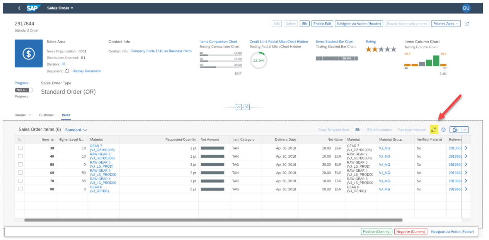
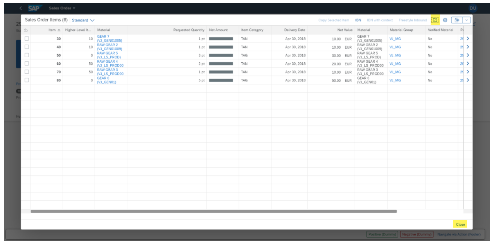

<!-- loio1d3c2ff9fb1e4807ad2cc28f8c65e56b -->

# Enabling the Full-Screen Mode for Tables

When application developers enable the full-screen mode for tables, a button on the table toolbar is displayed that allows users to open the table in full-screen mode. This provides more space for displaying and working with table entries.

> ### Note:  
> This topic is currently only applicable to SAP Fiori elements for OData V4.

Make the settings in the `manifest.json` as follows:

> ### Sample Code:  
> ```
> "SalesOrderManageObjectPage": {
>     "options": {
>         "settings": {
>             "controlConfiguration": {
>                 "_Item/@com.sap.vocabularies.UI.v1.LineItem": {
>                     "tableSettings": {
>                         "enableFullScreen": true
>                     }
>                 }
>             }
>         }
>     }
> }
> ```

> ### Note:  
> -   This setting is currently not available for the list report. If it is configured for a list report, the setting will be ignored during templating.
> 
> -   On mobile phones, full-screen mode is enabled by default.

The full-screen button is added to the left of the personalization button:

  

When you click the button, the table is displayed in full-screen mode, and the icon of the button changes accordingly to allow users to leave full-screen mode when clicking the button again.

In addition, a *Close* button is displayed at the bottom of the dialog:

  

