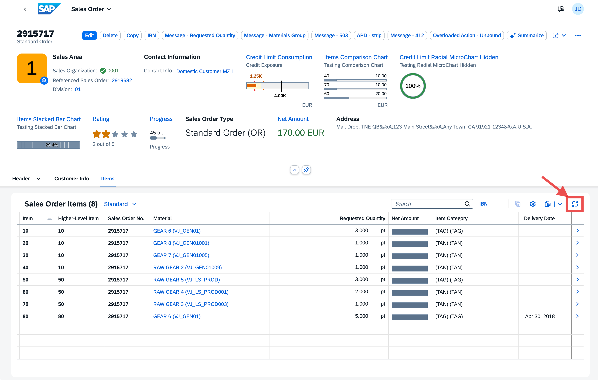
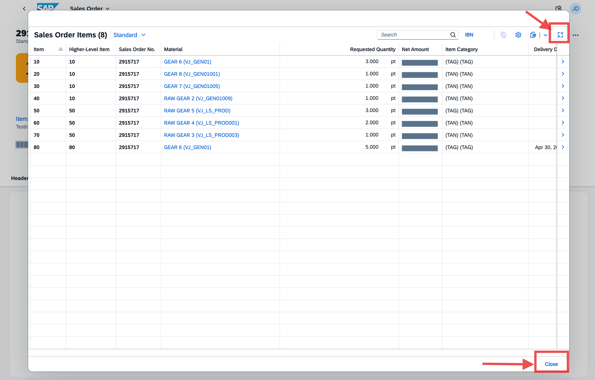

<!-- loio1d3c2ff9fb1e4807ad2cc28f8c65e56b -->

# Enabling the Full-Screen Mode for Tables

You can enable full-screen mode for tables.

When the full-screen mode for tables is enabled, a button on the table toolbar allows users to open the table in full-screen mode. This provides more space for displaying and working with table entries.

Make the settings in the `manifest.json` file as follows:

> ### Sample Code:  
> `manifest.json`
> 
> ```
> "SalesOrderManageObjectPage": {
>     "options": {
>         "settings": {
>             "controlConfiguration": {
>                 "_Item/@com.sap.vocabularies.UI.v1.LineItem": {
>                     "tableSettings": {
>                         "enableFullScreen": true
>                     }
>                 }
>             }
>         }
>     }
> }
> ```

> ### Note:  
> -   This setting is not available for the list report page. If it is configured for a list report, the setting will be ignored during templating.
> 
> -   On mobile phones, full-screen mode is enabled by default.

The full-screen button is added to the table toolbar, as shown in the following screenshot:



When you click the button, the table is displayed in full-screen mode, and the icon of the button changes accordingly to allow users to leave full-screen mode when clicking the button again.

Additionally, a *Close* button is displayed at the bottom of the dialog, as shown in the following screenshot:



