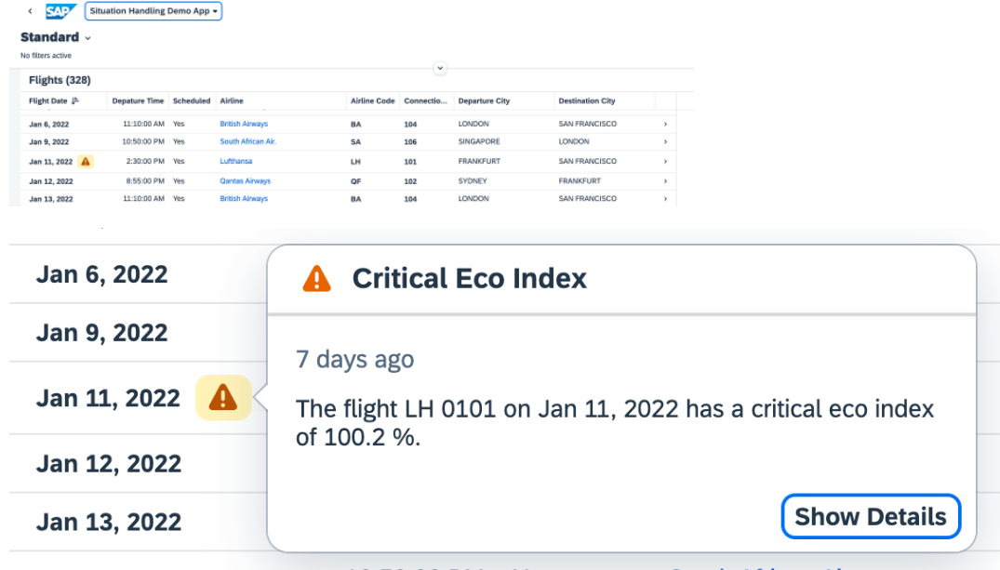
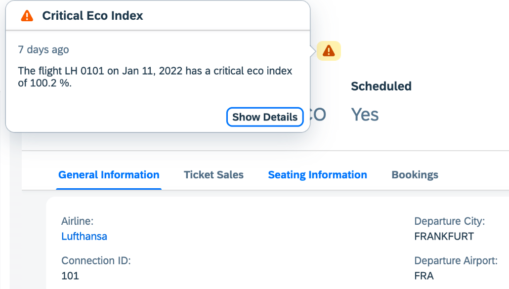

<!-- loiofe4b9013feb04bbfae94f1040a796781 -->

# Enabling the Icon for Situation Handling

You can enable the icon to indicate an existing situation in the list report and the object page.

> ### Note:  
> This topic is currently only applicable to SAP Fiori elements for OData V4.

SAP Fiori elements for OData V4 automatically displays an icon for Situation Handling in the list report and the object page if your service contains the corresponding annotation. You must ensure that exactly one navigation property exists whose target entity type is annotated with the following:

> ### Sample Code:  
> ```
> <Annotation Term="com.sap.vocabularies.Common.v1.SAPObjectNodeType">
>      <Record>
>           <PropertyValue Property="Name" String="BusinessSituation" />
>      </Record>
> </Annotation>
> ```

The following screenshot shows an example from a list report:

  

The following screenshot shows an example from an object page:

  

