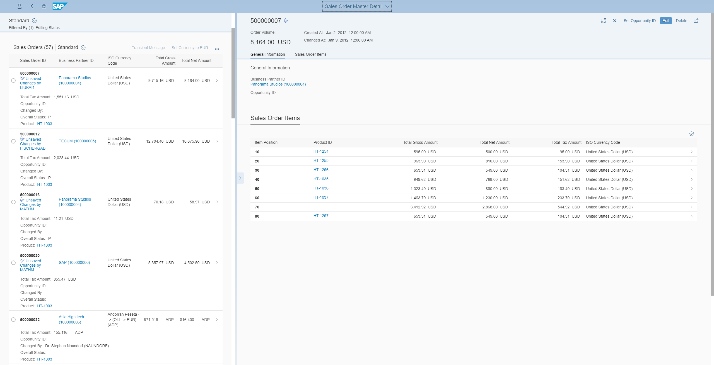
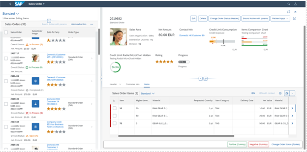

<!-- loiob890ebadf10c4083a643740db3beec38 -->

# Enabling the List-Detail Mode

You can set up the flexible column layout to display just two columns. This is called list-detail mode.

By default, the flexible column layout starts off with one column. The user opens new columns by navigating forward. You can set the layout to display just two columns by adding additional parameters to the flexible column layout entry in the `manifest.json` in your app:


<a name="loiob890ebadf10c4083a643740db3beec38__section_zy3_1m1_jmb"/>

## Additional Features in SAP Fiori Elements for OData V2


<table>
<tr>
<th valign="top">

Parameter

</th>
<th valign="top">

Description

</th>
</tr>
<tr>
<td valign="top">

`initialColumnsCount` 

</td>
<td valign="top">

Use this parameter to configure the layout to start with two columns. Only the values 1 or 2 are allowed for this parameter.

</td>
</tr>
<tr>
<td valign="top">

`maxColumnsCount` 

</td>
<td valign="top">

Use this parameter to configure the layout to show a maximum of two or three columns in the flexible column layout. Only the values 2 or 3 are allowed for this parameter.

If your app has three views and you set `maxColumnsCount` : 2, the third view is shown in full-screen mode.

</td>
</tr>
<tr>
<td valign="top">

`displayNextObjectAfterDelete` 

</td>
<td valign="top">

Use this parameter to configure what happens if the user deletes an object in the list report, or the entire main object on the object page.

> ### Note:  
> This parameter does not work for deleting objects within the object page, that is, sub-objects.

Only the values `true` or `false` are allowed. If you set the parameter to `false`, the column is closed after deletion.

</td>
</tr>
</table>

> ### Sample Code:  
> ```
> 
> "sap.ui.generic.app": {
>     "_version": "1.1.0",
>     "settings": {
>         "flexibleColumnLayout": {
>             "defaultTwoColumnLayoutType": "TwoColumnsMidExpanded",
>             "defaultThreeColumnLayoutType": "ThreeColumnsMidExpanded",
>             "initialColumnsCount": 2,
>             "maxColumnsCount" : 2,
>             "displayNextObjectAfterDelete": true
>         }
>     },
>     "pages": [
> 
> ```

The result looks like this:




<a name="loiob890ebadf10c4083a643740db3beec38__section_cvv_wxp_g5b"/>

## Additional Features in SAP Fiori Elements for OData V4


<table>
<tr>
<th valign="top">

Parameter

</th>
<th valign="top">

Description

</th>
</tr>
<tr>
<td valign="top">

`limitFCLToTwoColumns` 

</td>
<td valign="top">

Use this parameter to configure the layout to show a maximum of two columns in the flexible column layout. Only the values true or false are allowed for this parameter.

If your app has three views and you set `limitFCLToTwoColumns` : true, the third view is shown in full-screen mode.

</td>
</tr>
</table>

> ### Sample Code:  
> ```
> 
> "routing": {
>     "config": {
>         "routerClass": "sap.f.routing.Router",
>         "flexibleColumnLayout": {
>             "defaultTwoColumnLayoutType": "TwoColumnsMidExpanded",
>             "defaultThreeColumnLayoutType": "ThreeColumnsMidExpanded",
>             "limitFCLToTwoColumns": true
>         }
>     },
> }
> ```

The result looks like this:



