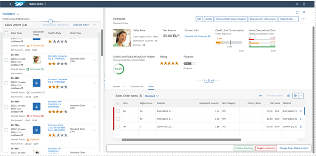

<!-- loiob890ebadf10c4083a643740db3beec38 -->

# Enabling the List-Detail Mode

You can set up the flexible column layout to display just two columns. This is called list-detail mode.

By default, the flexible column layout starts off with one column. The user opens new columns by navigating forward. You can set the layout to display just two columns by adding additional parameters to the flexible column layout entry in the `manifest.json` file in your app:


<table>
<tr>
<th valign="top">

Parameter

</th>
<th valign="top">

Description

</th>
</tr>
<tr>
<td valign="top">

`limitFCLToTwoColumns` 

</td>
<td valign="top">

Use this parameter to configure the layout to show a maximum of two columns in the flexible column layout. Only the values true or false are allowed for this parameter.

If your app has three views and you set `limitFCLToTwoColumns` : true, the third view is shown in full-screen mode.

</td>
</tr>
</table>

> ### Sample Code:  
> ```
> 
> "routing": {
>     "config": {
>         "routerClass": "sap.f.routing.Router",
>         "flexibleColumnLayout": {
>             "defaultTwoColumnLayoutType": "TwoColumnsMidExpanded",
>             "defaultThreeColumnLayoutType": "ThreeColumnsMidExpanded",
>             "limitFCLToTwoColumns": true
>         }
>     },
> }
> ```

The result looks like this:




> ### Note:  
> For information about SAP Fiori elements for OData V2, see [Enabling the List-Detail Mode](enabling-the-list-detail-mode-7353974.md).

