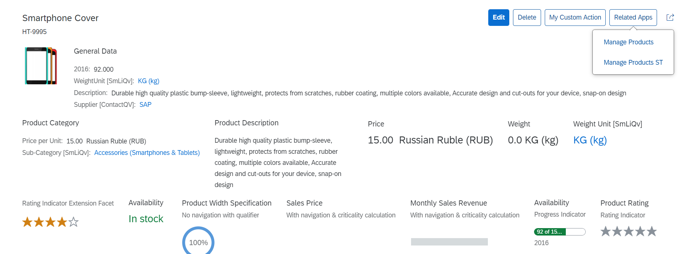

<!-- loio8dcfe2e4555f49db8859cb6eb838692e -->

# Enabling the Related Apps Button

By default, the *Related Apps* button is disabled on object pages created with the object page template. If you want, you can enable this button, which allows you to provide a link to any of the semantic object's navigation targets.

  
  
**Related Apps Button**

  

The *Related Apps* button is displayed on the object page if you set the `showRelatedApps` parameter to `true` in the `manifest.json`.

If a user chooses this button, the navigation targets of the given semantic object are displayed. The semantic object is taken from the app that's currently open \(see the hash in the app's URL\). Apps with the same semantic object but different actions are shown in the popover.


<a name="loio8dcfe2e4555f49db8859cb6eb838692e__section_kd5_msk_dkb"/>

## Hiding Actions for a Semantic Object

You can hide actions of a semantic object in the specific context of an SAP Fiori elements app. To do so, you can use the `SemanticObjectUnavailableActions` annotation to define a list of actions that can be excluded in the context of a specific app.

For example, you can hide the `displayFactSheet` action associated with related app as shown here:

> ### Sample Code:  
> XML Annotation
> 
> ```xml
> <Annotations Target="SalesOrderService.SalesOrderManage"> 
>      …
>      <Annotation Term="Common.SemanticObjectUnavailableActions"> 
>           <Collection> 
>                <String>displayFactSheet</String> 
>           </Collection> 
>      </Annotation>
>      <Annotation Term="Common.SemanticObject" String="SalesOrder"/>
>      …
> </Annotations>
> ```

> ### Sample Code:  
> ABAP CDS Annotations
> 
> No ABAP CDS annotation sample is available. Please use the local XML annotation.

> ### Sample Code:  
> CAP CDS Annotation
> 
> ```
> 
> Common.SemanticObjectUnavailableActions : ['displayFactSheet']
> 
> 
> ```


<a name="loio8dcfe2e4555f49db8859cb6eb838692e__section_ysw_m3l_h4b"/>

## Adding Additional Links to Related Apps

Application developers can add additional links under the "Related Apps" button of the object page header. The links originate from the additional semantic objects defined in the `manifest.json` file.

> ### Note:  
> Links from additional semantic object are only considered if you have set the `showRelatedApps` parameter to `true` in the `manifest.json`.


<a name="loio8dcfe2e4555f49db8859cb6eb838692e__section_app_rdd_dmb"/>

## Additional Features in SAP Fiori Elements for OData V2

The *Related Apps* button is displayed on the object page if you set the `showRelatedApps` parameter to `true` in the `manifest.json` as shown here:

```js
"sap.ui.generic.app": {
		"pages": [
			{
				"entitySet": "SEPMRA_C_PD_Product",
				"component": {
					"name": "sap.suite.ui.generic.template.ListReport",
					"list": true
				},
				"pages": [
					{
						"entitySet": "SEPMRA_C_PD_Product",
						"component": {
							"name": "sap.suite.ui.generic.template.ObjectPage",
							"settings": {
								"showRelatedApps": true
							}
						},
						"pages": [
							{
								"navigationProperty": "to_ProductText",
								"entitySet": "SEPMRA_C_PD_ProductText",
								"component": {
									"name": "sap.suite.ui.generic.template.ObjectPage"
								}
							}
						]
					}
				]
			}
		]
	},	
```


### Adding Semantic Objects as Related Apps

You can display multiple semantic objects under the *Related Apps* button in the `manifest.json` file.

You can configure the `relatedAppsSettings` parameter in the `manifiest.json` file as shown in the example below:

> ### Sample Code:  
> ```
> 
> "sap.ui.generic.app": {
> 	"pages": [
> 		{
> 			"entitySet": "SEPMRA_C_PD_Product",
> 			"component": {
> 				"name": "sap.suite.ui.generic.template.ListReport",
> 				"list": true
> 			},
> 			"pages": [
> 				{
> 					"entitySet": "SEPMRA_C_PD_Product",
> 					"component": {
> 						"name": "sap.suite.ui.generic.template.ObjectPage",
> 						"settings": {
> 							"showRelatedApps": true,
> 							"relatedAppsSettings": {
> 								"0": {
> 									"semanticObject": "EPMProduct"
> 								}
> 							}
> 						}
> 					},
> 					"pages": [
> 						{
> 							"navigationProperty": "to_ProductText",
> 							"entitySet": "SEPMRA_C_PD_ProductText",
> 							"component": {
> 								"name": "sap.suite.ui.generic.template.ObjectPage"
> 							}
> 						}
> 					]
> 				}
> 			]
> 		}
> 	]
> }
> ```

With this setting, all related apps from the app’s URL and from the `manifest.json` file are displayed on the UI under the *Related Apps* button.


### Adding Semantic Objects with Required Action on Related App Settings

You can display multiple semantic objects under the *Related Apps* button in the `manifest.json` file.

> ### Sample Code:  
> ```
> "sap.ui.generic.app": {
>     "pages": [
>         {
>             "entitySet": "SEPMRA_C_PD_Product",
>             "component": {
>                 "name": "sap.suite.ui.generic.template.ListReport",
>             },
>             "pages": [
>                 {
>                     "entitySet": "SEPMRA_C_PD_Product",
>                     "component": {
>                         "name": "sap.suite.ui.generic.template.ObjectPage",
>                         "relatedAppsSettings": {
>                             "": {
>                                 "semanticObject": "",
>                                 "semanticObjectAction": {}
> 						   }
>                             },
>                             "EPMProduct": {
>                                 "semanticObject": "EPMProduct"
>                             },
>                             "STTA_WD20": {
>                                 "semanticObject": "STTA_WD20",
>                                 "semanticObjectAction": {
>                                     "0": {
>                                         "action": "Multi_View"
>                                     },
>                                     "1": {
>                                         "action": "Tree_Table"
>                                     }
>                                 }
>                             }
>                         }
>                     }
>                 }
>             ]
>         }
>     ]
> }
> 
> ```

You must ensure that you define the same semantic object list object-key and there corresponding `semanticObject` value.

In the code sample for `"semanticObject" : "EPMProduct"`, `semanticObjectAction` is not defined. In this case, all the `semanticObjectAction` excluding the ones with `SemanticObjectUnavailableActions` annotation are displayed in the related apps list.

If `semanticObjectAction` list is defined in the manifest as shown for `"semanticObject": "STTA_WD20"`, then only the ones defined in the list are shown in the related apps. In this case, `SemanticObjectUnavailableActions` annotation is not considered.

If the `semanticObjectAction` list is defined in the manifest as an empty object such as `"semanticObjectAction":{}` provided in the sample code, then no action from the semantic object of the current application is considered.


<a name="loio8dcfe2e4555f49db8859cb6eb838692e__section_lnm_5bx_4lb"/>

## Additional Features in SAP Fiori Elements for OData V4

You can enable this feature through the following settings in the `manifest.json` file.

```json
"SalesOrderManageObjectPage":{
   "type": "Component",
   "id": "SalesOrderManageObjectPage",
   "name": "sap.fe.templates.ObjectPage",
   "options":{
      "settings":{
         ...
         ...
         "showRelatedApps": true,
         ...
         ...
      }
   }
}
```

> ### Note:  
> When making a call to the SAP Fiori launchpad to determine the related apps via the `GetLinks` API, SAP Fiori elements passes all the semantic keys - provided they are available. If not all semantic keys are available, then SAP Fiori elements passes all the technical keys.


### Supporting the Mapping of Default Links in Related Apps

When working with default links, if the technical field name of the field on the object page and the corresponding field in the target app differ, application developers can define a mapping between these fields. This mapping enables passing the context between these fields even though their technical field names are different.

To create this mapping, you can use `Common.SemanticObject` and `Common.SemanticObjectMapping` annotation as shown in the following sample codes:

> ### Sample Code:  
> XML Annotation
> 
> ```xml
> <Annotations Target="com.c_salesordermanage_sd.SalesOrderManage">
>     <Annotation Term="Common.SemanticObject" String="SalesOrder"/>
>     <Annotation Term="Common.SemanticObjectMapping">
>         <Collection>
>             <Record Type="Common.SemanticObjectMappingType">
>                 <PropertyValue Property="LocalProperty" PropertyPath="SoldToParty"/>
>                 <PropertyValue Property="SemanticObjectProperty" String="Customer"/>
>             </Record>
>         </Collection>
>     </Annotation>
> </Annotations>
> 
> ```

> ### Sample Code:  
> ABAP CDS Annotation
> 
> ```xml
> 
> annotate view SalesOrderManage with {
>    @Consumption.semanticObject: 'SalesOrder'
>    @Consumption.semanticObjectMapping.additionalBinding: [{element: 'Customer', localElement: 'SoldToParty'}]
>    Customer
> }
> ```

> ### Sample Code:  
> CAP CDS Annotation
> 
> ```xml
> entity SalesOrderManage                                                       @(
>     Common       : {
>         SemanticObject                   : 'SalesOrder',
>         SemanticObjectMapping            : [{
>             LocalProperty          : SoldToParty,
>             SemanticObjectProperty : 'Customer'
>         }
>         ]
>     }
> )
> ```

> ### Note:  
> You mustn't define a mapping between the fields on the object page and the additional links added through the manifest property `additionalSemanticObjects`.
> 
> To map to these additional links, use the manifest settings as provided in the following section.


### Adding Additional Links to Related Apps

Application developers can add additional links under the *Related Apps* button of the object page header. The links originate from the additional semantic objects defined in the `manifest.json` file, as shown in the following example:

```json
"SalesOrderManageObjectPage": {
    "type": "Component",
    "id": "SalesOrderManageObjectPage",
    "name": "sap.fe.templates.ObjectPage",
    "options": {
        "settings": {
            "entitySet": "SalesOrderManage",
            "showRelatedApps": true,
            "additionalSemanticObjects": {
                “ProductCollection”: {
                    unavailableActions: ["displayFactSheet", "reorderProduct"],
                    mapping: {
                        “SoldToParty”: “Client”,
                         .
                         .
                    }
                },
                "Customer": {
                    "unavailableActions": ["manage"],
                    "mapping": {
                        "SoldToParty": "Customer"
                    }
                }
            },
            ....
            ....
        }
    }
}
```

In the previous example , `additionalSemanticObjects` is the manifest setting that you need to add under the object page section of the `manifest.json` file. `ProductCollection` and `Customer` refer to the additional semantic objects from which we get additional links that are displayed under the *Related Apps* button.

The array of unavailable actions defined in the preceding settings denote those navigation actions of the semantic object which should not be displayed under the *Related Apps* button. `displayFactSheet` and `reorderProduct` will not appear in the *Related Apps* menu \(unless they happen to be actions defined for other additional semantic objects and are not part of the unavailable actions there\).

`Mapping`, defined for a semantic object, consists of key value pairs. The key defines the way in which the source application \(object page\) passes the context. The value represents the term used for the same entity in the target app. In the example above, an object page context for `SoldToParty` like "SoldToParty"="001" is passed using the specified target name \(`Customer`\) instead of `SoldToParty`. So the target will receive "Customer"="001" in the app context.

You can also use the `allowedActions` key in the `manifest.json` file to define the exact list of semantic object links to be displayed under the *Related Apps* button:

```json
"SalesOrderManageObjectPage": {
    "type": "Component",
    "id": "SalesOrderManageObjectPage",
    "name": "sap.fe.templates.ObjectPage",
    "options": {
        "settings": {
            "entitySet": "SalesOrderManage",
            "showRelatedApps": true,
            "additionalSemanticObjects": {
                “SalesOrder”: {
                    allowedActions: ["create", "managev2"],
                “ProductCollection”: {
                    allowedActions: ["displayFactSheet"],
                    mapping: {
                        “SoldToParty”: “Client”,
                         .
                         .
                    }
                },
            },
            ....
        }
    }
}
```

In this example, three application links will appear in the *Related Apps* menu.

> ### Note:  
> -   When you enable the `allowedActions` key, the `unavailableActions` key is disabled.
> 
> -   If you do not list any links under `allowedActions`, no applications for the semantic objects will be shown under the *Related Apps* button.

