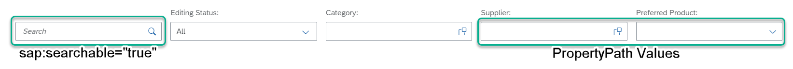

<!-- loio3cdebeebb04b4205908140242c9d6817 -->

# Enabling the Search Function

You can enable the *Search* function in the list report, for example.


<a name="loio3cdebeebb04b4205908140242c9d6817__section_rbx_2bh_psb"/>

## Additional Features in SAP Fiori Elements for OData V2

To enable the search function, `sap:searchable` must be set to `true` for the root entity set.

  
  
**List Report: Search**

 




### Metadata XML

```xml
<EntitySet Name="SEPMRA_C_PD_Product"EntityType="SEPMRA_PROD_MAN.SEPMRA_C_PD_ProductType" sap:searchable="true" sap:content-version="1"/>
```


<a name="loio3cdebeebb04b4205908140242c9d6817__section_knm_fch_psb"/>

## Additional Features in SAP Fiori Elements for OData V4

For more information about how to enable and disable the *Search* field for analytical tables, see the corresponding section in [Setting the Table Type](setting-the-table-type-7f844f1.md).


<a name="loio3cdebeebb04b4205908140242c9d6817__section_q5w_tgf_nmb"/>

## More Information

For more information on configuring filter bar in list report, see [Adapting the Filter Bar](adapting-the-filter-bar-609c39a.md).

