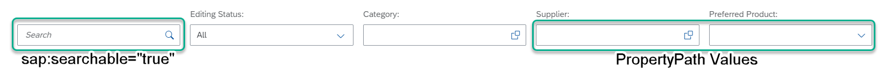

<!-- loiofffde600dda84e1c94f8e3361a92f854 -->

# Enabling the Search Function

You can enable the *Search* function in the list report.

The search is restricted to 1000 characters.

To enable the search function, you must set `sap:searchable` to `true` for the root entity set.

  
  
**List Report: Search**





### Metadata XML

```xml
<EntitySet Name="SEPMRA_C_PD_Product"EntityType="SEPMRA_PROD_MAN.SEPMRA_C_PD_ProductType" sap:searchable="true" sap:content-version="1"/>
```


<a name="loiofffde600dda84e1c94f8e3361a92f854__section_q5w_tgf_nmb"/>

## More Information

For more information about configuring the filter bar in a list report, see [Adapting the Filter Bar](adapting-the-filter-bar-c7a7ac4.md).

