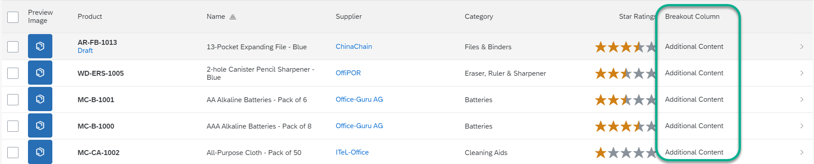

<!-- loioc174923c270049c4b73d646cc688b8d9 -->

# Example: Adding Columns to a Responsive Table on the Object Page

You have to implement two extension points to add a custom column to a table.


## Context

> ### Caution:  
> Use app extensions with caution and only if you cannot produce the required behavior by other means, such as manifest settings or annotations. To correctly integrate your app extension coding with SAP Fiori elements, use only the `extensionAPI` of SAP Fiori elements. For more information, see [Using the extensionAPI](using-the-extensionapi-bd2994b.md).
> 
> After you've created an app extension, its display \(for example, control placement and layout\) and system behavior \(for example, model and binding usage, busy handling\) lies within the application's responsibility. SAP Fiori elements provides support only for the official `extensionAPI` functions. Don't access or manipulate controls, properties, models, or other internal objects created by the SAP Fiori elements framework.

 <a name="task_yhy_gqg_d4b"/>

<!-- task\_yhy\_gqg\_d4b -->

## Additional Features in SAP Fiori Elements for OData V2


## Context

The table containing additional columns can look like this:

   
  
**Custom columns in a responsive table on the object page**

  


<a name="task_yhy_gqg_d4b__steps_tzk_4qg_d4b"/>

## Procedure

1.  Define a fragment for the view extension.

    For a custom column in a responsive table, you have to implement two extensions. First, implement the definition of the custom columns and then implement the content of the custom columns.

    In the example project: webapp/ext/fragments/ProductTextResponsiveTableColumns.fragment.xml:

    > ### Sample Code:  
    > ```
    > <core:FragmentDefinition xmlns:core="sap.ui.core"
    >        xmlns="sap.m">
    >        <Column>
    >               <Text text="{i18n|sap.suite.ui.generic.template.ObjectPage|STTA_C_MP_Product>xfld.BreakoutColumn}" />
    >               <customData>
    >                      <core:CustomData key="p13nData"
    >                             value='\{"columnKey": "Test", "columnIndex" : "101"}' />
    >               </customData>
    >        </Column>
    > </core:FragmentDefinition>
    > 
    > ```

    In the example project: ProductTextResponsiveTableCells.fragment.xml:

    > ### Sample Code:  
    > ```
    > <core:FragmentDefinition xmlns:core="sap.ui.core" xmlns="sap.m">
    >        <Text text="{i18n|sap.suite.ui.generic.template.ObjectPage|STTA_C_MP_Product>xfld.BreakoutColumnContent}"></Text>
    > </core:FragmentDefinition>
    > 
    > ```

2.  Register your view extensions in the `manifest.json` file of your application as follows:

    For information on naming, see [Extension Points for Tables](extension-points-for-tables-d525522.md).

    > ### Sample Code:  
    > ```
    > ...
    >  "extends": {
    >       "component": "sap.suite.ui.generic.template.ListReport",
    >       "minVersion": "1.1.0",
    >       "extensions": {
    >         "sap.ui.viewExtensions": {
    > "sap.suite.ui.generic.template.ObjectPage.view.Details": {
    >             "ResponsiveTableColumnsExtension|STTA_C_MP_ProductText|to_ProductText::com.sap.vocabularies.UI.v1.LineItem": {
    >                   "className": "sap.ui.core.Fragment",
    >                   "fragmentName": "STTA_MP.ext.fragments.ProductTextResponsiveTableColumns",
    >                   "type": "XML"
    >             },
    >             "ResponsiveTableCellsExtension|STTA_C_MP_ProductText|to_ProductText::com.sap.vocabularies.UI.v1.LineItem": {
    >                   "className": "sap.ui.core.Fragment",
    >                   "fragmentName": "STTA_MP.ext.fragments.ProductTextResponsiveTableCells",
    >                   "type": "XML"
    >             }    
    >       }, 
    > 
    > ```


 <a name="task_c1y_4qg_d4b"/>

<!-- task\_c1y\_4qg\_d4b -->

## Additional Features in SAP Fiori Elements for OData V4


<a name="task_c1y_4qg_d4b__context_ptm_prs_h4b"/>

## Context

You can find a detailed description of how to add custom columns to a table in the topic [Extension Points for Tables](extension-points-for-tables-d525522.md).

