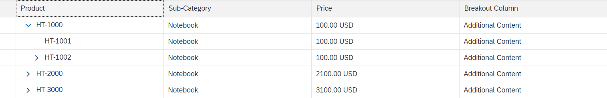

<!-- loiob903da5f037244629aa6462af2eb32ec -->

# Example: Adding Columns to a Tree Table in the List Report

To add custom columns to a tree table in the list report, follow the steps described below.


## Context

> ### Note:  
> This topic is currently only applicable to SAP Fiori elements for OData V2.

> ### Caution:  
> Use app extensions with caution and only if you cannot produce the required behavior by other means, such as manifest settings or annotations. To correctly integrate your app extension coding with SAP Fiori elements, use only the `extensionAPI` of SAP Fiori elements. For more information, see [Using the extensionAPI](using-the-extensionapi-bd2994b.md).
> 
> After you've created an app extension, its display \(for example, control placement and layout\) and system behavior \(for example, model and binding usage, busy handling\) lies within the application's responsibility. SAP Fiori elements provides support only for the official `extensionAPI` functions. Don't access or manipulate controls, properties, models, or other internal objects created by the SAP Fiori elements framework.

The table containing additional columns can look like this:

   
  
**Custom columns in tree table in the list report**

  


## Procedure

1.  Define a fragment for the view extension

    In the example project webapp/ext/fragments/ListReportTreeTableColumns.fragment.xml, the custom column is added to the first position of the tree table. You can change the sequence via the `customData` property `columnIndex` as shown below.

    > ### Note:  
    > If the content of your custom column refers to a property \(such as`{Price}`\), you need to include a corresponding `"leadingProperty"` entry in the `CustomData` of the column definition.

    > ### Sample Code:  
    > ```
    > <core:FragmentDefinition xmlns:core="sap.ui.core"
    >        xmlns:table="sap.ui.table" xmlns="sap.m">
    >        <table:Column>
    >               <Label text="Rating" />
    >               <table:customData>
    >                      <core:CustomData key="p13nData"
    >                             value='\{"columnKey": "Rating", "leadingProperty":"Price", "columnIndex" : "100"}' />
    >               </table:customData
    > 
    >               <table:template>
    >                      <RatingIndicator value="{= ${Price} > 500 ? 1:5}"></RatingIndicator>
    >               </table:template>
    >        </table:Column>
    >        <table:Column>
    >               <Label text="Test" />
    >               <table:customData>
    >                      <core:CustomData key="p13nData" value='\{"columnKey": "Test", "columnIndex" : "101"}' />
    >               </table:customData>
    >               <table:template>
    >                      <Text text="{i18n|sap.suite.ui.generic.template.ListReport|STTA_C_MP_Product>xfld.BreakoutColumnContent}"></Text>
    >               </table:template>
    >        </table:Column>
    > </core:FragmentDefinition>
    > 
    > ```

2.  Register your view extension in the `manifest.json` file of your application.

    > ### Sample Code:  
    > ```
    > ...
    >  "extends": {
    >       "component": "sap.suite.ui.generic.template.ListReport",
    >       "minVersion": "1.1.0",
    >       "extensions": {
    >         "sap.ui.viewExtensions": {
    >           "sap.suite.ui.generic.template.ListReport.view.ListReport": {
    >             "TreeTableColumnsExtension|STTA_C_MP_Product": {
    >                   "className": "sap.ui.core.Fragment",
    >                   "fragmentName": "STTA_MP.ext.fragments.ListReportTreeTableColumns",
    >                   "type": "XML"
    >             },… 
    > 
    > ```

    If you use `QuickVariantSelectionX`, you need to define the extensions per tab. In this case, the name of the extension point is `TreeTableColumnExtension|<EntitySet>|<tabKey>`. `<tabKey>` is the key provided when defining the `QuickVariantSelectionX`. See also [Defining Multiple Views on a List Report Table - Multiple Table Mode](defining-multiple-views-on-a-list-report-table-multiple-table-mode-37aeed7.md).

    > ### Note:  
    > If you do not use |<tab key\> as part of the extension point name, for compatibility reasons, the feature will also work. However, you cannot provide stable IDs for the columns and cells.

    > ### Sample Code:  
    > ```
    > ...
    > "extends": {
    >   "extensions": {
    >     "sap.ui.viewExtensions": {
    >       "sap.suite.ui.generic.template.ListReport.view.ListReport": {
    >         "TreeTableColumnsExtension|STTA_C_MP_Product|Expensive": {
    >           "className": "sap.ui.core.Fragment",
    >           "fragmentName": "STTA_MP.ext.fragments.ListReportTreeTableColumnsExpensive",
    >           "type": "XML"
    >         },
    >         "TreeTableColumnsExtension|STTA_C_MP_Product|Cheap": {
    >           "className": "sap.ui.core.Fragment",
    >           "fragmentName": "STTA_MP.ext.fragments.ListReportTreeTableColumnsCheap",
    >           "type": "XML"
    >         },... 
    > 
    > ```


