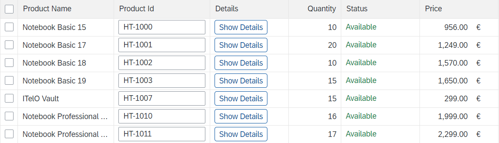

<!-- loio3b78e695abde4c21a472cd9e2f1c9eb5 -->

# Example: Adding Columns to an Analytical Table on the Object Page

To add custom columns to an analytical table on the object page, follow the steps described below.


## Context

> ### Note:  
> This topic is currently only applicable to SAP Fiori elements for OData V2.

> ### Caution:  
> Use app extensions with caution and only if you cannot produce the required behavior by other means, such as manifest settings or annotations. To correctly integrate your app extension coding with SAP Fiori elements, use only the `extensionAPI` of SAP Fiori elements. For more information, see [Using the extensionAPI](using-the-extensionapi-bd2994b.md).
> 
> After you've created an app extension, its display \(for example, control placement and layout\) and system behavior \(for example, model and binding usage, busy handling\) lies within the application's responsibility. SAP Fiori elements provides support only for the official `extensionAPI` functions. Don't access or manipulate controls, properties, models, or other internal objects created by the SAP Fiori elements framework.

The table containing additional columns can look like this:

   
  
**Custom columns in an analytical table on the object page**

  


## Procedure

1.  Define a fragement for the view extension

    In the example project webapp/ext/fragments/ProductSalesDataAnalyticalTableColumns.fragment.xml, two columns are added: One containing text, the other one containing an action button.

    > ### Sample Code:  
    > ```
    > <core:FragmentDefinition
    >                xmlns:core="sap.ui.core"
    >                xmlns:table="sap.ui.table" 
    >                xmlns="sap.m" 
    >                xmlns:sfi="sap.ui.comp.smartfield">
    > 
    >                <table:AnalyticalColumn width="150px"> 
    >       <Label text="{i18n|sap.suite.ui.generic.template.ObjectPage|STTA_C_MP_Product>xfld.BreakoutColumn}" />
    >       <table:template>
    >          <Text text="{i18n|sap.suite.ui.generic.template.ObjectPage|STTA_C_MP_Product>xfld.BreakoutColumnContent}"></Text>
    >       </table:template>
    >       <table:customData>
    >                               <core:CustomData key="p13nData" value='\{"columnKey": "some unique key" \}' />
    >                    </table:customData>
    >                </table:AnalyticalColumn>
    >                
    >                <table:AnalyticalColumn width="170px">
    > 
    >                               <Label text="{i18n|sap.suite.ui.generic.template.ObjectPage|STTA_C_MP_Product>xfld.BreakoutColumn}" />
    > 
    >                               <table:template>
    >                                              <Button text="{i18n|sap.suite.ui.generic.template.ObjectPage|STTA_C_MP_Product>xfld.AnalyticalTableButton}"
    >                                                                                                          press = "onAnalyticalTableBreakoutButtonPress">
    >                                              </Button>
    >                              </table:template>            
    >                               
    >                               <table:customData>
    >                                              <core:CustomData key="p13nData" value='\{"columnKey": some unique key"  \}' />
    >                               </table:customData>
    >                
    >                </table:AnalyticalColumn>
    >                
    > </core:FragmentDefinition>
    > 
    > ```

2.  Register your view extensions in the `manifest.json` file of your application, as follows:

    > ### Sample Code:  
    > ```
    > "extends": {
    >      "extensions": {
    >          "sap.ui.controllerExtensions": {
    >              ....
    >          }
    >          "sap.ui.viewExtensions": {
    >               .... 
    >               "sap.suite.ui.generic.template.ObjectPage.view.Details": {
    >                      ....
    >                      "AnalyticalTableColumnsExtension|STTA_C_MP_ProductSalesData|to_ProductSalesData::com.sap.vocabularies.UI.v1.LineItem": {
    >                         "className": "sap.ui.core.Fragment",
    >                         "fragmentName": "STTA_MP.ext.fragments.ProductSalesDataAnalyticalTableColumns",
    >                         "type": "XML"
    >                      },
    >                      ....
    > 
    > ```


