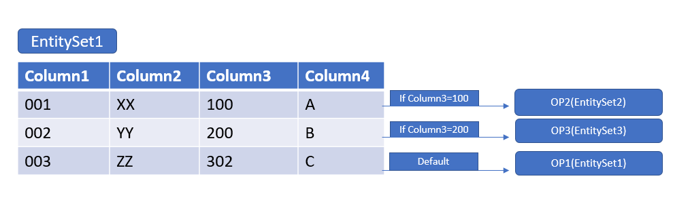

<!-- loio75002b3c5ad7407dadce2f88f15f4253 -->

# Example: Enable Internal Navigation to Different Detail Page

You can enable internal navigation to a different detail page \(i.e. using different entity sets\) for a list report or an object page.

In the extension function, you can define the logic or condition that triggers the navigation to the detail page. If none of the conditions mentioned in the extension are met, navigation to the default detail page is triggered.

The figure below shows a sample navigation scenario:

  


<a name="loio75002b3c5ad7407dadce2f88f15f4253__section_fk3_xzg_wrb"/>

## Additional Features in SAP Fiori Elements for OData V2

Enabling conditional navigation to a different detail page can be achieved using the `onListNavigationExtension` method. The code snippet below shows a sample implementation of the `onListNavigationExtension`.

> ### Sample Code:  
> ```
> onListNavigationExtension: function(oEvent) {
> 			var oBindingContext = oEvent.getSource().getBindingContext();
> 			var oObject = oBindingContext.getObject();
> 			var sNavigationProperty;
> 			switch (oObject.Column3){
> 				case "100":
> 					sNavigationProperty = "NavigationProperty1";
> 					break;
> 				case "200":
> 					sNavigationProperty = "NavigationProperty2";
> 					break;
> 			}
> 			if (sNavigationProperty){
> 				var oExtensionAPI = this.extensionAPI;
> 				var fnNavigate = function(){
> 					return new Promise(function(fnResolve, fnReject){
> 						var oModel = oBindingContext.getModel();
> 						var oTarget;
> 						oModel.createBindingContext(sNavigationProperty, oBindingContext, {}, function(oTarget){
> 							var oNavigationController = oExtensionAPI.getNavigationController();
> 							oNavigationController.navigateInternal(oTarget);
> 							fnResolve();
> 						});
> 					});
> 				};
> 			oExtensionAPI.securedExecution(fnNavigate, {
>                 busy: {
>                                check: false
>                 },
>                 dataloss: {
>                              popup: false
>                 }
> });
> 
> 				return true;				
> 			}
> 			return false;
> 		}
> 
> Sample Implementation of Manifest changes:
> 		"pages": {
> 					"ObjectPage|EntitySet1 ": {
> 						"entitySet": " EntitySet1",
> 						"component": {
> 							"name": "sap.suite.ui.generic.template.ObjectPage"
> 						}
> 					},					
> 					"ObjectPage| EntitySet2 ": {
> 						"entitySet": " EntitySet2",
> 						"component": {
> 							"name": "sap.suite.ui.generic.template.ObjectPage"
> 						}
> 					},
> 					"ObjectPage| EntitySet3": {
> 						"entitySet": " EntitySet3",
> 						"component": {
> 							"name": "sap.suite.ui.generic.template.ObjectPage"
> 						}
> 					}
> 
> ```


### Visual Indication for Table Rows when Navigated Using `onListNavigationExtension`

You can implement the `onChildOpenedExtension` function within the list report/object page controller extension, where you can pass the binding path of corresponding list item to `fnSetPath`.

> ### Sample Code:  
> ```
> onChildOpenedExtension: function(oSelectionInfo, fnSetPath) {
> 	//oSelectionInfo - Information about the child page instance opened last.
> 	//oSelectionInfo.keys – The array of keys (one on each hierarchy level) used for last opened child page.
> 	//fnSetPath - pass the binding path of the corresponding list item to this function if it is not identical 	to oSelection.path.
> 	var oModel = this.getView().getModel();
>           oModel.createBindingContext(oSelectionInfo.path + “NavigationProperty”, null, null, function(oContext) { 
>                 fnSetPath(oContext.getPath());
> 	});
> },  
> 
> ```


<a name="loio75002b3c5ad7407dadce2f88f15f4253__section_k5z_hyx_2sb"/>

## Additional Features in SAP Fiori Elements for OData V4

Application developers must ensure that an appropriate route has been defined in the manifest for the detail page. Here's an example:

> ### Sample Code:  
> Route defined in manifest
> 
> ```
> "sap.ui5": {
>   "routing": {
>      "routes": [
>         ......
>         {
>            "pattern": "SalesOrderManage({key})/_Item({key2})/_MaterialDetails({key3}):?query:",
>            "name": "CustomMaterialDetailsPage",
>            "target": "CustomMaterialDetailsPage"
>         }
>       ]
>     }
> }
> ```

Application developers can then add the extension code to call the route defined in a conditional manner. Here's a code snippet showing the extension code for the list report:

> ### Sample Code:  
> Extension code for the list report
> 
> ```
> sap.ui.define(["sap/ui/core/mvc/ControllerExtension", "sap/m/MessageToast", "sap/base/Log"], function(
>     ControllerExtension,
>     MessageToast,
>     Log
> ) {
>     "use strict";
>     return ControllerExtension.extend("SalesOrder.custom.LRExtend", {
>         // this section allows to extend lifecycle hooks or override public methods of the base controller
>         override: {
>             ......
>             ......
>             routing: {
>                 onBeforeNavigation: function(oContextInfo) {
>                     var oLineContextData = oContextInfo.sourceBindingContext,
>                         oNav = this.base.getExtensionAPI().intentBasedNavigation,
>                         oRouting = this.base.getExtensionAPI().routing;
>                     // for salesOrder 2919431 navigate to CustomMaterialDetailsPage
>                     if (oLineContextData.SalesOrder === "2919431") {
>                         oRouting.navigateToRoute("CustomMaterialDetailsPage", {
>                             "key": "ID=11111138-aaaa-bbbb-cccc-ddddeeeeffff,IsActiveEntity=true",
>                             "key2": "ID=11111142-aaaa-bbbb-cccc-ddddeeeeffff,IsActiveEntity=true",
>                             "key3": "ID=21111142-aaaa-bbbb-cccc-ddddeeeeffff,IsActiveEntity=true"
>                         });
>                     } else {
>                         // return false to trigger the default internal navigation
>                         return false;
>                     }
>                     // return true is necessary to prevent further default navigation
>                     return true;
>                 }
>             },
>             .......
>             .......
>         }
>     }
> }
> );
> ```

In addition, here's an example for the object page:

> ### Sample Code:  
> Extension code for the obect page
> 
> ```
> sap.ui.define(
>     [
>         "sap/ui/core/mvc/ControllerExtension",
>         "sap/m/Dialog",
>         "sap/m/DialogType",
>         "sap/m/Text",
>         "sap/m/Button",
>         "sap/m/ButtonType",
>         "sap/m/MessageToast",
>         "sap/base/Log"
>     ],
>     function(ControllerExtension, Dialog, DialogType, Text, Button, ButtonType, MessageToast, Log) {
>         "use strict";
>         return ControllerExtension.extend("SalesOrder.custom.OPExtend", {
>             // this section allows to extend lifecycle hooks or override public methods of the base controller
>             override: {
>                 ......
>                 ......
>                 routing: {
>                     onBeforeNavigation: function(oContextInfo) {
>                         var oLineContextData = oContextInfo.sourceBindingContext,
>                             oExtensionAPI = this.base.getExtensionAPI(),
>                             oNav = oExtensionAPI.intentBasedNavigation,
>                             oRouting = oExtensionAPI.routing;
>                         // for salesOrderItem 40 from SalesOrder 2916499, navigate to PartnerObjectPage
>                         if (
>                             oLineContextData.SalesOrder &&
>                             oLineContextData.SalesOrder === "2916499" &&
>                             oLineContextData.SalesOrderItem &&
>                             oLineContextData.SalesOrderItem === 40
>                         ) {
>                             oRouting.navigateToRoute("PartnerObjectPage", {
>                                 "key": "ID=" + oLineContextData.ID + ",IsActiveEntity=" + oLineContextData.IsActiveEntity,
>                                 "key2": "ID=" + oLineContextData.ID + ",IsActiveEntity=" + oLineContextData.IsActiveEntity
>                             });
>                         } else {
>                             // return false to trigger the default internal navigation
>                             return false;
>                         }
>                         // return true is necessary to prevent further default navigation
>                         return true;
>                     }
>                 },
>                 ......
>                 ......
>             }
>         }
>     }
> );
> ```

**Related Information**  


[Example: Replacing Standard Navigation in a Responsive Table in the List Report](example-replacing-standard-navigation-in-a-responsive-table-in-the-list-report-a12ad60.md "You can replace the standard navigation from the list report to the object page with your own navigation to an external or internal target.")

[Example: Replacing Standard Navigation in a Responsive Table on the Object Page](example-replacing-standard-navigation-in-a-responsive-table-on-the-object-page-b20dc7a.md "You can replace the standard navigation from the object page with your own navigation to an external or internal target.")

[Configuring Internal Navigation](configuring-internal-navigation-2c65f07.md "SAP Fiori elements control the navigation within an app (internal navigation). This section describes the configuration options that you have.")

