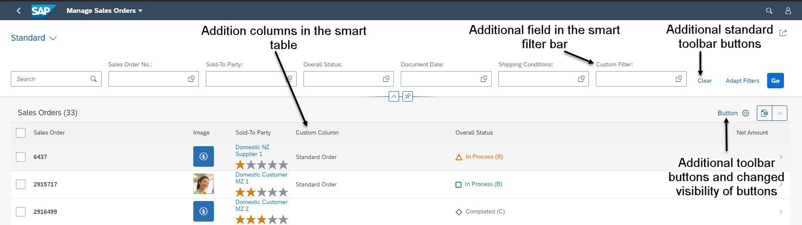
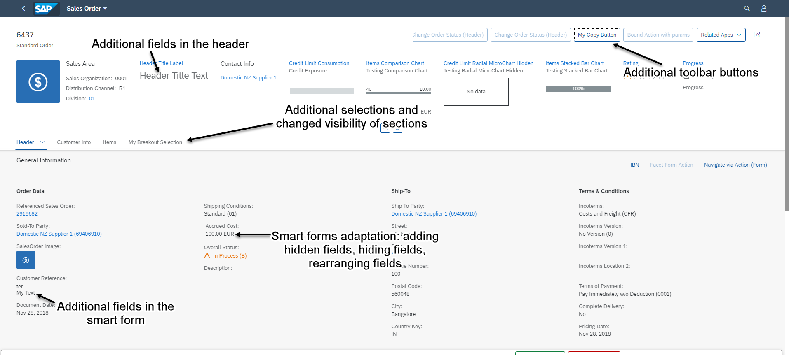

<!-- loio4221538fc7264d3fb72be8473b12ee82 -->

# Extending Delivered Apps Using Adaptation Extensions

You can create adaptation projects on top of SAP Fiori elements-based applications by using the Adaptation Editor in SAP Business Application Studio.

> ### Note:  
> For information about SAP Fiori elements for OData V4, see [Extending Delivered Apps Using Adaptation Extensions](extending-delivered-apps-using-adaptation-extensions-52fc48b.md).

You can implement extension functions as part of a UI adaptation project by using the Adaptation Editor in SAP Business Application Studio. The adaptation project references the applications delivered by SAP as base or parent applications.

> ### Note:  
> This procedure is relevant only for list report pages, object pages, overview pages, and analytical list pages.
> 
> The flexible column layout is not supported by the Adaptation Editor.

You can try the adaptation extensions by creating an adaptation project described in [Extending an SAP Fiori Application](https://help.sap.com/docs/bas/developing-sap-fiori-app-in-sap-business-application-studio/extending-sap-fiori-application).

You can use adaptation extensions for the following extension points:

-   List report page and analytical list page

    -   Add additional fields to the smart filter bar

    -   Add additional columns to tables

    -   Add additional table toolbar buttons and extension controller logic. For an example, see [Adaptation Extension Example: Adding a Button to the Table Toolbar on the List Report Page](adaptation-extension-example-adding-a-button-to-the-table-toolbar-on-the-list-report-page-a269671.md)

          
          
        **Adaptation Extension Options on the List Report Page**

        

    -   Override extension functions

        -   `onInitSmartFilterBar`

        -   `provideExtensionAppStateData`

        -   `restoreExtensionAppStateData`

        -   `ensureFieldsForSelect`

        -   `addFilters`


    These extension functions can be consumed as a part of `ControllerExtension`, by overriding the `templateBasedExtension` points.

    > ### Sample Code:  
    > Overriding `addFilters` extension function
    > 
    > ```
    > override: {	
    >     // override public method of the ListReport controller 
    >     templateBaseExtension: {	
    >         addFilters: function(fnAddFilter, sControlId){							
    >             // custom logic
    >         }
    >     }
    > }
    > 
    > ```

-   Object page

    -   Toolbar actions

    -   Additional sections

    -   Add additional fields to the header facet

    -   Add additional fields and field groups to forms

          
          
        **Adaptation Extension Options on the Object Page**

        

    -   Override extension functions

        -   `provideExtensionStateData`

        -   `restoreExtensionStateData`

        -   `ensureFieldsForSelect`

        -   `addFilters`


        These extension functions can be consumed as part of the `ControllerExtension`, by overriding the `templateBasedExtension` points.


    > ### Note:  
    > The extension points mentioned in the [API Reference](https://ui5.sap.com/#/api/sap.suite.ui.generic.template.ListReport.controllerFrameworkExtensions%23overview) cannot be consumed as a part of the adaptation project.

-   Overview page

    -   Add additional fields to the smart filter bar

    -   Add global actions to the filter bar

    -   Add additional extension controller logic

    -   Add cards

    -   Clone cards

    -   Edit cards

    -   Override extension functions

        -   `provideExtensionAppStateData`

        -   `restoreExtensionAppStateData`

        -   `addFilters`

        -   `provideStartupExtension`

        -   `provideExtensionNavigation`

        -   `provideCustomActionPress`

        -   `provideCustomParameter`


For more information, see [Details of Extension Functions Used for Extending Delivered Apps](details-of-extension-functions-used-for-extending-delivered-apps-82630e5.md).

**Related Information**  


[SAPUI5 Flexibility: Enable Your App for UI Adaptation](../05_Developing_Apps/sapui5-flexibility-enable-your-app-for-ui-adaptation-f1430c0.md "Here's what you have to consider when developing apps that support UI adaptation.")

[SAPUI5 Flexibility: Adapting UIs Made Easy](../04_Essentials/sapui5-flexibility-adapting-uis-made-easy-a8e55aa.md "Modification-free, cost-saving, easy to use, and performant: Discover the new flexibility when adapting SAP Fiori UIs using SAPUI5 flexibility.")

[Adapting the UI](adapting-the-ui-7837c7a.md "App developers and key users can extend and configure the app UI.")

[Extending SAP Fiori Applications](https://help.sap.com/docs/bas/developing-sap-fiori-app-in-sap-business-application-studio/extending-sap-fiori-application?locale=en-US)

[Adding App Descripto Changes](https://help.sap.com/docs/bas/developing-sap-fiori-app-in-sap-business-application-studio/adding-app-descriptor-changes)

